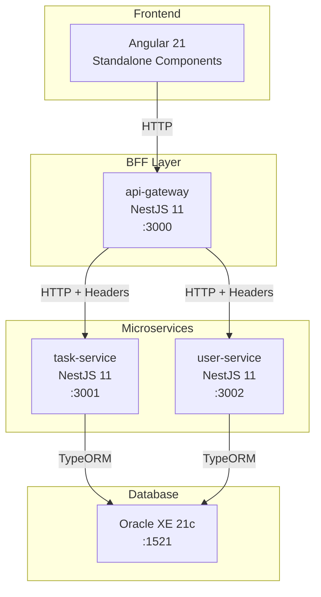
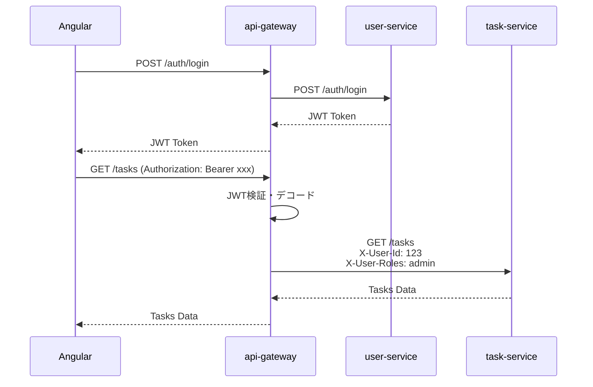
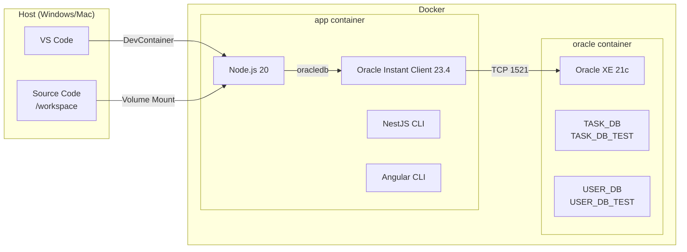

# NestJS + BFF パターン 開発環境構築ガイド

このドキュメントでは、NestJS + Angular + Oracle を使用した BFF（Backend For Frontend）パターンの開発環境構築方法を解説します。

## 目次

1. [アーキテクチャ概要](#アーキテクチャ概要)
2. [技術スタック](#技術スタック)
3. [DevContainer環境構成](#devcontainer環境構成)
4. [各サービスのパッケージ詳細](#各サービスのパッケージ詳細)
5. [推奨VS Code拡張機能](#推奨vs-code拡張機能)
6. [環境構築手順](#環境構築手順)
7. [トラブルシューティング](#トラブルシューティング)

---

## アーキテクチャ概要

### システム全体構成



### BFFパターンの認証フロー



### DevContainer構成



---

## 技術スタック

### バージョン一覧

| カテゴリ | 技術 | バージョン | 用途 |
|---------|------|-----------|------|
| **Runtime** | Node.js | 20 LTS | JavaScript実行環境 |
| **Backend** | NestJS | 11 | APIフレームワーク |
| **Frontend** | Angular | 21 | SPAフレームワーク |
| **ORM** | TypeORM | 0.3 | DBアクセス |
| **Database** | Oracle XE | 21c | RDBMS |
| **DB Driver** | oracledb | 6.10 | Node.js用Oracleドライバ |
| **Container** | Docker | - | 開発環境仮想化 |

### npm Workspaces 構成

```
nestjs-bff-learning/
├── package.json              # ルート（workspaces定義）
├── services/
│   ├── task-service/         # タスク管理サービス
│   ├── user-service/         # ユーザー認証サービス
│   └── api-gateway/          # BFF層
└── frontend/
    └── angular-app/          # Angularアプリ
```

npm workspaces により、ルートディレクトリで `npm install` を実行すると全サービスの依存関係が一括インストールされます。

---

## DevContainer環境構成

### 必要ファイル

```
.devcontainer/
├── devcontainer.json    # VS Code DevContainer設定
├── docker-compose.yml   # コンテナ構成定義
└── Dockerfile           # Node.js + Oracle Instant Client
```

### Dockerfile の要点

Node.jsからOracleに接続するには、**Oracle Instant Client** が必要です：

```dockerfile
FROM mcr.microsoft.com/devcontainers/javascript-node:20

# Oracle Instant Client インストール
RUN apt-get update && apt-get install -y libaio1t64 wget unzip \
    && wget https://download.oracle.com/otn_software/linux/instantclient/2340000/instantclient-basiclite-linux.x64-23.4.0.24.05.zip \
    && unzip instantclient-basiclite-linux.x64-23.4.0.24.05.zip -d /opt/oracle \
    && rm instantclient-basiclite-linux.x64-23.4.0.24.05.zip \
    && echo /opt/oracle/instantclient_23_4 > /etc/ld.so.conf.d/oracle-instantclient.conf \
    && ldconfig \
    && apt-get clean && rm -rf /var/lib/apt/lists/*

# 環境変数設定
ENV LD_LIBRARY_PATH=/opt/oracle/instantclient_23_4:$LD_LIBRARY_PATH
ENV PATH=/opt/oracle/instantclient_23_4:$PATH

# NestJS CLI グローバルインストール
RUN npm install -g @nestjs/cli
```

### docker-compose.yml の要点

```yaml
services:
  app:
    build:
      context: .
      dockerfile: Dockerfile
    volumes:
      - ..:/workspace:cached
    command: sleep infinity
    environment:
      # Oracle接続情報
      - ORACLE_HOST=oracle
      - ORACLE_PORT=1521
      - ORACLE_SERVICE=XEPDB1
      # 各サービス用DB認証情報
      - TASK_DB_USER=TASK_DB
      - TASK_DB_PASSWORD=task_password
      - USER_DB_USER=USER_DB
      - USER_DB_PASSWORD=user_password
      # BFF用サービスURL
      - TASK_SERVICE_URL=http://localhost:3001
      - USER_SERVICE_URL=http://localhost:3002
    depends_on:
      oracle:
        condition: service_healthy

  oracle:
    image: container-registry.oracle.com/database/express:21.3.0-xe
    environment:
      - ORACLE_PWD=password
      - ORACLE_CHARACTERSET=AL32UTF8
    ports:
      - "1521:1521"
    volumes:
      - oracle-data:/opt/oracle/oradata
      - ../database/init:/opt/oracle/scripts/startup
    healthcheck:
      test: ["CMD-SHELL", "echo 'SELECT 1 FROM DUAL;' | sqlplus -s system/password@localhost:1521/XEPDB1 || exit 1"]
      interval: 30s
      timeout: 10s
      retries: 10
      start_period: 120s

volumes:
  oracle-data:
```

**ポイント**:
- `depends_on` + `service_healthy`: Oracle起動完了まで待機
- `start_period: 120s`: Oracle XEは初回起動に2-3分かかる
- `../database/init`: 初期化SQLを自動実行

---

## 各サービスのパッケージ詳細

### 共通パッケージ（全NestJSサービス）

| パッケージ | 用途 |
|-----------|------|
| `@nestjs/common` | NestJSコア機能（デコレータ、パイプ等） |
| `@nestjs/core` | NestJSアプリケーションコア |
| `@nestjs/platform-express` | Express.jsアダプター |
| `@nestjs/config` | 環境変数・設定管理 |
| `class-validator` | DTOバリデーション |
| `class-transformer` | オブジェクト変換 |
| `reflect-metadata` | デコレータメタデータ |
| `rxjs` | リアクティブプログラミング |

### task-service（タスク管理）

```bash
# 本番依存
npm install @nestjs/config @nestjs/typeorm typeorm oracledb class-validator class-transformer
```

| パッケージ | バージョン | 用途 |
|-----------|-----------|------|
| `@nestjs/typeorm` | ^11.0.0 | TypeORM統合モジュール |
| `typeorm` | ^0.3.28 | ORM（Entity定義、Repository） |
| `oracledb` | ^6.10.0 | Oracle Database接続ドライバ |

**なぜこれらが必要か**:
- `typeorm`: SQLを書かずにEntityクラスでDB操作
- `oracledb`: Oracle固有の接続プロトコル対応
- `@nestjs/typeorm`: NestJSのDI（依存性注入）とTypeORMを統合

### user-service（認証・ユーザー管理）

```bash
# task-serviceと同等 + 認証系パッケージ
npm install @nestjs/config @nestjs/typeorm typeorm oracledb class-validator class-transformer
npm install @nestjs/passport @nestjs/jwt passport passport-jwt bcrypt
npm install -D @types/bcrypt @types/passport-jwt
```

| パッケージ | バージョン | 用途 |
|-----------|-----------|------|
| `@nestjs/passport` | ^11.0.5 | Passport.js統合モジュール |
| `@nestjs/jwt` | ^11.0.2 | JWT生成・検証 |
| `passport` | ^0.7.0 | 認証ミドルウェア |
| `passport-jwt` | ^4.0.1 | JWT認証ストラテジー |
| `bcrypt` | ^6.0.0 | パスワードハッシュ化 |

**なぜこれらが必要か**:
- `passport`: 認証の標準的なミドルウェア
- `passport-jwt`: Bearer Token認証の実装
- `bcrypt`: パスワードの安全な保存（ソルト付きハッシュ）
- `@nestjs/jwt`: JWTトークンの発行・署名

### api-gateway（BFF層）

```bash
# HTTPクライアントのみ（TypeORM不要）
npm install @nestjs/config @nestjs/axios axios class-validator class-transformer
```

| パッケージ | バージョン | 用途 |
|-----------|-----------|------|
| `@nestjs/axios` | ^4.0.1 | Axios統合モジュール |
| `axios` | ^1.13.2 | HTTPクライアント |

**なぜこれらが必要か**:
- BFFはDBに直接アクセスしないため `typeorm` 不要
- 各マイクロサービスへのHTTPリクエストに `axios` を使用
- `@nestjs/axios`: NestJSのDIでHttpServiceを注入可能に

### angular-app（フロントエンド）

```bash
ng new angular-app --standalone --routing --style=scss --skip-git --skip-tests
```

| パッケージ | バージョン | 用途 |
|-----------|-----------|------|
| `@angular/core` | ^21.0.0 | Angularコア |
| `@angular/common` | ^21.0.0 | 共通モジュール（HttpClient等） |
| `@angular/router` | ^21.0.0 | ルーティング |
| `@angular/forms` | ^21.0.0 | フォーム処理 |

**Standalone Componentsを選択した理由**:
- Angular 14以降の推奨アプローチ
- NgModuleが不要でシンプル
- 遅延読み込みが容易

### ルートpackage.json（Workspaces管理）

```json
{
  "workspaces": [
    "services/*",
    "frontend/*"
  ],
  "scripts": {
    "start:task": "npm run start --workspace=services/task-service",
    "start:user": "npm run start --workspace=services/user-service",
    "start:gateway": "npm run start --workspace=services/api-gateway",
    "start:angular": "npm run start --workspace=frontend/angular-app",
    "test:task": "npm run test --workspace=services/task-service",
    "lint": "npm run lint --workspaces --if-present"
  },
  "devDependencies": {
    "husky": "^9.0.0",
    "lint-staged": "^15.0.0"
  }
}
```

---

## 推奨VS Code拡張機能

### 必須（DevContainerに含める）

| 拡張機能 | ID | 用途 |
|---------|---|------|
| ESLint | `dbaeumer.vscode-eslint` | JavaScriptリンター |
| Prettier | `esbenp.prettier-vscode` | コードフォーマッター |
| Jest | `Orta.vscode-jest` | テストランナー統合 |
| NestJS | `ashinzekene.nestjs` | NestJSシンタックスハイライト |
| NestJS Snippets | `imgildev.vscode-nestjs-snippets-extension` | NestJSコードスニペット |
| REST Client | `humao.rest-client` | HTTPリクエストテスト |
| Angular Language Service | `Angular.ng-template` | Angularテンプレート補完 |
| Angular Snippets | `johnpapa.Angular2` | Angularコードスニペット |

### 推奨（ホスト側にインストール）

| 拡張機能 | ID | 用途 |
|---------|---|------|
| GitLens | `eamodio.gitlens` | Git履歴・blame表示 |
| Docker | `ms-azuretools.vscode-docker` | Dockerファイル編集 |
| Thunder Client | `rangav.vscode-thunder-client` | GUIのAPIクライアント |
| Error Lens | `usernamehw.errorlens` | インラインエラー表示 |
| Pretty TypeScript Errors | `yoavbls.pretty-ts-errors` | TypeScriptエラー可読化 |
| npm Intellisense | `christian-kohler.npm-intellisense` | npmパッケージ補完 |
| Path Intellisense | `christian-kohler.path-intellisense` | ファイルパス補完 |

### devcontainer.jsonへの設定

```json
{
  "customizations": {
    "vscode": {
      "extensions": [
        "dbaeumer.vscode-eslint",
        "esbenp.prettier-vscode",
        "Orta.vscode-jest",
        "ashinzekene.nestjs",
        "imgildev.vscode-nestjs-snippets-extension",
        "humao.rest-client",
        "Angular.ng-template",
        "johnpapa.Angular2",
        "christian-kohler.npm-intellisense",
        "christian-kohler.path-intellisense",
        "yoavbls.pretty-ts-errors"
      ],
      "settings": {
        "editor.formatOnSave": true,
        "editor.defaultFormatter": "esbenp.prettier-vscode",
        "editor.codeActionsOnSave": {
          "source.fixAll.eslint": "explicit"
        }
      }
    }
  }
}
```

---

## CodeRabbit CLI（オプション）

AIコードレビューツール。DevContainer内で利用可能。

### インストール

```bash
# DevContainer内で実行
curl -fsSL https://cli.coderabbit.ai/install.sh | sh
source ~/.profile
```

### 認証

```bash
# D-Busセッション経由で認証（gnome-keyring必要）
dbus-run-session -- bash
echo "" | gnome-keyring-daemon --unlock --components=secrets
coderabbit auth login
# ブラウザでGitHubアカウント認証、トークンを貼り付け
```

### 使用方法

```bash
cd /workspace/services/task-service

# AI向け簡潔出力（Claude Code連携に最適）
coderabbit review --prompt-only --type uncommitted

# 詳細出力（人間向け）
coderabbit review --plain --type uncommitted
```

### 参考

- [CodeRabbit CLI Documentation](https://docs.coderabbit.ai/cli/overview)
- [CodeRabbit CLI公式サイト](https://www.coderabbit.ai/cli)

---

## 環境構築手順

### 前提条件

- Docker Desktop インストール済み
- VS Code インストール済み
- Dev Containers 拡張機能 インストール済み
- Oracle Container Registry アカウント作成済み

### Step 1: Oracle Container Registry ログイン

Oracle XEイメージの取得には事前ログインが必要です：

1. [container-registry.oracle.com](https://container-registry.oracle.com/) にアクセス
2. Oracleアカウントでサインイン
3. `database/express` のライセンス同意
4. ローカルでログイン：

```bash
docker login container-registry.oracle.com
# Username: your-oracle-account
# Password: your-password
```

### Step 2: プロジェクト作成

```bash
mkdir nestjs-bff-learning
cd nestjs-bff-learning
git init
```

### Step 3: DevContainer設定ファイル作成

`.devcontainer/` ディレクトリに以下を配置：
- `Dockerfile`
- `docker-compose.yml`
- `devcontainer.json`

（詳細は前述の「DevContainer環境構成」参照）

### Step 4: DB初期化SQL作成

`database/init/` に初期化SQLを配置：

```sql
-- 01_create_task_schema.sql
CREATE USER TASK_DB IDENTIFIED BY task_password;
GRANT CONNECT, RESOURCE, CREATE VIEW TO TASK_DB;
ALTER USER TASK_DB QUOTA UNLIMITED ON USERS;

CREATE USER TASK_DB_TEST IDENTIFIED BY task_test_password;
GRANT CONNECT, RESOURCE, CREATE VIEW TO TASK_DB_TEST;
ALTER USER TASK_DB_TEST QUOTA UNLIMITED ON USERS;
```

### Step 5: DevContainer起動

VS Codeでプロジェクトを開き、コマンドパレットから：
- `Dev Containers: Reopen in Container`

初回起動は Oracle XE の初期化に5-10分程度かかります。

### Step 6: NestJSサービス作成

```bash
# task-service
cd /workspace/services
nest new task-service --package-manager npm --skip-git
cd task-service
npm install @nestjs/config @nestjs/typeorm typeorm oracledb class-validator class-transformer

# user-service
cd /workspace/services
nest new user-service --package-manager npm --skip-git
cd user-service
npm install @nestjs/config @nestjs/typeorm typeorm oracledb class-validator class-transformer
npm install @nestjs/passport @nestjs/jwt passport passport-jwt bcrypt
npm install -D @types/bcrypt @types/passport-jwt

# api-gateway
cd /workspace/services
nest new api-gateway --package-manager npm --skip-git
cd api-gateway
npm install @nestjs/config @nestjs/axios axios class-validator class-transformer
```

### Step 7: Angular作成

```bash
cd /workspace/frontend
ng new angular-app --standalone --routing --style=scss --skip-git --skip-tests
```

### Step 8: ルートpackage.json設定

```bash
cd /workspace
npm init -y
# workspaces設定とスクリプト追加
```

### Step 9: 動作確認

```bash
# 各サービス起動
npm run start:task     # localhost:3001
npm run start:user     # localhost:3002
npm run start:gateway  # localhost:3000
npm run start:angular  # localhost:4200
```

---

## トラブルシューティング

### EACCES権限エラー（DevContainerリビルド時）

```
npm error EACCES: permission denied, mkdir '/workspace/node_modules/...'
```

**原因**: ホスト側のnode_modulesがrootユーザーで作成されている

**解決策**:
```powershell
# ホスト側（Windows）で実行
Remove-Item -Recurse -Force .\node_modules, .\.husky
Remove-Item -Recurse -Force .\services\*\node_modules
Remove-Item -Recurse -Force .\frontend\angular-app\node_modules
```

その後、DevContainerをリビルド。

### Oracle接続エラー

```
ORA-12541: TNS:no listener
```

**原因**: Oracleコンテナが起動完了していない

**解決策**:
```bash
docker logs nestjs-bff-learning_devcontainer-oracle-1
# "DATABASE IS READY TO USE!" を待つ
```

### oracledb インストールエラー

```
Error: DPI-1047: Cannot locate a 64-bit Oracle Client library
```

**原因**: Oracle Instant Clientがインストールされていない

**解決策**: Dockerfileに Instant Client インストール手順を追加（前述参照）

---

## 参考リンク

- [NestJS Documentation](https://docs.nestjs.com/)
- [TypeORM Documentation](https://typeorm.io/)
- [Angular Documentation](https://angular.dev/)
- [node-oracledb Documentation](https://node-oracledb.readthedocs.io/)
- [VS Code Dev Containers](https://code.visualstudio.com/docs/devcontainers/containers)
- [Oracle Container Registry](https://container-registry.oracle.com/)
