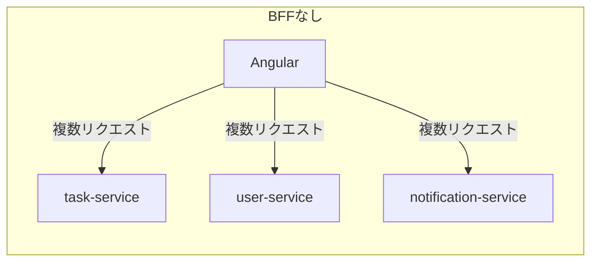
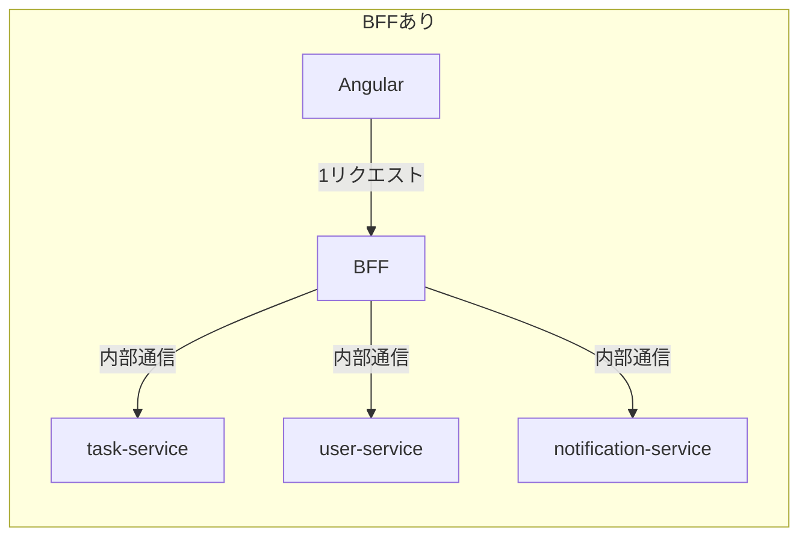
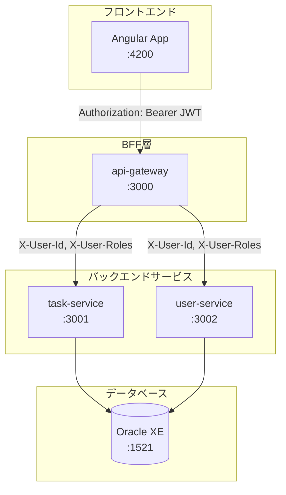
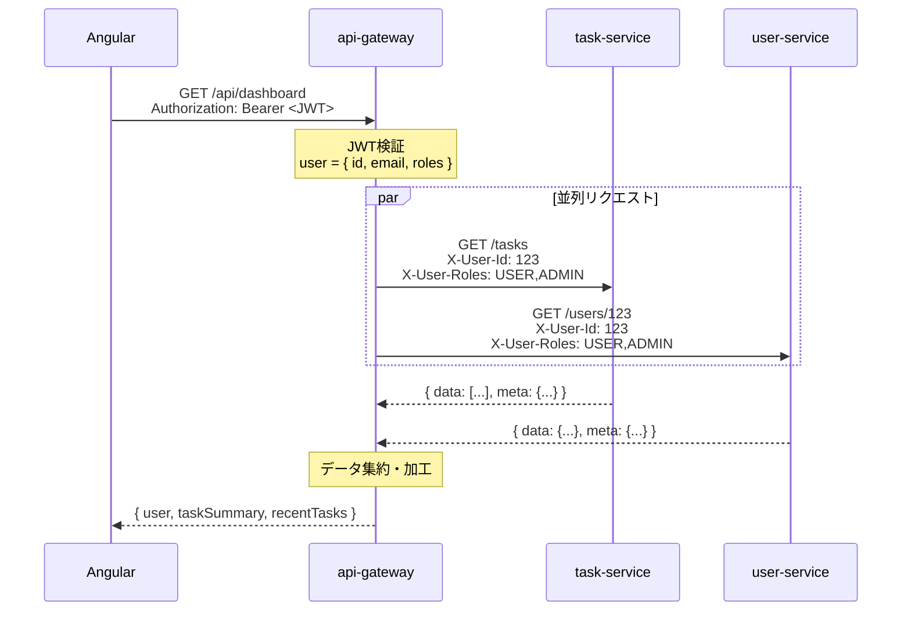
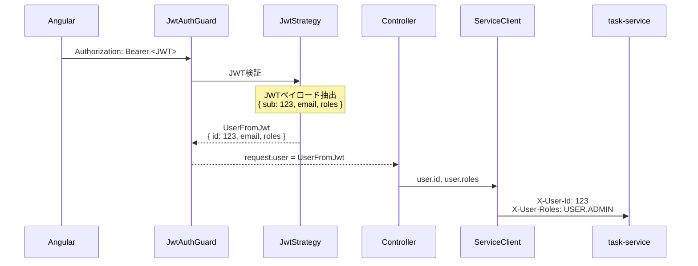
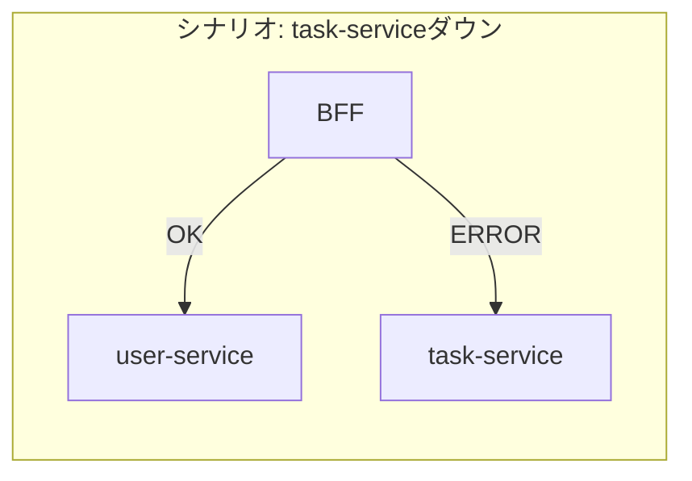
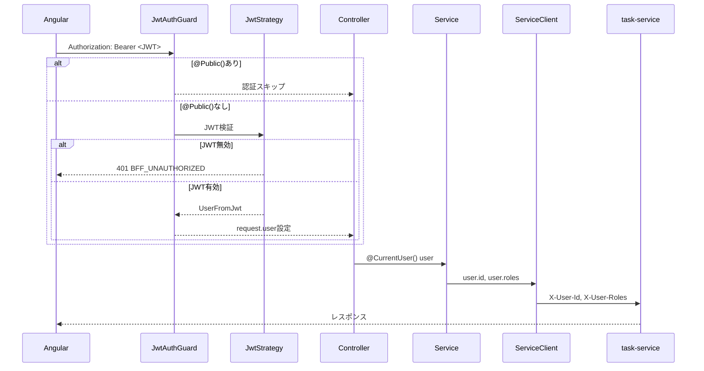

# サービス間通信（BFFパターン）

> **Note**: BFF（Backend For Frontend）は、フロントエンド専用のバックエンドサーバーを設けるアーキテクチャパターン。
> 複数のマイクロサービスを集約し、フロントエンドに最適化されたAPIを提供する。
> 本プロジェクトのapi-gatewayがBFF層に相当する。

## 目次

1. [概要](#概要)
2. [アーキテクチャ全体像](#アーキテクチャ全体像)
3. [サービスクライアントの実装](#サービスクライアントの実装)
   - [HttpModuleの設定](#httpmoduleの設定)
   - [クライアントクラスの構造](#クライアントクラスの構造)
   - [AxiosErrorのハンドリング](#axioserrorのハンドリング)
4. [認証ヘッダの伝播](#認証ヘッダの伝播)
   - [JWT検証からヘッダ生成まで](#jwt検証からヘッダ生成まで)
   - [X-User-IdとX-User-Rolesヘッダ](#x-user-idとx-user-rolesヘッダ)
   - [下流サービスでの受け取り](#下流サービスでの受け取り)
5. [Proxyパターン](#proxyパターン)
   - [薄いController/Service層](#薄いcontrollerservice層)
   - [@CurrentUser()デコレータ](#currentuserデコレータ)
6. [データ集約パターン](#データ集約パターン)
   - [Dashboardの実装](#dashboardの実装)
   - [Promise.allSettled()による並列実行](#promiseallsettledによる並列実行)
7. [部分失敗ハンドリング](#部分失敗ハンドリング)
   - [なぜ部分失敗対応が必要か](#なぜ部分失敗対応が必要か)
   - [_errorsフィールドによるエラー通知](#_errorsフィールドによるエラー通知)
8. [BFF固有のエラーハンドリング](#bff固有のエラーハンドリング)
   - [カスタム例外クラス](#カスタム例外クラス)
   - [エラーコード体系](#エラーコード体系)
9. [本プロジェクトでの実装まとめ](#本プロジェクトでの実装まとめ)
10. [まとめ](#まとめ)

---

## 概要

**BFF（Backend For Frontend）** は、フロントエンドアプリケーション専用のバックエンド層を設けるアーキテクチャパターン。

### なぜBFFが必要か





| 観点 | BFFなし | BFFあり |
|------|---------|---------|
| フロント複雑性 | 複数サービスの呼び出し管理 | 単一エンドポイント |
| ネットワーク | 複数のHTTPリクエスト（遅延大） | 1リクエスト（内部は高速） |
| 認証 | 各サービスでJWT検証 | BFFで一括検証 |
| データ変換 | フロントで加工 | BFFで最適化済み |
| 部分失敗 | 個別にエラーハンドリング | BFFで統一的に処理 |

### BFFの主な役割

1. **認証の一元化**: JWT検証をBFFで行い、内部ヘッダで伝播
2. **データ集約**: 複数サービスのデータを1レスポンスにまとめる
3. **プロトコル変換**: REST/GraphQL/gRPC間の変換
4. **部分失敗対応**: 一部サービス障害時もレスポンス返却
5. **レスポンス最適化**: フロントエンドに必要なデータのみ返す

---

## アーキテクチャ全体像

本プロジェクトのサービス構成:



### 通信フロー



### ディレクトリ構造

```
services/api-gateway/src/
├── app.module.ts                 # ルートモジュール（グローバル設定）
├── main.ts
│
├── clients/                      # サービスクライアント（共有）
│   ├── clients.module.ts
│   ├── task-service.client.ts    # task-service向けHTTPクライアント
│   └── user-service.client.ts    # user-service向けHTTPクライアント
│
├── auth/                         # 認証Proxy
│   ├── auth.controller.ts
│   ├── auth.service.ts
│   └── dto/
│
├── dashboard/                    # データ集約（BFF特有）
│   ├── dashboard.controller.ts
│   ├── dashboard.service.ts      # 複数サービス集約ロジック
│   └── dto/
│
├── projects/                     # Proxy層（薄いController/Service）
├── tasks/
├── comments/
├── tags/
├── users/
├── roles/
│
└── common/
    ├── guards/                   # JwtAuthGuard, RolesGuard
    ├── decorators/               # @CurrentUser(), @Public(), @Roles()
    ├── filters/                  # HttpExceptionFilter
    ├── interceptors/             # ResponseInterceptor
    ├── strategies/               # JwtStrategy (Passport)
    ├── exceptions/               # BFF固有例外
    └── dto/                      # 統一レスポンス型
```

---

## サービスクライアントの実装

サービスクライアントは、BFFから下流サービスへのHTTP通信を担当するクラス。

### HttpModuleの設定

NestJSでは`@nestjs/axios`パッケージでHTTPクライアントを利用する。

```typescript
// clients/clients.module.ts
import { Module } from '@nestjs/common';
import { HttpModule } from '@nestjs/axios';
import { ConfigModule, ConfigService } from '@nestjs/config';
import { TaskServiceClient } from './task-service.client';
import { UserServiceClient } from './user-service.client';

@Module({
  imports: [
    // HttpModuleの動的設定
    HttpModule.registerAsync({
      imports: [ConfigModule],
      inject: [ConfigService],
      useFactory: (configService: ConfigService) => ({
        timeout: configService.get<number>('HTTP_TIMEOUT', 5000), // デフォルト5秒
        maxRedirects: 5,
      }),
    }),
  ],
  providers: [TaskServiceClient, UserServiceClient],
  exports: [TaskServiceClient, UserServiceClient], // 他モジュールで使用可能に
})
export class ClientsModule {}
```

**設定のポイント:**
- `registerAsync()`: 環境変数から動的に設定を読み込む
- `timeout`: リクエストタイムアウト（障害検知の基準）
- `exports`: 他のモジュール（projects, tasks等）で注入可能にする

### クライアントクラスの構造

```typescript
// clients/task-service.client.ts
import { Injectable } from '@nestjs/common';
import { HttpService } from '@nestjs/axios';
import { ConfigService } from '@nestjs/config';
import { AxiosError } from 'axios';
import { firstValueFrom } from 'rxjs';
import { HttpException } from '@nestjs/common';
import {
  BffServiceUnavailableException,
  BffTimeoutException,
} from '../common/exceptions';

@Injectable()
export class TaskServiceClient {
  private readonly baseUrl: string;

  constructor(
    private readonly httpService: HttpService,
    private readonly configService: ConfigService,
  ) {
    // 環境変数からベースURL取得（開発時はデフォルト値使用）
    this.baseUrl = this.configService.get<string>(
      'TASK_SERVICE_URL',
      'http://localhost:3001',
    );
  }

  // ===========================================
  // 認証ヘッダ生成
  // ===========================================

  /**
   * 下流サービスに渡す認証ヘッダを生成
   * JWTは渡さず、検証済みのユーザー情報をヘッダで伝播
   */
  private createConfig(userId: number, roles: string[]) {
    return {
      headers: {
        'X-User-Id': String(userId),      // 数値を文字列に変換
        'X-User-Roles': roles.join(','),  // 配列をカンマ区切りに
      },
    };
  }

  // ===========================================
  // HTTPメソッド（共通化）
  // ===========================================

  private async get<T>(
    path: string,
    userId: number,
    roles: string[],
    query?: Record<string, any>,
  ): Promise<T> {
    try {
      const config = {
        ...this.createConfig(userId, roles),
        params: query,
      };
      // RxJSのObservableをPromiseに変換
      const response = await firstValueFrom(
        this.httpService.get<T>(`${this.baseUrl}${path}`, config),
      );
      return response.data;
    } catch (error) {
      this.handleError(error);
    }
  }

  private async post<T>(
    path: string,
    data: any,
    userId: number,
    roles: string[],
  ): Promise<T> {
    try {
      const response = await firstValueFrom(
        this.httpService.post<T>(
          `${this.baseUrl}${path}`,
          data,
          this.createConfig(userId, roles),
        ),
      );
      return response.data;
    } catch (error) {
      this.handleError(error);
    }
  }

  // PATCH, DELETE も同様のパターン...

  // ===========================================
  // エラーハンドリング
  // ===========================================

  private handleError(error: unknown): never {
    if (error instanceof AxiosError) {
      // タイムアウト
      if (error.code === 'ECONNABORTED' || error.code === 'ETIMEDOUT') {
        throw new BffTimeoutException('task-service');
      }

      // 接続エラー（サービスダウン）
      if (error.code === 'ECONNREFUSED' || error.code === 'ENOTFOUND') {
        throw new BffServiceUnavailableException('task-service');
      }

      // HTTPエラー（4xx, 5xx）は透過的に伝播
      if (error.response) {
        throw new HttpException(
          error.response.data,
          error.response.status,
        );
      }
    }

    // その他のエラー
    throw new BffServiceUnavailableException('task-service');
  }

  // ===========================================
  // 公開API
  // ===========================================

  // Projects
  async getProjects(userId: number, roles: string[], query?: any) {
    return this.get('/projects', userId, roles, query);
  }

  async createProject(data: any, userId: number, roles: string[]) {
    return this.post('/projects', data, userId, roles);
  }

  // Tasks
  async getTasks(userId: number, roles: string[], query?: any) {
    return this.get('/tasks', userId, roles, query);
  }

  async getTask(id: number, userId: number, roles: string[]) {
    return this.get(`/tasks/${id}`, userId, roles);
  }

  // ... その他のメソッド
}
```

### AxiosErrorのハンドリング

AxiosErrorは様々なエラー状況を表現する。適切に分類することで、クライアントに有用なエラー情報を返せる。

```typescript
import { AxiosError } from 'axios';

private handleError(error: unknown): never {
  if (error instanceof AxiosError) {
    // 1. タイムアウト
    //    - ECONNABORTED: リクエストがタイムアウト
    //    - ETIMEDOUT: 接続がタイムアウト
    if (error.code === 'ECONNABORTED' || error.code === 'ETIMEDOUT') {
      throw new BffTimeoutException('task-service');
    }

    // 2. 接続エラー（サービス到達不可）
    //    - ECONNREFUSED: 接続拒否（サービス停止）
    //    - ENOTFOUND: ホスト名解決失敗
    if (error.code === 'ECONNREFUSED' || error.code === 'ENOTFOUND') {
      throw new BffServiceUnavailableException('task-service');
    }

    // 3. HTTPエラー（レスポンスあり）
    //    - 4xx: クライアントエラー（バリデーション失敗等）
    //    - 5xx: サーバーエラー
    if (error.response) {
      // 下流サービスのエラーレスポンスをそのまま伝播
      throw new HttpException(
        error.response.data,  // エラーボディ
        error.response.status, // ステータスコード
      );
    }
  }

  // 4. その他の予期しないエラー
  throw new BffServiceUnavailableException('task-service');
}
```

| エラーコード | 状況 | BFF側の対応 |
|-------------|------|------------|
| `ECONNABORTED` | リクエストタイムアウト | 504 Gateway Timeout |
| `ETIMEDOUT` | 接続タイムアウト | 504 Gateway Timeout |
| `ECONNREFUSED` | サービス停止 | 503 Service Unavailable |
| `ENOTFOUND` | DNS解決失敗 | 503 Service Unavailable |
| HTTPエラー | 4xx/5xx応答 | そのまま伝播 |

### firstValueFrom()について

`@nestjs/axios`の`HttpService`はRxJSの`Observable`を返す。
`firstValueFrom()`で最初の値を取得してPromiseに変換する。

```typescript
import { firstValueFrom } from 'rxjs';

// Observableパターン（RxJS）
this.httpService.get('/tasks').subscribe({
  next: (response) => console.log(response.data),
  error: (err) => console.error(err),
});

// Promiseパターン（async/await）- 本プロジェクトで採用
const response = await firstValueFrom(this.httpService.get('/tasks'));
console.log(response.data);
```

**なぜPromiseパターンを採用したか:**
- NestJSのController/Serviceは`async/await`が標準的
- RxJSのストリーム処理が不要な単純なリクエスト/レスポンス
- エラーハンドリングが`try/catch`で直感的に書ける

---

## 認証ヘッダの伝播

### JWT検証からヘッダ生成まで

BFFでは、フロントエンドから受け取ったJWTを検証し、内部通信用のヘッダに変換する。



### X-User-IdとX-User-Rolesヘッダ

内部通信では、JWTを渡さずにユーザー情報をカスタムヘッダで伝播する。

```typescript
// サービスクライアントでのヘッダ生成
private createConfig(userId: number, roles: string[]) {
  return {
    headers: {
      'X-User-Id': String(userId),      // "123"
      'X-User-Roles': roles.join(','),  // "USER,ADMIN"
    },
  };
}
```

**なぜJWTを渡さないのか:**

| 観点 | JWTを渡す | カスタムヘッダ |
|------|----------|--------------|
| 検証コスト | 各サービスでJWT検証（重複） | BFFで1回のみ |
| シークレット管理 | 各サービスにシークレット配布 | BFFのみ |
| 柔軟性 | JWT形式に依存 | 任意の情報を追加可能 |
| セキュリティ | 内部でもトークン漏洩リスク | ネットワーク境界内で完結 |

**セキュリティ上の前提:**
- 内部通信はネットワーク境界内（Docker network等）で行われる
- 外部からX-User-Id/X-User-Rolesヘッダを直接送信しても無視される
- BFFがゲートウェイとして外部トラフィックを制御

### 下流サービスでの受け取り

task-service/user-serviceでは、ヘッダからユーザー情報を取得する。

```typescript
// task-service: common/decorators/current-user-id.decorator.ts
import { createParamDecorator, ExecutionContext } from '@nestjs/common';

/**
 * X-User-IdヘッダからユーザーIDを取得
 * BFFが検証済みなので、内部サービスは信頼する
 */
export const CurrentUserId = createParamDecorator(
  (data: unknown, ctx: ExecutionContext): number | undefined => {
    const request = ctx.switchToHttp().getRequest();
    const userIdHeader = request.headers['x-user-id'];

    if (!userIdHeader) {
      return undefined;
    }

    const userId = parseInt(userIdHeader, 10);
    return isNaN(userId) ? undefined : userId;
  },
);
```

```typescript
// task-service: projects/projects.controller.ts
@Controller('projects')
export class ProjectsController {
  @Post()
  create(
    @Body() dto: CreateProjectDto,
    @CurrentUserId() userId: number,  // X-User-Idから取得
  ) {
    return this.projectsService.create(dto, userId);
  }
}
```

---

## Proxyパターン

BFFのProxy層は、下流サービスへのリクエストを中継する薄いレイヤー。

### 薄いController/Service層

**設計原則**: BFFのProxy層にはビジネスロジックを置かない

```typescript
// tasks/tasks.controller.ts
@Controller('api/tasks')
export class TasksController {
  constructor(private readonly tasksService: TasksService) {}

  @Get()
  async findAll(
    @CurrentUser() user: UserFromJwt,
    @Query() query: TaskQueryDto,
  ) {
    // Serviceに委譲するだけ
    return this.tasksService.findAll(user, query);
  }

  @Get(':id')
  async findOne(
    @Param('id', ParseIntPipe) id: number,
    @CurrentUser() user: UserFromJwt,
  ) {
    return this.tasksService.findOne(id, user);
  }

  @Post()
  @HttpCode(HttpStatus.CREATED)
  async create(
    @Body() dto: CreateTaskDto,
    @CurrentUser() user: UserFromJwt,
  ) {
    return this.tasksService.create(dto, user);
  }

  @Delete(':id')
  @HttpCode(HttpStatus.NO_CONTENT)
  async delete(
    @Param('id', ParseIntPipe) id: number,
    @CurrentUser() user: UserFromJwt,
  ): Promise<void> {
    return this.tasksService.delete(id, user);
  }
}
```

```typescript
// tasks/tasks.service.ts
@Injectable()
export class TasksService {
  constructor(private readonly taskServiceClient: TaskServiceClient) {}

  async findAll(user: UserFromJwt, query: TaskQueryDto) {
    // クライアントに委譲するだけ
    return this.taskServiceClient.getTasks(user.id, user.roles, query);
  }

  async findOne(id: number, user: UserFromJwt) {
    return this.taskServiceClient.getTask(id, user.id, user.roles);
  }

  async create(dto: CreateTaskDto, user: UserFromJwt) {
    return this.taskServiceClient.createTask(dto, user.id, user.roles);
  }

  async delete(id: number, user: UserFromJwt) {
    return this.taskServiceClient.deleteTask(id, user.id, user.roles);
  }
}
```

**なぜ薄くするのか:**
- ビジネスロジックは下流サービスに集約
- BFFは「通過点」として、変換・集約に専念
- 重複ロジックを防ぎ、保守性を向上

### @CurrentUser()デコレータ

BFFでは、JWTから抽出したユーザー情報を取得するカスタムデコレータを使用。

```typescript
// common/decorators/current-user.decorator.ts
import { createParamDecorator, ExecutionContext } from '@nestjs/common';
import { UserFromJwt } from '../types';

export const CurrentUser = createParamDecorator(
  (data: keyof UserFromJwt | undefined, ctx: ExecutionContext) => {
    const request = ctx.switchToHttp().getRequest();
    const user = request.user as UserFromJwt;

    if (!user) return undefined;

    // プロパティ指定時はその値のみ返す
    if (data) {
      return user[data];  // @CurrentUser('id') → user.id
    }

    return user;  // @CurrentUser() → 全オブジェクト
  },
);
```

```typescript
// 使用例
@Get('profile')
getProfile(@CurrentUser() user: UserFromJwt) {
  // user = { id: 123, email: 'test@example.com', roles: ['USER'] }
}

@Get('my-id')
getMyId(@CurrentUser('id') userId: number) {
  // userId = 123
}
```

---

## データ集約パターン

BFFの主要な役割の一つが、複数サービスからのデータ集約。

### Dashboardの実装

ダッシュボードは、ユーザー情報・タスク・プロジェクトを1つのレスポンスにまとめる。

```typescript
// dashboard/dashboard.service.ts
@Injectable()
export class DashboardService {
  constructor(
    private readonly taskServiceClient: TaskServiceClient,
    private readonly userServiceClient: UserServiceClient,
  ) {}

  async getDashboard(user: UserFromJwt): Promise<DashboardResponse> {
    const errors: string[] = [];

    // 並列リクエスト（すべての完了を待つ）
    const [userResult, tasksResult, projectsResult] = await Promise.allSettled([
      this.userServiceClient.getUser(user.id, user.id, user.roles),
      this.taskServiceClient.getTasks(user.id, user.roles, {
        assigneeId: user.id,
      }),
      this.taskServiceClient.getProjects(user.id, user.roles, {
        ownerId: user.id,
      }),
    ]);

    // 各結果を処理（失敗時はデフォルト値）
    const userData = this.processResult(
      userResult,
      null,
      'user-service unavailable',
      errors,
    );

    const tasksData = this.processResult(
      tasksResult,
      { data: [], meta: { total: 0 } },
      'task-service unavailable',
      errors,
    );

    const projectsData = this.processResult(
      projectsResult,
      { data: [], meta: { total: 0 } },
      'task-service unavailable',
      errors,
    );

    // データ加工
    const tasks = tasksData?.data ?? [];
    const projects = projectsData?.data ?? [];

    const taskSummary = this.summarizeTasks(tasks);
    const projectSummary = this.summarizeProjects(projects, user.id);
    const recentTasks = this.extractRecentTasks(tasks, 5);

    // レスポンス構築
    const uniqueErrors = [...new Set(errors)];
    return {
      user: this.formatUserSummary(userData),
      taskSummary,
      projectSummary,
      recentTasks,
      ...(uniqueErrors.length > 0 && { _errors: uniqueErrors }),
    };
  }

  /**
   * PromiseSettledResultを処理
   * 成功時は値を返し、失敗時はデフォルト値とエラーメッセージを記録
   */
  private processResult<T>(
    result: PromiseSettledResult<T>,
    defaultValue: T,
    errorMessage: string,
    errors: string[],
  ): T {
    if (result.status === 'fulfilled') {
      return result.value;
    } else {
      errors.push(errorMessage);
      return defaultValue;
    }
  }

  private summarizeTasks(tasks: any[]): TaskSummary {
    return {
      total: tasks.length,
      todo: tasks.filter((t) => t.status === 'TODO').length,
      inProgress: tasks.filter((t) => t.status === 'IN_PROGRESS').length,
      done: tasks.filter((t) => t.status === 'DONE').length,
    };
  }

  // ... その他のヘルパーメソッド
}
```

### Promise.allSettled()による並列実行

`Promise.allSettled()`は、すべてのPromiseが完了するまで待ち、各結果を返す。

```typescript
// Promise.all() vs Promise.allSettled()

// Promise.all(): 1つでも失敗すると即座にreject
const results = await Promise.all([promise1, promise2, promise3]);
// → promise2が失敗すると、promise1, promise3の結果は失われる

// Promise.allSettled(): すべて完了まで待機
const results = await Promise.allSettled([promise1, promise2, promise3]);
// → 各結果が { status: 'fulfilled', value } または { status: 'rejected', reason }
```

**結果の型:**

```typescript
type PromiseSettledResult<T> =
  | { status: 'fulfilled'; value: T }      // 成功
  | { status: 'rejected'; reason: any };   // 失敗

// 使用例
const [result1, result2] = await Promise.allSettled([
  fetchUser(),
  fetchTasks(),
]);

if (result1.status === 'fulfilled') {
  const user = result1.value;  // 成功時の値
} else {
  const error = result1.reason; // 失敗時のエラー
}
```

---

## 部分失敗ハンドリング

### なぜ部分失敗対応が必要か

マイクロサービス環境では、一部のサービスが障害を起こしても、他のサービスは正常に動作している可能性がある。



| アプローチ | 動作 | ユーザー体験 |
|-----------|------|-------------|
| **全体失敗** | 1つでもエラーなら500 | 画面全体が表示不可 |
| **部分失敗** | 取得できたデータで応答 | 一部機能が使用可能 |

### _errorsフィールドによるエラー通知

部分失敗時は、HTTP 200で応答しつつ、`_errors`フィールドでエラーを通知する。

```typescript
// dashboard/dto/dashboard-response.dto.ts
export interface DashboardResponse {
  user: UserSummary | null;
  taskSummary: TaskSummary;
  projectSummary: ProjectSummary;
  recentTasks: RecentTask[];
  _errors?: string[];  // 部分失敗時のエラーメッセージ
}
```

**正常時のレスポンス:**

```json
{
  "data": {
    "user": { "id": 123, "displayName": "John" },
    "taskSummary": { "total": 10, "todo": 3, "inProgress": 5, "done": 2 },
    "projectSummary": { "total": 2, "owned": 1, "participating": 1 },
    "recentTasks": [...]
  },
  "meta": { "timestamp": "2026-01-29T10:00:00Z" }
}
```

**部分失敗時のレスポンス:**

```json
{
  "data": {
    "user": { "id": 123, "displayName": "John" },
    "taskSummary": { "total": 0, "todo": 0, "inProgress": 0, "done": 0 },
    "projectSummary": { "total": 0, "owned": 0, "participating": 0 },
    "recentTasks": [],
    "_errors": ["task-service unavailable"]
  },
  "meta": { "timestamp": "2026-01-29T10:00:00Z" }
}
```

**フロントエンド側の処理:**

```typescript
// Angular: dashboard.component.ts
ngOnInit() {
  this.dashboardService.getDashboard().subscribe({
    next: (response) => {
      this.dashboard = response.data;

      // 部分失敗の通知
      if (response.data._errors?.length) {
        this.showWarning('一部のデータを取得できませんでした');
      }
    },
    error: (err) => {
      // 完全失敗（BFF自体のエラー）
      this.showError('ダッシュボードを読み込めませんでした');
    },
  });
}
```

---

## BFF固有のエラーハンドリング

### カスタム例外クラス

BFF層専用の例外クラスを定義し、エラーコードを統一する。

```typescript
// common/exceptions/bff.exception.ts
import {
  UnauthorizedException,
  ForbiddenException,
  ServiceUnavailableException,
  GatewayTimeoutException,
} from '@nestjs/common';

/**
 * BFF認証エラー
 * JWTが無効または欠落している場合
 */
export class BffUnauthorizedException extends UnauthorizedException {
  constructor(message: string = 'Unauthorized') {
    super({ code: 'BFF_UNAUTHORIZED', message });
  }
}

/**
 * BFF認可エラー
 * 権限不足の場合
 */
export class BffForbiddenException extends ForbiddenException {
  constructor(message: string = 'Forbidden') {
    super({ code: 'BFF_FORBIDDEN', message });
  }
}

/**
 * 下流サービス利用不可
 * サービスがダウンしている場合
 */
export class BffServiceUnavailableException extends ServiceUnavailableException {
  constructor(serviceName: string) {
    super({
      code: 'BFF_SERVICE_UNAVAILABLE',
      message: `${serviceName} is unavailable`,
    });
  }
}

/**
 * 下流サービスタイムアウト
 * リクエストがタイムアウトした場合
 */
export class BffTimeoutException extends GatewayTimeoutException {
  constructor(serviceName: string) {
    super({
      code: 'BFF_TIMEOUT',
      message: `${serviceName} request timed out`,
    });
  }
}
```

### エラーコード体系

本プロジェクトのエラーコード規則:

```
[サービス]_[エンティティ]_[エラー種別]
```

| エラーコード | 説明 | HTTPステータス |
|-------------|------|---------------|
| `BFF_UNAUTHORIZED` | JWT無効/欠落 | 401 |
| `BFF_FORBIDDEN` | 権限不足 | 403 |
| `BFF_VALIDATION_ERROR` | バリデーションエラー | 400 |
| `BFF_SERVICE_UNAVAILABLE` | 下流サービスダウン | 503 |
| `BFF_TIMEOUT` | 下流サービスタイムアウト | 504 |
| `TASK_PROJECT_NOT_FOUND` | プロジェクト未存在 | 404 |
| `USER_USER_NOT_FOUND` | ユーザー未存在 | 404 |

**HttpExceptionFilterでの処理:**

```typescript
// common/filters/http-exception.filter.ts
@Catch(HttpException)
export class HttpExceptionFilter implements ExceptionFilter {
  catch(exception: HttpException, host: ArgumentsHost) {
    const ctx = host.switchToHttp();
    const response = ctx.getResponse<Response>();
    const status = exception.getStatus();

    const { code, message } = this.extractErrorInfo(exception, status);

    // 統一形式でレスポンス
    const errorResponse = new ErrorResponse(code, message);
    response.status(status).json(errorResponse);
  }

  private extractErrorInfo(
    exception: HttpException,
    status: number,
  ): { code: string; message: string } {
    const exceptionResponse = exception.getResponse();

    // カスタムエラーコードがあればそのまま使用
    if (typeof exceptionResponse === 'object' && 'code' in exceptionResponse) {
      return {
        code: (exceptionResponse as any).code,
        message: this.extractMessage(exceptionResponse),
      };
    }

    // デフォルトエラーコード
    return {
      code: this.getDefaultErrorCode(status),
      message: this.extractMessage(exceptionResponse),
    };
  }

  private getDefaultErrorCode(status: number): string {
    const codeMap: Record<number, string> = {
      400: 'BFF_VALIDATION_ERROR',
      401: 'BFF_UNAUTHORIZED',
      403: 'BFF_FORBIDDEN',
      404: 'BFF_NOT_FOUND',
      500: 'BFF_INTERNAL_ERROR',
    };
    return codeMap[status] ?? 'BFF_UNKNOWN_ERROR';
  }
}
```

---

## 本プロジェクトでの実装まとめ

### ファイル一覧

| ファイル | 役割 |
|---------|------|
| `clients/clients.module.ts` | HttpModule設定、クライアント提供 |
| `clients/task-service.client.ts` | task-service向けHTTPクライアント |
| `clients/user-service.client.ts` | user-service向けHTTPクライアント |
| `dashboard/dashboard.service.ts` | データ集約、部分失敗対応 |
| `common/guards/jwt-auth.guard.ts` | JWT検証、@Public()対応 |
| `common/guards/roles.guard.ts` | ロールベース認可 |
| `common/decorators/current-user.decorator.ts` | JWTユーザー情報取得 |
| `common/exceptions/bff.exception.ts` | BFF固有例外クラス |
| `common/filters/http-exception.filter.ts` | エラーレスポンス統一 |

### 認証フロー



### グローバル設定

```typescript
// app.module.ts
@Module({
  imports: [
    ConfigModule.forRoot({ isGlobal: true }),
    ClientsModule,  // サービスクライアント共有
    AuthModule,
    DashboardModule,
    ProjectsModule,
    TasksModule,
    // ...
  ],
  providers: [
    // グローバルガード（順序重要）
    { provide: APP_GUARD, useClass: JwtAuthGuard },   // 1. 認証
    { provide: APP_GUARD, useClass: RolesGuard },     // 2. 認可

    // グローバルフィルター
    { provide: APP_FILTER, useClass: HttpExceptionFilter },

    // グローバルインターセプター
    { provide: APP_INTERCEPTOR, useClass: ResponseInterceptor },
  ],
})
export class AppModule {}
```

---

## まとめ

### BFFパターンの要点

| 項目 | 内容 |
|------|------|
| **目的** | フロントエンド専用のバックエンドを提供 |
| **認証** | BFFでJWT検証、内部はカスタムヘッダで伝播 |
| **Proxy層** | ビジネスロジックは下流に委譲、BFFは薄く |
| **データ集約** | `Promise.allSettled()`で並列取得、1レスポンスに統合 |
| **部分失敗** | 一部障害でも応答可能、`_errors`で通知 |
| **エラーコード** | `BFF_*`プレフィックスで統一 |

### サービスクライアント設計

| 項目 | 実装 |
|------|------|
| HTTPライブラリ | `@nestjs/axios`（RxJS → `firstValueFrom()`でPromise化） |
| タイムアウト | `HTTP_TIMEOUT`環境変数（デフォルト5秒） |
| ヘッダ伝播 | `X-User-Id`, `X-User-Roles` |
| エラー分類 | タイムアウト / 接続エラー / HTTPエラー |

### 参照ファイル

- サービスクライアント: `services/api-gateway/src/clients/`
- ダッシュボード: `services/api-gateway/src/dashboard/dashboard.service.ts`
- BFF例外: `services/api-gateway/src/common/exceptions/bff.exception.ts`
- API設計書: `docs/design/api-gateway-api.md`
