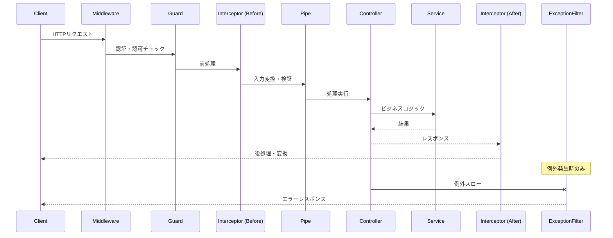
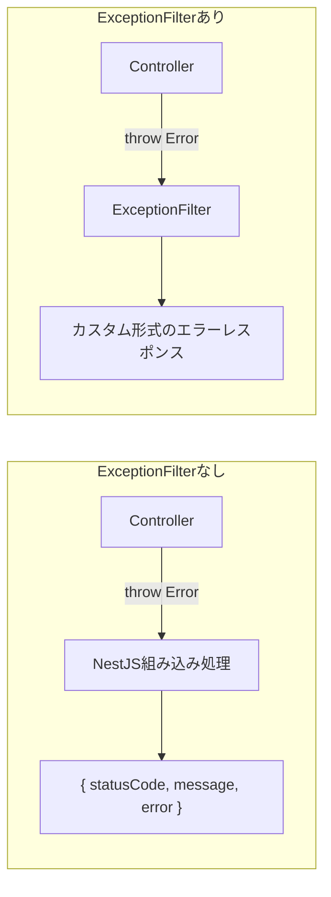
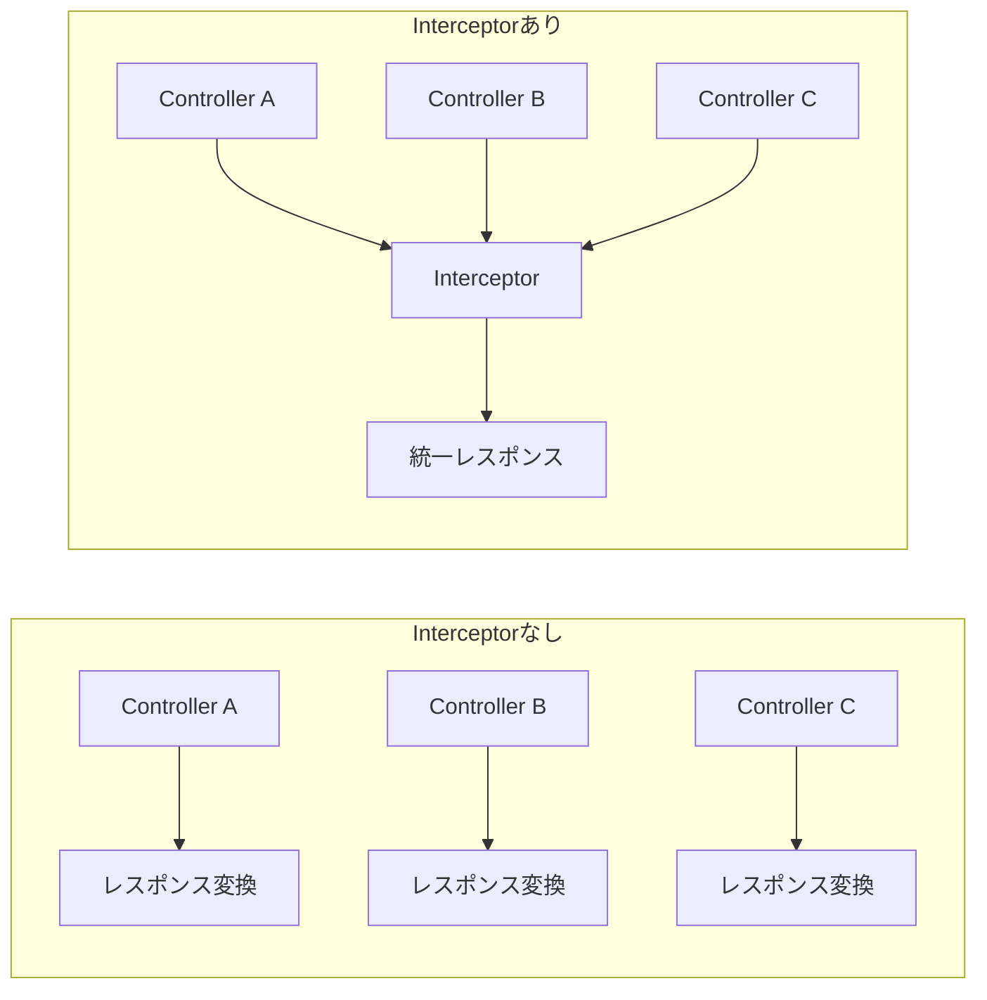
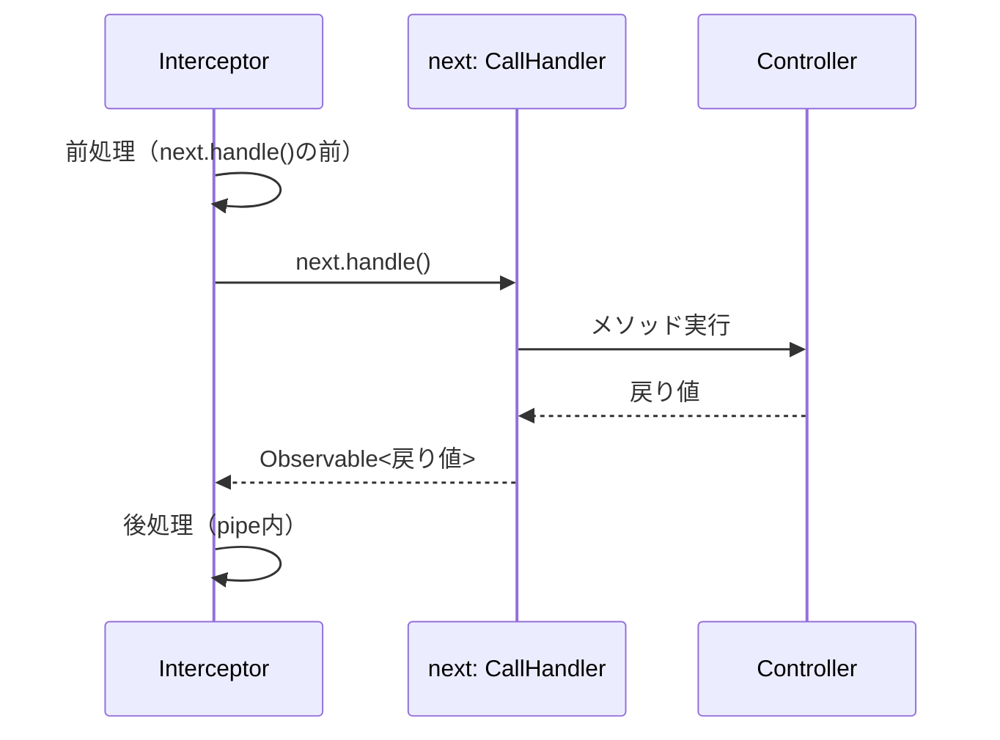
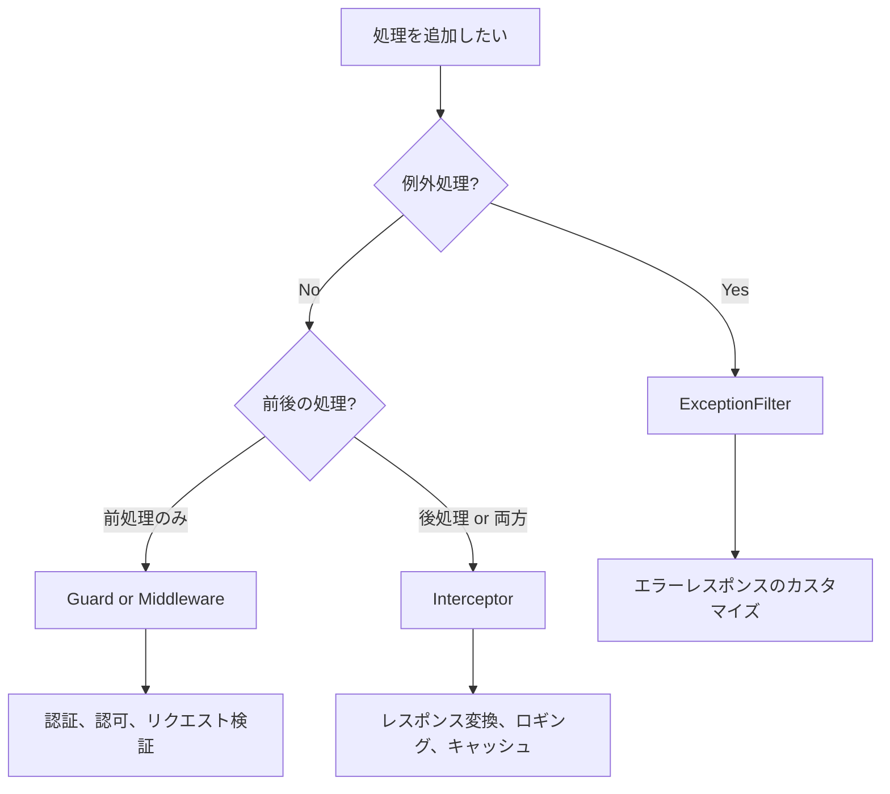

# ExceptionFilter と Interceptor

> **Note**: NestJSにおける「Filter」は**ExceptionFilter専用**である。
> 他フレームワーク（ASP.NET Core等）のようにAuthorization FilterやAction Filterといった種類は存在しない。
> 認証・認可はGuard、前後処理はInterceptor、入力検証はPipeが担当する。

## 目次

1. [概要](#概要)
2. [リクエストライフサイクル](#リクエストライフサイクル)
3. [ExceptionFilter](#exceptionfilter)
   - [ExceptionFilterとは](#exceptionfilterとは)
   - [@Catchデコレータ](#catchデコレータ)
   - [ArgumentsHost](#argumentshost)
   - [組み込み例外クラス](#組み込み例外クラス)
   - [カスタムExceptionFilter](#カスタムexceptionfilter)
   - [フィルターの適用スコープ](#フィルターの適用スコープ)
4. [Interceptor](#interceptor)
   - [Interceptorとは](#interceptorとは)
   - [ExecutionContext](#executioncontext)
   - [CallHandler](#callhandler)
   - [RxJSオペレータとの連携](#rxjsオペレータとの連携)
   - [Interceptorの適用スコープ](#interceptorの適用スコープ)
5. [Filter vs Interceptor](#filter-vs-interceptor)
6. [本プロジェクトでの実装例](#本プロジェクトでの実装例)
7. [まとめ](#まとめ)

---

## 概要

NestJSの**ExceptionFilter**と**Interceptor**は、リクエスト/レスポンスの処理フローに介入する仕組み。
横断的関心事（エラーハンドリング、ロギング、レスポンス変換など）をControllerから分離できる。

| 機能 | 目的 | 実行タイミング |
|------|------|---------------|
| **ExceptionFilter** | 例外のキャッチとエラーレスポンス生成 | 例外発生時 |
| **Interceptor** | リクエスト/レスポンスの加工・変換 | Controller実行の前後 |

> **Pipe**（入力の変換・検証）と**Guard**（認証・認可）については、それぞれ別の資料で解説。

## リクエストライフサイクル

NestJSでリクエストが処理される流れを理解することが重要。
各コンポーネントがどの順序で実行されるかを把握しておくと、適切な実装場所を選択できる。



### 実行順序

```
リクエスト受信
    ↓
Middleware（Express互換のミドルウェア）
    ↓
Guard（認証・認可）→ 拒否なら403等を返す
    ↓
Interceptor（前処理）
    ↓
Pipe（入力変換・検証）→ 検証失敗なら400を返す
    ↓
Controller + Service
    ↓
Interceptor（後処理）
    ↓
レスポンス送信

※ 途中で例外が発生 → ExceptionFilterがキャッチ
```

### 各コンポーネントの責務

| コンポーネント | 責務 | 例 |
|--------------|------|-----|
| **Middleware** | リクエストの前処理全般 | ロギング、CORS、セッション |
| **Guard** | アクセス可否の判定 | JWT検証、ロールチェック |
| **Interceptor** | リクエスト/レスポンスの加工 | レスポンス変換、タイムアウト |
| **Pipe** | 入力の変換・検証 | 型変換、バリデーション |
| **ExceptionFilter** | 例外のハンドリング | エラーレスポンス生成 |

### Middleware vs Interceptor

MiddlewareとInterceptorは似ているが、**異なるコンポーネント**である。

| 観点 | Middleware | Interceptor |
|------|-----------|-------------|
| **由来** | Express由来（フレームワーク非依存） | NestJS固有（AOPパターン） |
| **実行タイミング** | 最初（Guard/Pipe/Interceptorより前） | Guard後、Controller前後 |
| **アクセス対象** | `req`, `res`, `next` のみ | `ExecutionContext`（Controller/Handler情報） |
| **レスポンス変換** | 困難 | 容易（RxJS `map`で変換） |
| **Controllerの情報** | 取得不可 | 取得可能（どのController/メソッドか） |

**Middleware**（リクエストログ）

```typescript
@Injectable()
export class LoggerMiddleware implements NestMiddleware {
  use(req: Request, res: Response, next: NextFunction) {
    // Controllerの情報は取得できない
    console.log(`${req.method} ${req.url}`);
    next();
  }
}
```

**Interceptor**（リクエストログ）

```typescript
@Injectable()
export class LoggingInterceptor implements NestInterceptor {
  intercept(context: ExecutionContext, next: CallHandler) {
    // Controllerの情報を取得できる
    const controller = context.getClass().name;
    const handler = context.getHandler().name;
    console.log(`${controller}.${handler}()`);

    return next.handle();
  }
}
```

**使い分けの指針**

| ユースケース | 選択 | 理由 |
|-------------|------|------|
| CORS、セッション管理 | Middleware | Express互換ライブラリが使える |
| リクエストログ（単純） | Middleware | Controller情報不要なら軽量 |
| リクエストログ（詳細） | Interceptor | Controller/メソッド名が欲しい場合 |
| レスポンス変換 | Interceptor | Middlewareでは困難 |
| 処理時間の計測 | Interceptor | 前後で時刻を比較できる |

## ExceptionFilter

### ExceptionFilterとは

ExceptionFilterは、アプリケーション内で発生した例外をキャッチし、
クライアントへ返すエラーレスポンスを制御する仕組み。

**なぜ必要か**



| 観点 | デフォルト | ExceptionFilter使用 |
|------|----------|-------------------|
| レスポンス形式 | NestJS標準形式 | 自由にカスタマイズ可能 |
| ロギング | なし | エラーログを記録可能 |
| エラーコード | statusCodeのみ | 独自のエラーコード体系 |
| 外部通知 | なし | Slack/メール通知等 |

### @Catchデコレータ

`@Catch()`デコレータで、キャッチする例外の種類を指定する。

```typescript
import { ExceptionFilter, Catch, ArgumentsHost, HttpException } from '@nestjs/common';

// HttpExceptionをキャッチするフィルター
@Catch(HttpException)
export class HttpExceptionFilter implements ExceptionFilter {
  catch(exception: HttpException, host: ArgumentsHost) {
    // エラー処理
  }
}

// すべての例外をキャッチするフィルター
@Catch()
export class AllExceptionsFilter implements ExceptionFilter {
  catch(exception: unknown, host: ArgumentsHost) {
    // あらゆる例外を処理
  }
}

// 複数の例外型をキャッチ
@Catch(HttpException, TypeError)
export class MultiExceptionFilter implements ExceptionFilter {
  catch(exception: HttpException | TypeError, host: ArgumentsHost) {
    // 複数種類の例外を処理
  }
}
```

**@Catchの引数パターン**

| パターン | 動作 | 用途 |
|---------|------|------|
| `@Catch(HttpException)` | HttpExceptionのみキャッチ | HTTP関連エラー |
| `@Catch(NotFoundException)` | 特定の例外のみキャッチ | 404専用処理 |
| `@Catch()` | すべての例外をキャッチ | 最後の砦として |
| `@Catch(TypeA, TypeB)` | 複数種類をキャッチ | 関連する例外をまとめて処理 |

### ArgumentsHost

`ArgumentsHost`は、現在の実行コンテキストに関する情報を提供する。
HTTPリクエスト、WebSocket、マイクロサービスなど、異なる実行環境に対応できる。

```typescript
@Catch(HttpException)
export class HttpExceptionFilter implements ExceptionFilter {
  catch(exception: HttpException, host: ArgumentsHost) {
    // 実行コンテキストの種類を取得
    const contextType = host.getType(); // 'http' | 'ws' | 'rpc'

    // HTTPコンテキストに切り替え
    const ctx = host.switchToHttp();

    // Request/Responseオブジェクトを取得
    const request = ctx.getRequest<Request>();
    const response = ctx.getResponse<Response>();

    // リクエスト情報を利用
    console.log(`[ERROR] ${request.method} ${request.url}`);

    // レスポンスを返す
    response.status(exception.getStatus()).json({
      statusCode: exception.getStatus(),
      message: exception.message,
      path: request.url,
    });
  }
}
```

**ArgumentsHostのメソッド**

| メソッド | 戻り値 | 用途 |
|---------|--------|------|
| `getType()` | `'http' \| 'ws' \| 'rpc'` | 実行コンテキストの種類判定 |
| `switchToHttp()` | `HttpArgumentsHost` | HTTP用のコンテキストに切り替え |
| `switchToWs()` | `WsArgumentsHost` | WebSocket用に切り替え |
| `switchToRpc()` | `RpcArgumentsHost` | マイクロサービス用に切り替え |

**HttpArgumentsHostのメソッド**

| メソッド | 戻り値 | 用途 |
|---------|--------|------|
| `getRequest<T>()` | `T`（Express: Request） | リクエストオブジェクト取得 |
| `getResponse<T>()` | `T`（Express: Response） | レスポンスオブジェクト取得 |
| `getNext()` | NextFunction | 次のハンドラー（※Middleware用。Filter/Interceptorでは使用しない） |

### 組み込み例外クラス

NestJSには、よく使うHTTPエラーに対応した例外クラスが用意されている。
これらをスローすると、対応するHTTPステータスコードが自動的に設定される。

```typescript
import {
  BadRequestException,      // 400
  UnauthorizedException,    // 401
  ForbiddenException,       // 403
  NotFoundException,        // 404
  ConflictException,        // 409
  InternalServerErrorException, // 500
} from '@nestjs/common';

// 使用例
throw new NotFoundException('Project not found');
throw new BadRequestException('Invalid input');
throw new UnauthorizedException('Authentication required');
```

**主要な組み込み例外**

| 例外クラス | ステータス | 用途 |
|-----------|----------|------|
| `BadRequestException` | 400 | リクエスト形式エラー |
| `UnauthorizedException` | 401 | 認証エラー |
| `ForbiddenException` | 403 | 権限エラー |
| `NotFoundException` | 404 | リソースが存在しない |
| `MethodNotAllowedException` | 405 | HTTPメソッドが許可されていない |
| `ConflictException` | 409 | データ競合（重複など） |
| `GoneException` | 410 | リソースが恒久的に削除された |
| `PayloadTooLargeException` | 413 | リクエストボディが大きすぎる |
| `UnsupportedMediaTypeException` | 415 | Content-Typeが未対応 |
| `InternalServerErrorException` | 500 | サーバー内部エラー |
| `NotImplementedException` | 501 | 未実装 |
| `BadGatewayException` | 502 | 外部サービスエラー |
| `ServiceUnavailableException` | 503 | サービス一時停止中 |
| `GatewayTimeoutException` | 504 | 外部サービスタイムアウト |

**カスタムレスポンスを渡す方法**

```typescript
// 文字列メッセージ
throw new NotFoundException('Project not found');
// → { statusCode: 404, message: 'Project not found', error: 'Not Found' }

// オブジェクトでカスタムレスポンス
throw new BadRequestException({
  code: 'VALIDATION_ERROR',
  message: 'Name is required',
  details: ['name should not be empty'],
});
// → { code: 'VALIDATION_ERROR', message: 'Name is required', details: [...] }
```

### カスタムExceptionFilter

プロジェクト独自のエラーレスポンス形式を実現するには、カスタムExceptionFilterを作成する。

**基本的なカスタムFilter**

```typescript
import {
  ExceptionFilter,
  Catch,
  ArgumentsHost,
  HttpException,
  HttpStatus,
} from '@nestjs/common';
import { Response, Request } from 'express';

@Catch(HttpException)
export class HttpExceptionFilter implements ExceptionFilter {
  catch(exception: HttpException, host: ArgumentsHost) {
    const ctx = host.switchToHttp();
    const response = ctx.getResponse<Response>();
    const request = ctx.getRequest<Request>();
    const status = exception.getStatus();

    // カスタム形式でレスポンス
    response.status(status).json({
      error: {
        code: this.getErrorCode(status),
        message: exception.message,
      },
      meta: {
        timestamp: new Date().toISOString(),
        path: request.url,
      },
    });
  }

  private getErrorCode(status: number): string {
    switch (status) {
      case HttpStatus.BAD_REQUEST: return 'VALIDATION_ERROR';
      case HttpStatus.NOT_FOUND: return 'NOT_FOUND';
      case HttpStatus.FORBIDDEN: return 'FORBIDDEN';
      default: return 'INTERNAL_ERROR';
    }
  }
}
```

**ロギング付きFilter**

```typescript
import { Logger } from '@nestjs/common';

@Catch()
export class AllExceptionsFilter implements ExceptionFilter {
  private readonly logger = new Logger(AllExceptionsFilter.name);

  catch(exception: unknown, host: ArgumentsHost) {
    const ctx = host.switchToHttp();
    const response = ctx.getResponse<Response>();
    const request = ctx.getRequest<Request>();

    const status = exception instanceof HttpException
      ? exception.getStatus()
      : HttpStatus.INTERNAL_SERVER_ERROR;

    const message = exception instanceof Error
      ? exception.message
      : 'Unknown error';

    // エラーログを出力
    this.logger.error(
      `${request.method} ${request.url} - ${status} - ${message}`,
      exception instanceof Error ? exception.stack : undefined,
    );

    response.status(status).json({
      statusCode: status,
      message,
      timestamp: new Date().toISOString(),
    });
  }
}
```

### フィルターの適用スコープ

ExceptionFilterは3つのレベルで適用できる。

**1. グローバルスコープ**

```typescript
// main.ts
async function bootstrap() {
  const app = await NestFactory.create(AppModule);

  // 方法1: インスタンスを直接渡す（DIなし）
  app.useGlobalFilters(new HttpExceptionFilter());

  await app.listen(3000);
}
```

```typescript
// 方法2: DIコンテナ経由（他のServiceを注入可能）
// app.module.ts
import { APP_FILTER } from '@nestjs/core';

@Module({
  providers: [
    {
      provide: APP_FILTER,
      useClass: HttpExceptionFilter,
    },
  ],
})
export class AppModule {}
```

**2. コントローラースコープ**

```typescript
@Controller('projects')
@UseFilters(HttpExceptionFilter) // このController全体に適用
export class ProjectController {
  // ...
}
```

**3. メソッドスコープ**

```typescript
@Controller('projects')
export class ProjectController {
  @Post()
  @UseFilters(HttpExceptionFilter) // このメソッドのみに適用
  async create(@Body() dto: CreateProjectDto) {
    // ...
  }
}
```

**適用スコープの使い分け**

| スコープ | 用途 | 例 |
|---------|------|-----|
| グローバル | アプリ全体で統一したエラー形式 | 共通のErrorResponse形式 |
| コントローラー | 特定のコントローラーだけ特殊処理 | 外部API連携用のエラー変換 |
| メソッド | 特定のエンドポイントだけ特殊処理 | ファイルアップロードのエラー |

## Interceptor

### Interceptorとは

Interceptorは、Controller実行の**前後**に処理を挿入できる仕組み。
AOP（アスペクト指向プログラミング）のパターンを実現する。

**なぜ必要か**



| 観点 | Interceptorなし | Interceptorあり |
|------|----------------|----------------|
| コード重複 | 各Controllerで同じ処理 | 1箇所に集約 |
| 保守性 | 変更時に複数箇所を修正 | 1箇所の修正で済む |
| テスト | Controllerごとにテスト | Interceptorを単体テスト |

**Interceptorでできること**

- Controllerメソッド実行前後に追加ロジックを実行
- Controllerメソッドの戻り値を変換
- Controllerメソッドから投げられた例外を変換
- 基本的な機能を拡張
- 特定の条件に基づいて機能をオーバーライド（キャッシュなど）

### ExecutionContext

`ExecutionContext`は、`ArgumentsHost`を拡張したクラスで、
現在実行中のメソッドに関する追加情報を提供する。

```typescript
import {
  Injectable,
  NestInterceptor,
  ExecutionContext,
  CallHandler,
} from '@nestjs/common';

@Injectable()
export class LoggingInterceptor implements NestInterceptor {
  intercept(context: ExecutionContext, next: CallHandler) {
    // ArgumentsHostと同じメソッド
    const ctx = context.switchToHttp();
    const request = ctx.getRequest();

    // ExecutionContext固有のメソッド
    const controller = context.getClass();        // コントローラークラス
    const handler = context.getHandler();          // ハンドラーメソッド
    const controllerName = controller.name;        // "ProjectController"
    const methodName = handler.name;               // "findAll"

    console.log(`Calling ${controllerName}.${methodName}`);

    return next.handle();
  }
}
```

**ExecutionContext固有のメソッド**

| メソッド | 戻り値 | 用途 |
|---------|--------|------|
| `getClass()` | `Type<any>` | コントローラークラスの参照 |
| `getHandler()` | `Function` | ハンドラーメソッドの参照 |

**メタデータの取得**

```typescript
import { Reflector } from '@nestjs/core';

@Injectable()
export class RolesInterceptor implements NestInterceptor {
  constructor(private reflector: Reflector) {}

  intercept(context: ExecutionContext, next: CallHandler) {
    // @SetMetadata('roles', ['admin'])で設定したメタデータを取得
    const roles = this.reflector.get<string[]>('roles', context.getHandler());
    console.log('Required roles:', roles);

    return next.handle();
  }
}
```

### CallHandler

`CallHandler`は、Interceptor内で次の処理（Controller）を呼び出すためのインターフェース。
`handle()`メソッドを呼び出すと、Controllerメソッドが実行される。

```typescript
@Injectable()
export class TimingInterceptor implements NestInterceptor {
  intercept(context: ExecutionContext, next: CallHandler): Observable<any> {
    const start = Date.now();

    // next.handle() でControllerを実行
    // 戻り値はObservable
    return next.handle().pipe(
      tap(() => {
        const elapsed = Date.now() - start;
        console.log(`Execution time: ${elapsed}ms`);
      }),
    );
  }
}
```

**処理の流れ**



**next.handle()を呼ばない場合**

`next.handle()`を呼ばなければ、Controllerは実行されない。
これを利用してキャッシュなどを実装できる。

```typescript
@Injectable()
export class CacheInterceptor implements NestInterceptor {
  constructor(private cache: Map<string, any>) {}

  intercept(context: ExecutionContext, next: CallHandler) {
    const request = context.switchToHttp().getRequest();
    const key = request.url;

    // キャッシュがあれば、Controllerを実行せずに返す
    if (this.cache.has(key)) {
      return of(this.cache.get(key));
    }

    // キャッシュがなければControllerを実行
    return next.handle().pipe(
      tap(response => this.cache.set(key, response)),
    );
  }
}
```

### RxJSオペレータとの連携

Interceptorは`Observable`を返すため、RxJSオペレータを使って様々な処理が可能。

**よく使うオペレータ**

| オペレータ | 用途 | 例 |
|-----------|------|-----|
| `map` | レスポンスを変換 | データをラップ |
| `tap` | 副作用（ログなど） | 処理時間の計測 |
| `catchError` | エラーハンドリング | エラー変換 |
| `timeout` | タイムアウト設定 | 処理時間制限 |
| `finalize` | 終了時処理 | リソース解放 |

**map: レスポンス変換**

```typescript
import { map } from 'rxjs/operators';

@Injectable()
export class TransformInterceptor implements NestInterceptor {
  intercept(context: ExecutionContext, next: CallHandler) {
    return next.handle().pipe(
      // Controllerの戻り値を変換
      map(data => ({
        data,
        meta: { timestamp: new Date().toISOString() },
      })),
    );
  }
}
```

**tap: 副作用（ロギング）**

```typescript
import { tap } from 'rxjs/operators';

@Injectable()
export class LoggingInterceptor implements NestInterceptor {
  private readonly logger = new Logger(LoggingInterceptor.name);

  intercept(context: ExecutionContext, next: CallHandler) {
    const request = context.switchToHttp().getRequest();
    const { method, url } = request;
    const now = Date.now();

    return next.handle().pipe(
      tap({
        next: (data) => {
          // 成功時のログ
          this.logger.log(`${method} ${url} - ${Date.now() - now}ms`);
        },
        error: (error) => {
          // エラー時のログ
          this.logger.error(`${method} ${url} - ${error.message}`);
        },
      }),
    );
  }
}
```

**catchError: エラー変換**

```typescript
import { catchError } from 'rxjs/operators';
import { throwError } from 'rxjs';

@Injectable()
export class ErrorTransformInterceptor implements NestInterceptor {
  intercept(context: ExecutionContext, next: CallHandler) {
    return next.handle().pipe(
      catchError(error => {
        // 特定のエラーを別のエラーに変換
        if (error.code === 'ECONNREFUSED') {
          return throwError(() => new ServiceUnavailableException('Service is down'));
        }
        return throwError(() => error);
      }),
    );
  }
}
```

**timeout: タイムアウト**

```typescript
import { timeout, catchError } from 'rxjs/operators';
import { TimeoutError, throwError } from 'rxjs';

@Injectable()
export class TimeoutInterceptor implements NestInterceptor {
  intercept(context: ExecutionContext, next: CallHandler) {
    return next.handle().pipe(
      timeout(5000), // 5秒でタイムアウト
      catchError(error => {
        if (error instanceof TimeoutError) {
          return throwError(() =>
            new GatewayTimeoutException('Request timeout'),
          );
        }
        return throwError(() => error);
      }),
    );
  }
}
```

### Interceptorの適用スコープ

ExceptionFilterと同様、3つのレベルで適用できる。

**1. グローバルスコープ**

```typescript
// main.ts
async function bootstrap() {
  const app = await NestFactory.create(AppModule);

  // 方法1: インスタンスを直接渡す
  app.useGlobalInterceptors(new ResponseInterceptor());

  await app.listen(3000);
}
```

```typescript
// 方法2: DIコンテナ経由
// app.module.ts
import { APP_INTERCEPTOR } from '@nestjs/core';

@Module({
  providers: [
    {
      provide: APP_INTERCEPTOR,
      useClass: ResponseInterceptor,
    },
  ],
})
export class AppModule {}
```

**2. コントローラースコープ**

```typescript
@Controller('projects')
@UseInterceptors(LoggingInterceptor) // このController全体に適用
export class ProjectController {
  // ...
}
```

**3. メソッドスコープ**

```typescript
@Controller('projects')
export class ProjectController {
  @Get()
  @UseInterceptors(CacheInterceptor) // このメソッドのみに適用
  async findAll() {
    // ...
  }
}
```

**複数のInterceptorの実行順序**

```typescript
@UseInterceptors(InterceptorA, InterceptorB)
async method() { }
```

```
リクエスト時:  InterceptorA → InterceptorB → Controller
レスポンス時: Controller → InterceptorB → InterceptorA
```

## Filter vs Interceptor

### 機能の比較

| 観点 | ExceptionFilter | Interceptor |
|------|----------------|-------------|
| **実行タイミング** | 例外発生時のみ | Controller前後 |
| **主な用途** | エラーハンドリング | 横断的関心事 |
| **レスポンス制御** | エラーレスポンスのみ | 成功/エラー両方 |
| **Controllerへのアクセス** | なし | ExecutionContextで可能 |
| **RxJSとの親和性** | 低い | 高い |

### 使い分けの指針



| ユースケース | 適切な選択 | 理由 |
|-------------|-----------|------|
| 統一エラーレスポンス | **ExceptionFilter** | 例外時のみ動作 |
| レスポンス形式の統一 | **Interceptor** | 成功時のレスポンス変換 |
| 処理時間の計測 | **Interceptor** | 前後の時刻を比較 |
| 認証チェック | Guard | 専用機能がある |
| リクエストログ | Middleware or Interceptor | どちらでも可能 |

## 本プロジェクトでの実装例

### HttpExceptionFilter

`services/task-service/src/common/filters/http-exception.filter.ts`

全エンドポイントで発生するHttpExceptionをキャッチし、
CLAUDE.mdで定義されたErrorResponse形式に変換する。

```typescript
/**
 * HTTP例外フィルター
 *
 * Why: NestJSのデフォルトエラーレスポンスではなく、
 * 統一されたAPI Response Formatに準拠するため。
 */
@Catch(HttpException)
export class HttpExceptionFilter implements ExceptionFilter {
  catch(exception: HttpException, host: ArgumentsHost) {
    const ctx = host.switchToHttp();
    const response = ctx.getResponse<Response>();
    const status = exception.getStatus();

    // エラーコードとメッセージを決定
    const { code, message } = this.extractErrorInfo(exception, status);

    // ErrorResponse形式でレスポンス
    const errorResponse = new ErrorResponse(code, message);

    response.status(status).json(errorResponse);
  }

  /**
   * 例外からエラーコードとメッセージを抽出
   *
   * Why: ValidationPipeのエラーは配列で返されることがあるため、
   * 統一された形式に変換する必要がある。
   */
  private extractErrorInfo(
    exception: HttpException,
    status: number,
  ): { code: string; message: string } {
    const exceptionResponse = exception.getResponse();

    // 文字列の場合はそのまま使用
    if (typeof exceptionResponse === 'string') {
      return {
        code: this.getDefaultErrorCode(status),
        message: exceptionResponse,
      };
    }

    // カスタムエラーコードがある場合（ビジネス例外）
    if ('code' in exceptionResponse) {
      return {
        code: (exceptionResponse as { code: string }).code,
        message: this.extractMessage(exceptionResponse.message),
      };
    }

    // ValidationPipeのエラー
    return {
      code: this.getDefaultErrorCode(status),
      message: this.extractMessage(exceptionResponse.message),
    };
  }

  /**
   * HTTPステータスコードからデフォルトのエラーコードを生成
   */
  private getDefaultErrorCode(status: HttpStatus): string {
    switch (status) {
      case HttpStatus.BAD_REQUEST: return 'TASK_VALIDATION_ERROR';
      case HttpStatus.NOT_FOUND: return 'TASK_NOT_FOUND';
      case HttpStatus.FORBIDDEN: return 'TASK_FORBIDDEN';
      case HttpStatus.UNAUTHORIZED: return 'TASK_UNAUTHORIZED';
      default: return 'TASK_INTERNAL_ERROR';
    }
  }
}
```

**BFF用のHttpExceptionFilter**

`services/api-gateway/src/common/filters/http-exception.filter.ts`

task-serviceとほぼ同じだが、以下が異なる:
- エラーコードのプレフィックスが`BFF_*`
- 下流サービスのエラーコード（TASK_*, USER_*）はそのまま透過

```typescript
private getDefaultErrorCode(status: HttpStatus): string {
  switch (status) {
    case HttpStatus.BAD_REQUEST: return 'BFF_VALIDATION_ERROR';
    case HttpStatus.SERVICE_UNAVAILABLE: return 'BFF_SERVICE_UNAVAILABLE';
    case HttpStatus.GATEWAY_TIMEOUT: return 'BFF_TIMEOUT';
    // ...
  }
}
```

### ResponseInterceptor

`services/task-service/src/common/interceptors/response.interceptor.ts`

Controllerの戻り値を統一されたApiResponse形式にラップする。

```typescript
/**
 * レスポンス変換インターセプター
 *
 * Why: 全エンドポイントで同一のレスポンス形式を保証し、
 * クライアント側での処理を統一するため。
 */
@Injectable()
export class ResponseInterceptor<T> implements NestInterceptor<T, ApiResponse<T> | T> {
  intercept(
    context: ExecutionContext,
    next: CallHandler,
  ): Observable<ApiResponse<T> | T> {
    return next.handle().pipe(
      map((data) => {
        // 既にラップされているレスポンスはそのまま返す
        if (this.isAlreadyWrapped(data)) {
          return data;
        }

        // null/undefinedの場合はそのまま返す（204 No Content対応）
        if (data === null || data === undefined) {
          return data;
        }

        // ApiResponse形式でラップ
        return new ApiResponse(data);
      }),
    );
  }

  /**
   * 既にラップ済みかどうかを判定
   *
   * Why: PaginatedResponseなど、Controller側で明示的に
   * ラップ済みレスポンスを返す場合があるため。
   */
  private isAlreadyWrapped(data: unknown): boolean {
    if (data === null || data === undefined) return false;
    if (typeof data !== 'object') return false;

    // インスタンスチェック
    if (
      data instanceof ApiResponse ||
      data instanceof PaginatedResponse ||
      data instanceof ErrorResponse
    ) {
      return true;
    }

    // プレーンオブジェクトの構造チェック
    const response = data as { data?: unknown; meta?: { timestamp?: string } };
    if ('data' in response && 'meta' in response && response.meta?.timestamp) {
      return true;
    }

    return false;
  }
}
```

### main.tsでの登録

```typescript
// services/task-service/src/main.ts
async function bootstrap() {
  const app = await NestFactory.create(AppModule);

  // グローバルValidationPipe設定
  app.useGlobalPipes(
    new ValidationPipe({
      whitelist: true,
      forbidNonWhitelisted: true,
      transform: true,
    }),
  );

  // グローバルExceptionFilter設定
  // 全エンドポイントで統一されたエラーレスポンス形式を適用
  app.useGlobalFilters(new HttpExceptionFilter());

  // グローバルResponseInterceptor設定
  // 全エンドポイントで統一された成功レスポンス形式を適用
  app.useGlobalInterceptors(new ResponseInterceptor());

  await app.listen(3001);
}
```

### レスポンス形式の統一結果

**成功レスポンス**（ResponseInterceptorによる変換）

```json
{
  "data": {
    "id": 1,
    "name": "Project Alpha"
  },
  "meta": {
    "timestamp": "2026-01-19T10:00:00.000Z"
  }
}
```

**エラーレスポンス**（HttpExceptionFilterによる変換）

```json
{
  "error": {
    "code": "TASK_PROJECT_NOT_FOUND",
    "message": "Project with id 999 not found"
  },
  "meta": {
    "timestamp": "2026-01-19T10:00:00.000Z"
  }
}
```

## まとめ

### ExceptionFilterの要点

| トピック | ポイント |
|---------|---------|
| **目的** | 例外をキャッチしてエラーレスポンスをカスタマイズ |
| **@Catch** | キャッチする例外の種類を指定 |
| **ArgumentsHost** | 実行コンテキスト（HTTP/WS/RPC）への統一アクセス |
| **適用スコープ** | グローバル / コントローラー / メソッド |
| **本プロジェクト** | 統一エラーレスポンス形式（ErrorResponse） |

### Interceptorの要点

| トピック | ポイント |
|---------|---------|
| **目的** | Controller実行の前後に処理を挿入 |
| **ExecutionContext** | 実行中のController/メソッド情報にアクセス |
| **CallHandler** | `next.handle()`でControllerを実行 |
| **RxJS** | `map`, `tap`, `catchError`等で柔軟な処理 |
| **本プロジェクト** | 統一成功レスポンス形式（ApiResponse） |

### リクエストライフサイクルの再確認

```
リクエスト → Middleware → Guard → Interceptor(前) → Pipe → Controller → Interceptor(後) → レスポンス
                                                              ↓
                                                    例外発生 → ExceptionFilter → エラーレスポンス
```

### 次のステップ

- **Guard**: 認証・認可の詳細は `guards.md`（予定）で解説
- **Pipe**: ValidationPipeの詳細は `nestjs-validation-pipe.md` を参照
- **カスタムデコレータ**: `nestjs-controller.md` のカスタムデコレータセクションを参照
