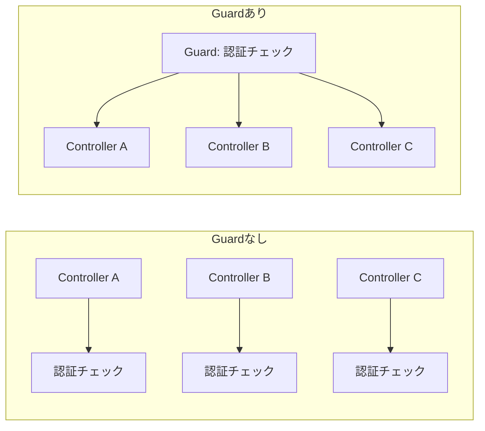
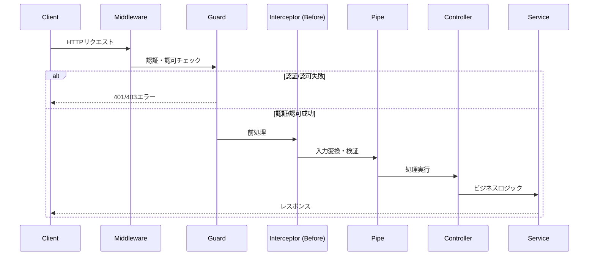
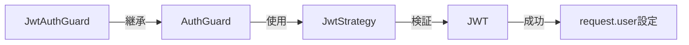
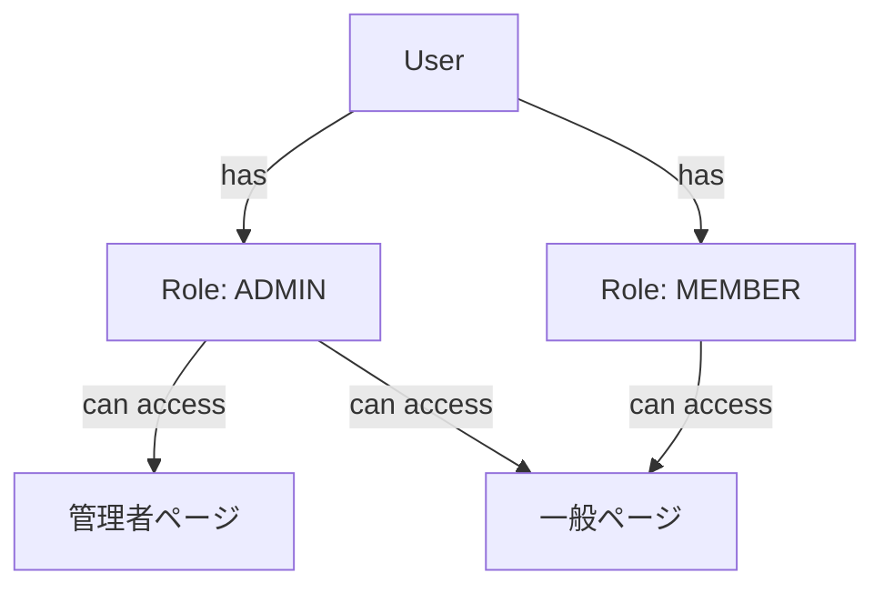
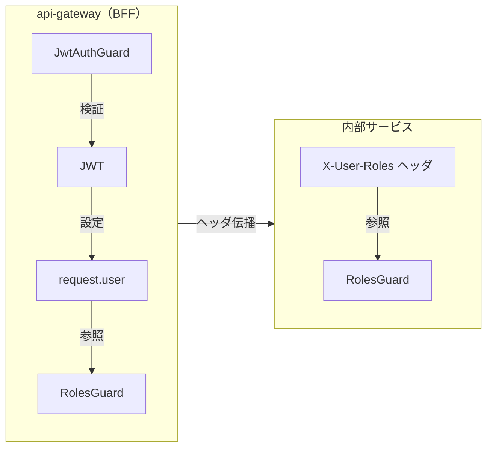
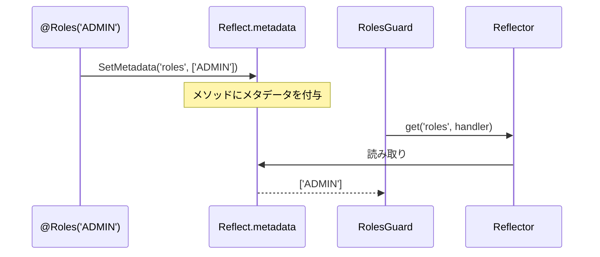
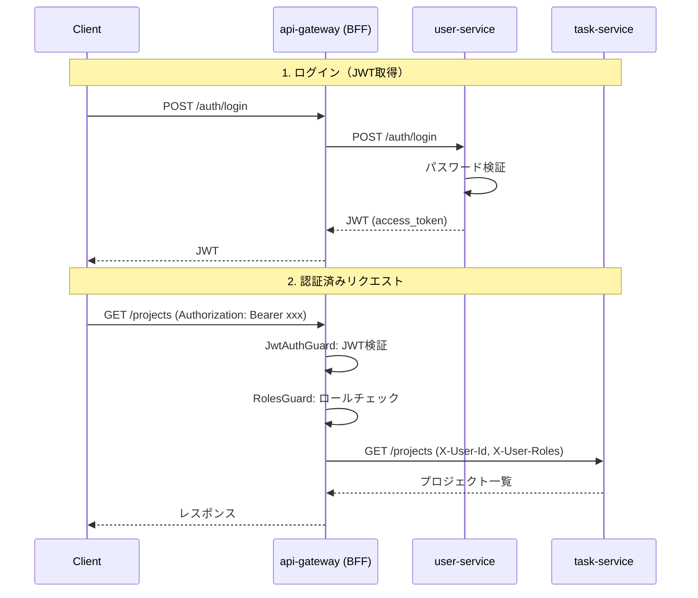
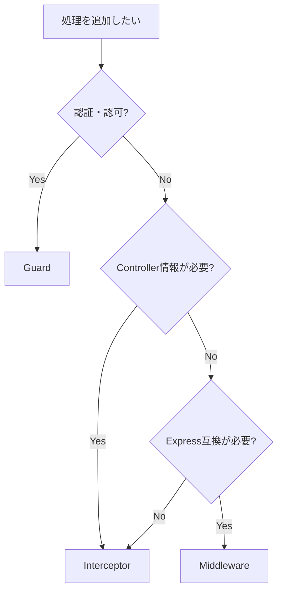

# Guard（認証・認可）

> **Note**: NestJSのGuardは**認証・認可専用**のコンポーネント。
> 他フレームワーク（ASP.NET Core等）のAuthorization Filterに相当する。
> リクエストの前処理全般はMiddleware、例外処理はExceptionFilterが担当。

## 目次

1. [概要](#概要)
2. [リクエストライフサイクルにおけるGuardの位置](#リクエストライフサイクルにおけるguardの位置)
3. [CanActivateインターフェース](#canactivateインターフェース)
   - [インターフェースの定義](#インターフェースの定義)
   - [ExecutionContext](#executioncontext)
   - [Reflectorによるメタデータ取得](#reflectorによるメタデータ取得)
4. [認証Guard（JwtAuthGuard）](#認証guardjwtauthguard)
   - [Passport.jsとの連携](#passportjsとの連携)
   - [AuthGuardの継承パターン](#authguardの継承パターン)
   - [@Public()デコレータによるスキップ](#publicデコレータによるスキップ)
   - [handleRequest()のカスタマイズ](#handlerequestのカスタマイズ)
5. [認可Guard（RolesGuard）](#認可guardrolesguar)
   - [ロールベースアクセス制御（RBAC）](#ロールベースアクセス制御rbac)
   - [@Roles()デコレータの実装](#rolesデコレータの実装)
   - [BFFのRolesGuard](#bffのrolesguard)
   - [内部サービスのRolesGuard](#内部サービスのrolesguard)
   - [2つの実装の違いと設計理由](#2つの実装の違いと設計理由)
6. [カスタムデコレータとの連携](#カスタムデコレータとの連携)
7. [Guardの適用スコープ](#guardの適用スコープ)
8. [JWT認証フロー全体像](#jwt認証フロー全体像)
9. [Guard vs Middleware vs Interceptor](#guard-vs-middleware-vs-interceptor)
10. [本プロジェクトでの実装まとめ](#本プロジェクトでの実装まとめ)
11. [まとめ](#まとめ)

---

## 概要

NestJSの**Guard**は、リクエストがControllerに到達する前にアクセス可否を判定する仕組み。
主に**認証**（誰か確認）と**認可**（何ができるか確認）に使用される。

| 概念 | 目的 | 例 |
|------|------|-----|
| **認証（Authentication）** | ユーザーが誰であるかを確認 | JWT検証、セッション確認 |
| **認可（Authorization）** | ユーザーに権限があるかを確認 | ロールチェック、リソースオーナー確認 |

**なぜGuardが必要か**



| 観点 | Guardなし | Guardあり |
|------|----------|----------|
| コード重複 | 各Controllerで認証ロジック | 1箇所に集約 |
| 保守性 | 変更時に複数箇所を修正 | 1箇所の修正で済む |
| 宣言的 | 手続き的な条件分岐 | デコレータで宣言 |
| テスト | Controllerごとにテスト | Guardを単体テスト |

---

## リクエストライフサイクルにおけるGuardの位置

NestJSでリクエストが処理される流れにおいて、Guardは**Middleware**の後、**Interceptor/Pipe**の前に実行される。



### 実行順序

```
リクエスト受信
    ↓
Middleware（Express互換のミドルウェア）
    ↓
Guard（認証・認可）→ 拒否なら401/403を返す
    ↓
Interceptor（前処理）
    ↓
Pipe（入力変換・検証）→ 検証失敗なら400を返す
    ↓
Controller + Service
    ↓
Interceptor（後処理）
    ↓
レスポンス送信
```

**Guardが早期に実行される理由**

- 認証失敗時は後続の処理を実行する必要がない
- 不正なリクエストを早期に弾くことでリソースを節約
- Pipeによるバリデーション前に認証を済ませる

---

## CanActivateインターフェース

### インターフェースの定義

すべてのGuardは`CanActivate`インターフェースを実装する必要がある。

```typescript
import { CanActivate, ExecutionContext } from '@nestjs/common';
import { Observable } from 'rxjs';

export interface CanActivate {
  canActivate(
    context: ExecutionContext,
  ): boolean | Promise<boolean> | Observable<boolean>;
}
```

**canActivate()の戻り値**

| 戻り値 | 動作 |
|--------|------|
| `true` | リクエストを許可（後続の処理へ） |
| `false` | リクエストを拒否（ForbiddenException） |
| `Promise<boolean>` | 非同期で判定（DB問い合わせ等） |
| `Observable<boolean>` | RxJSのObservableで判定 |

**基本的なGuardの実装**

```typescript
import { Injectable, CanActivate, ExecutionContext } from '@nestjs/common';

@Injectable()
export class SimpleGuard implements CanActivate {
  canActivate(context: ExecutionContext): boolean {
    const request = context.switchToHttp().getRequest();

    // 例: 特定のヘッダが存在するかチェック
    return request.headers['x-api-key'] === 'secret-key';
  }
}
```

### ExecutionContext

`ExecutionContext`は、現在の実行コンテキストに関する情報を提供する。
`ArgumentsHost`を拡張しており、Controllerやハンドラーの情報にもアクセスできる。

```typescript
@Injectable()
export class LoggingGuard implements CanActivate {
  canActivate(context: ExecutionContext): boolean {
    // ArgumentsHostのメソッド
    const ctx = context.switchToHttp();
    const request = ctx.getRequest();
    const response = ctx.getResponse();

    // ExecutionContext固有のメソッド
    const controller = context.getClass();      // コントローラークラス
    const handler = context.getHandler();        // ハンドラーメソッド

    console.log(`${controller.name}.${handler.name}()`);

    return true;
  }
}
```

**ExecutionContextのメソッド**

| メソッド | 戻り値 | 用途 |
|---------|--------|------|
| `switchToHttp()` | `HttpArgumentsHost` | HTTP用のコンテキストに切り替え |
| `switchToWs()` | `WsArgumentsHost` | WebSocket用に切り替え |
| `switchToRpc()` | `RpcArgumentsHost` | マイクロサービス用に切り替え |
| `getClass()` | `Type<any>` | コントローラークラスの参照 |
| `getHandler()` | `Function` | ハンドラーメソッドの参照 |
| `getType()` | `'http' \| 'ws' \| 'rpc'` | 実行コンテキストの種類 |

### Reflectorによるメタデータ取得

`Reflector`を使用すると、デコレータで設定されたメタデータを取得できる。

```typescript
import { Injectable, CanActivate, ExecutionContext } from '@nestjs/common';
import { Reflector } from '@nestjs/core';

@Injectable()
export class RolesGuard implements CanActivate {
  constructor(private reflector: Reflector) {}

  canActivate(context: ExecutionContext): boolean {
    // @SetMetadata('roles', ['admin'])で設定したメタデータを取得
    const roles = this.reflector.get<string[]>('roles', context.getHandler());

    if (!roles) {
      return true; // ロール指定なしは許可
    }

    // ユーザーのロールをチェック
    const request = context.switchToHttp().getRequest();
    const user = request.user;

    return roles.some(role => user.roles.includes(role));
  }
}
```

**Reflectorの主要メソッド**

| メソッド | 用途 |
|---------|------|
| `get(key, target)` | 指定したターゲットからメタデータを取得 |
| `getAll(key, targets)` | 複数のターゲットからメタデータを配列で取得 |
| `getAllAndMerge(key, targets)` | 複数のターゲットのメタデータをマージ |
| `getAllAndOverride(key, targets)` | 最初に見つかったメタデータを返す |

```typescript
// getAllAndOverride: メソッドレベル → クラスレベルの優先順位で取得
const roles = this.reflector.getAllAndOverride<string[]>(ROLES_KEY, [
  context.getHandler(), // メソッドレベル（優先）
  context.getClass(),   // クラスレベル
]);
```

---

## 認証Guard（JwtAuthGuard）

### Passport.jsとの連携

NestJSでは、認証処理に**Passport.js**を統合して使用できる。
`@nestjs/passport`パッケージが提供する`AuthGuard`を継承することで、
Passportの認証戦略（Strategy）をGuardとして利用できる。



**Passport連携の仕組み**

1. `JwtAuthGuard`が`canActivate()`を呼び出す
2. `AuthGuard`が`JwtStrategy`を実行
3. `JwtStrategy`がJWTを検証
4. 検証成功時、`validate()`の戻り値が`request.user`に設定される

### AuthGuardの継承パターン

`AuthGuard('jwt')`を継承することで、JWT認証のGuardを作成できる。

```typescript
// services/api-gateway/src/common/strategies/jwt.strategy.ts
import { Injectable } from '@nestjs/common';
import { PassportStrategy } from '@nestjs/passport';
import { ExtractJwt, Strategy } from 'passport-jwt';
import { ConfigService } from '@nestjs/config';
import { JwtPayload, UserFromJwt } from '../types';

/**
 * JWT認証ストラテジー
 *
 * Why: BFFでJWTを検証し、ペイロードをrequest.userに設定することで、
 * 後続の処理でユーザー情報を利用可能にする。
 */
@Injectable()
export class JwtStrategy extends PassportStrategy(Strategy) {
  constructor(configService: ConfigService) {
    super({
      // Authorizationヘッダからトークンを抽出
      jwtFromRequest: ExtractJwt.fromAuthHeaderAsBearerToken(),
      // 期限切れトークンを拒否
      ignoreExpiration: false,
      // user-serviceと同じシークレットキー
      secretOrKey: configService.get<string>('JWT_SECRET', 'dev-secret-key'),
    });
  }

  /**
   * JWTペイロードを検証し、request.userに設定する値を返す
   *
   * Why: JwtPayloadから必要な情報のみ抽出し、軽量なUserFromJwt型で返す。
   */
  validate(payload: JwtPayload): UserFromJwt {
    return {
      id: payload.sub,
      email: payload.email,
      roles: payload.roles,
    };
  }
}
```

**JwtStrategy設定オプション**

| オプション | 説明 | 推奨値 |
|-----------|------|--------|
| `jwtFromRequest` | JWTの抽出方法 | `ExtractJwt.fromAuthHeaderAsBearerToken()` |
| `ignoreExpiration` | 期限切れを無視するか | `false`（検証する） |
| `secretOrKey` | 検証用シークレット | 環境変数から取得 |
| `algorithms` | 許可するアルゴリズム | `['HS256']` など |

### @Public()デコレータによるスキップ

一部のエンドポイント（ログイン、会員登録など）は認証なしでアクセス可能にする必要がある。
`@Public()`デコレータでマークされたエンドポイントは認証をスキップする。

```typescript
// services/api-gateway/src/common/decorators/public.decorator.ts
import { SetMetadata } from '@nestjs/common';

export const IS_PUBLIC_KEY = 'isPublic';

/**
 * 認証不要エンドポイントを宣言するデコレータ
 *
 * Why: BFFでは一部のエンドポイント（login, register, refresh）は
 * 認証なしでアクセス可能にする必要がある。
 */
export const Public = () => SetMetadata(IS_PUBLIC_KEY, true);
```

**JwtAuthGuardでのスキップ処理**

```typescript
// services/api-gateway/src/common/guards/jwt-auth.guard.ts
import { Injectable, ExecutionContext } from '@nestjs/common';
import { AuthGuard } from '@nestjs/passport';
import { Reflector } from '@nestjs/core';
import { IS_PUBLIC_KEY } from '../decorators/public.decorator';
import { BffUnauthorizedException } from '../exceptions/bff.exception';

/**
 * JWT認証ガード
 *
 * Why: グローバルに適用して全エンドポイントをデフォルトで認証必須とし、
 * 公開エンドポイントのみ@Public()で除外する設計。
 */
@Injectable()
export class JwtAuthGuard extends AuthGuard('jwt') {
  constructor(private readonly reflector: Reflector) {
    super();
  }

  /**
   * アクセス可否を判定
   *
   * 1. @Public()デコレータがあればスキップ
   * 2. なければPassport JWT認証を実行
   */
  async canActivate(context: ExecutionContext): Promise<boolean> {
    // @Public()デコレータをチェック
    const isPublic = this.reflector.getAllAndOverride<boolean>(IS_PUBLIC_KEY, [
      context.getHandler(),
      context.getClass(),
    ]);

    if (isPublic) {
      return true;
    }

    // Passport JWT認証を実行
    return super.canActivate(context) as Promise<boolean>;
  }

  /**
   * 認証結果をハンドリング
   *
   * Why: デフォルトのエラーではなく、BFF固有のエラーコードを返すため。
   */
  handleRequest<TUser>(err: Error | null, user: TUser): TUser {
    if (err || !user) {
      throw new BffUnauthorizedException(
        'Invalid or missing authentication token',
      );
    }
    return user;
  }
}
```

**使用例**

```typescript
@Controller('auth')
export class AuthController {
  @Public()  // 認証不要
  @Post('login')
  login(@Body() dto: LoginDto) { ... }

  @Public()  // 認証不要
  @Post('register')
  register(@Body() dto: RegisterDto) { ... }

  // @Public()なし = 認証必須
  @Post('logout')
  logout(@CurrentUser() user: UserFromJwt) { ... }
}
```

### handleRequest()のカスタマイズ

`handleRequest()`をオーバーライドすることで、認証結果のハンドリングをカスタマイズできる。

```typescript
handleRequest<TUser>(
  err: Error | null,
  user: TUser,
  info: any,
  context: ExecutionContext,
  status?: any,
): TUser {
  // エラーまたはユーザーなしの場合
  if (err || !user) {
    throw new BffUnauthorizedException(
      'Invalid or missing authentication token',
    );
  }
  return user;
}
```

**handleRequest()のパラメータ**

| パラメータ | 説明 |
|-----------|------|
| `err` | Passport認証中に発生したエラー |
| `user` | 認証成功時のユーザー情報（validate()の戻り値） |
| `info` | 追加情報（トークン期限切れなど） |
| `context` | ExecutionContext |
| `status` | HTTPステータス（オプション） |

---

## 認可Guard（RolesGuard）

### ロールベースアクセス制御（RBAC）

RBAC（Role-Based Access Control）は、ユーザーに割り当てられたロール（役割）に基づいて
アクセス権限を制御する方式。



**本プロジェクトのロール**

| ロール | 説明 | 権限 |
|--------|------|------|
| `ADMIN` | 管理者 | 全機能にアクセス可能 |
| `MEMBER` | 一般メンバー | 基本機能にアクセス可能 |
| `GUEST` | ゲスト | 閲覧のみ |

### @Roles()デコレータの実装

エンドポイントに必要なロールを宣言するためのデコレータ。

```typescript
// services/api-gateway/src/common/decorators/roles.decorator.ts
import { SetMetadata } from '@nestjs/common';

export const ROLES_KEY = 'roles';

/**
 * ロール要求を宣言するデコレータ
 *
 * @param roles 必要なロール（いずれか1つを持っていればアクセス可）
 *
 * Why: ADMIN専用のエンドポイントがあるため、
 * 宣言的にロール要求を指定できるようにする。
 */
export const Roles = (...roles: string[]) => SetMetadata(ROLES_KEY, roles);
```

**使用例**

```typescript
@Controller('users')
export class UsersController {
  @Get()
  @Roles('ADMIN')  // ADMINのみアクセス可
  findAll() { ... }

  @Get(':id')
  @Roles('ADMIN', 'MEMBER')  // ADMINまたはMEMBERがアクセス可
  findOne(@Param('id') id: number) { ... }

  @Delete(':id')
  @Roles('ADMIN')  // ADMINのみアクセス可
  remove(@Param('id') id: number) { ... }
}
```

### BFFのRolesGuard

api-gateway（BFF）では、JWT検証後の`request.user`からロール情報を取得する。

```typescript
// services/api-gateway/src/common/guards/roles.guard.ts
import { Injectable, CanActivate, ExecutionContext } from '@nestjs/common';
import { Reflector } from '@nestjs/core';
import { Request } from 'express';
import { ROLES_KEY } from '../decorators/roles.decorator';
import { BffForbiddenException } from '../exceptions/bff.exception';
import { UserFromJwt } from '../types';

/**
 * RolesGuard（BFF版）
 *
 * Why: BFFではJWT検証後のrequest.userからロール情報を取得。
 * user-service/task-serviceのRolesGuardとは異なり、
 * X-User-Rolesヘッダではなくrequest.user.rolesを参照する。
 */
@Injectable()
export class RolesGuard implements CanActivate {
  constructor(private readonly reflector: Reflector) {}

  /**
   * アクセス可否を判定
   *
   * 1. @Roles()デコレータで指定されたロールを取得
   * 2. 指定がない場合はアクセス許可
   * 3. request.userからユーザーのロールを取得
   * 4. いずれかのロールが一致すればアクセス許可
   */
  canActivate(context: ExecutionContext): boolean {
    // @Roles()で指定された必要なロールを取得
    const requiredRoles = this.reflector.getAllAndOverride<string[]>(
      ROLES_KEY,
      [context.getHandler(), context.getClass()],
    );

    // @Roles()が指定されていない場合はアクセス許可
    if (!requiredRoles || requiredRoles.length === 0) {
      return true;
    }

    // リクエストからユーザー情報を取得
    const request = context
      .switchToHttp()
      .getRequest<Request & { user?: UserFromJwt }>();
    const user = request.user;

    if (!user || !user.roles || user.roles.length === 0) {
      throw new BffForbiddenException('Insufficient permissions');
    }

    // いずれかのロールが一致すればアクセス許可
    const hasRole = requiredRoles.some((role) => user.roles.includes(role));

    if (!hasRole) {
      throw new BffForbiddenException(
        `Required roles: ${requiredRoles.join(', ')}`,
      );
    }

    return true;
  }
}
```

**設計ポイント**

- `getAllAndOverride()` でメソッドレベル → クラスレベルの優先順位でメタデータを取得
- `some()` で「いずれかのロール」をチェック（OR条件）
- `@Roles()` 未指定はデフォルトで許可

### 内部サービスのRolesGuard

user-serviceやtask-serviceでは、BFFから伝播された`X-User-Roles`ヘッダからロール情報を取得する。

```typescript
// services/user-service/src/common/guards/roles.guard.ts
import {
  Injectable,
  CanActivate,
  ExecutionContext,
  ForbiddenException,
} from '@nestjs/common';
import { Reflector } from '@nestjs/core';
import { Request } from 'express';
import { ROLES_KEY } from '../decorators/roles.decorator';

/**
 * RolesGuard（内部サービス版）
 *
 * Why: X-User-Rolesヘッダからロール情報を取得
 * - BFFがJWT検証済みのロール情報を内部ヘッダで伝播
 * - 各サービスはこのヘッダを信頼
 */
@Injectable()
export class RolesGuard implements CanActivate {
  constructor(private readonly reflector: Reflector) {}

  canActivate(context: ExecutionContext): boolean {
    const requiredRoles = this.reflector.getAllAndOverride<string[]>(
      ROLES_KEY,
      [context.getHandler(), context.getClass()],
    );

    if (!requiredRoles || requiredRoles.length === 0) {
      return true;
    }

    // X-User-Rolesヘッダからロール情報を取得
    const request = context.switchToHttp().getRequest<Request>();
    const rolesHeader = request.headers['x-user-roles'];

    if (!rolesHeader) {
      throw new ForbiddenException('X-User-Roles header is required');
    }

    // ヘッダ値を配列に変換（カンマ区切り対応）
    const rolesString = Array.isArray(rolesHeader)
      ? rolesHeader[0]
      : rolesHeader;

    const userRoles = rolesString
      .split(',')
      .map((role) => role.trim())
      .filter((role) => role.length > 0);

    // いずれかのロールが一致すればアクセス許可
    const hasRole = requiredRoles.some((role) => userRoles.includes(role));

    if (!hasRole) {
      throw new ForbiddenException(
        `Required roles: ${requiredRoles.join(', ')}`,
      );
    }

    return true;
  }
}
```

**設計ポイント**

- `X-User-Roles`ヘッダからカンマ区切りのロール文字列を取得
- 空白トリミング対応（`"ADMIN, MEMBER"` → `["ADMIN", "MEMBER"]`）
- 標準の`ForbiddenException`を使用（BFF固有例外ではない）

### 2つの実装の違いと設計理由



| 観点 | BFF（api-gateway） | 内部サービス |
|------|-------------------|-------------|
| **ロール取得元** | `request.user.roles` | `X-User-Roles`ヘッダ |
| **JWT検証** | 実施する | 実施しない（BFFを信頼） |
| **例外クラス** | `BffForbiddenException` | `ForbiddenException` |
| **データ形式** | 配列 | カンマ区切り文字列 |

**この設計の理由**

1. **JWT検証の集約**: BFFで1回だけJWT検証を行い、内部サービスでは重複検証しない
2. **ヘッダ信頼モデル**: 内部通信は信頼できる前提（BFFからのリクエストのみ）
3. **パフォーマンス**: 内部サービスでJWT検証をスキップしてレイテンシを削減

---

## カスタムデコレータとの連携

### SetMetadata()の仕組み

`SetMetadata()`は、メタデータをクラスやメソッドに付与するための関数。
Guardは`Reflector`を使ってこのメタデータを読み取る。

```typescript
import { SetMetadata } from '@nestjs/common';

// 基本的な使い方
@SetMetadata('roles', ['admin', 'user'])
@Get()
findAll() { ... }

// カスタムデコレータとして定義
export const Roles = (...roles: string[]) => SetMetadata('roles', roles);

// 使用
@Roles('admin', 'user')
@Get()
findAll() { ... }
```

**メタデータの流れ**



### 複数デコレータの組み合わせ

複数のデコレータを組み合わせて使用することもできる。

```typescript
import { applyDecorators, SetMetadata, UseGuards } from '@nestjs/common';

/**
 * Admin専用エンドポイントを宣言するデコレータ
 *
 * @Roles('ADMIN')と@UseGuards(RolesGuard)を1つにまとめる
 */
export function AdminOnly() {
  return applyDecorators(
    SetMetadata('roles', ['ADMIN']),
    UseGuards(RolesGuard),
  );
}

// 使用例
@AdminOnly()
@Delete(':id')
remove(@Param('id') id: number) { ... }
```

### Reflectorの使い分け

| メソッド | 動作 | 使用場面 |
|---------|------|---------|
| `get(key, handler)` | ハンドラーのみから取得 | メソッドレベルのみ |
| `getAllAndOverride([handler, class])` | 最初に見つかった値を返す | メソッド優先 |
| `getAllAndMerge([handler, class])` | 両方の値をマージ | 両方を合成 |

```typescript
// 例: クラスとメソッドの両方に@Roles()が設定されている場合

@Roles('MEMBER')  // クラスレベル
@Controller('tasks')
export class TasksController {
  @Roles('ADMIN')  // メソッドレベル
  @Delete(':id')
  remove() {}
}

// getAllAndOverride: ['ADMIN']（メソッド優先）
// getAllAndMerge: ['ADMIN', 'MEMBER']（両方マージ）
```

---

## Guardの適用スコープ

Guardは3つのレベルで適用できる。

### グローバルスコープ

```typescript
// 方法1: main.ts で直接適用（DIなし）
async function bootstrap() {
  const app = await NestFactory.create(AppModule);
  app.useGlobalGuards(new JwtAuthGuard(new Reflector()));
  await app.listen(3000);
}
```

```typescript
// 方法2: APP_GUARD経由（DI可能）
// services/api-gateway/src/app.module.ts
import { APP_GUARD } from '@nestjs/core';

@Module({
  providers: [
    // Global Guards（順序重要: JwtAuthGuard → RolesGuard）
    {
      provide: APP_GUARD,
      useClass: JwtAuthGuard,
    },
    {
      provide: APP_GUARD,
      useClass: RolesGuard,
    },
  ],
})
export class AppModule {}
```

**設計ポイント**

- `APP_GUARD`を使うと、他のServiceをDIで注入できる
- 複数のGuardを登録した場合、登録順に実行される
- 認証（JwtAuthGuard）→ 認可（RolesGuard）の順序が重要

### コントローラースコープ

```typescript
@Controller('projects')
@UseGuards(RolesGuard)  // このController全体に適用
export class ProjectController {
  @Get()
  findAll() { ... }

  @Post()
  create() { ... }
}
```

### メソッドスコープ

```typescript
@Controller('projects')
export class ProjectController {
  @Get()
  findAll() { ... }  // Guardなし

  @Post()
  @UseGuards(RolesGuard)  // このメソッドのみ
  @Roles('ADMIN')
  create() { ... }
}
```

### 複数Guardの実行順序

```typescript
@UseGuards(GuardA, GuardB, GuardC)
@Get()
findAll() { ... }
```

```
リクエスト → GuardA → GuardB → GuardC → Controller

※ いずれかがfalseを返すと、以降のGuardは実行されない
```

**グローバルとローカルの組み合わせ**

```
グローバルGuard → コントローラーGuard → メソッドGuard → Controller
```

---

## JWT認証フロー全体像

本プロジェクトにおけるJWT認証の全体フローを解説する。

### 認証フロー図



### 各コンポーネントの役割

| コンポーネント | 役割 | 実装場所 |
|--------------|------|---------|
| **user-service** | JWT発行 | `auth/auth.service.ts` |
| **BFF JwtStrategy** | JWT検証、ペイロード抽出 | `common/strategies/jwt.strategy.ts` |
| **BFF JwtAuthGuard** | 認証要否判定、@Public処理 | `common/guards/jwt-auth.guard.ts` |
| **BFF RolesGuard** | ロールベース認可 | `common/guards/roles.guard.ts` |
| **内部ヘッダ** | 認証情報の伝播 | `X-User-Id`, `X-User-Roles` |

### JWTペイロードの構造

```typescript
// user-serviceが発行するJWTのペイロード
interface JwtPayload {
  sub: number;      // ユーザーID
  email: string;    // メールアドレス
  roles: string[];  // ロール配列
  iat: number;      // 発行時刻
  exp: number;      // 有効期限
}

// BFFでrequest.userに設定される型
interface UserFromJwt {
  id: number;
  email: string;
  roles: string[];
}
```

### 内部ヘッダによる認証情報伝播

BFFから内部サービスへのリクエストでは、以下のヘッダで認証情報を伝播する。

| ヘッダ | 値 | 用途 |
|--------|-----|------|
| `X-User-Id` | ユーザーID（数値） | リソースオーナー確認 |
| `X-User-Roles` | カンマ区切りロール | ロールベース認可 |

```typescript
// BFF → task-service へのリクエスト例
const response = await this.httpService.axiosRef.get(
  `${this.baseUrl}/projects`,
  {
    headers: {
      'X-User-Id': user.id.toString(),
      'X-User-Roles': user.roles.join(','),
    },
  },
);
```

---

## Guard vs Middleware vs Interceptor

### 機能の比較

| 観点 | Guard | Middleware | Interceptor |
|------|-------|-----------|-------------|
| **実行順序** | Middleware後 | 最初 | Guard後 |
| **主な用途** | 認証・認可 | 前処理全般 | 横断的関心事 |
| **Controllerへのアクセス** | ○（ExecutionContext） | × | ○（ExecutionContext） |
| **レスポンス制御** | × | △ | ○ |
| **RxJS連携** | △ | × | ○ |

### 使い分けフローチャート



### 具体的なユースケース

| ユースケース | 推奨 | 理由 |
|-------------|------|------|
| JWT認証 | **Guard** | Passport連携、`@Public()`対応 |
| ロールベース認可 | **Guard** | デコレータでの宣言的定義 |
| リクエストログ（単純） | Middleware | Controller情報不要 |
| リクエストログ（詳細） | Interceptor | Controller/メソッド名が必要 |
| レスポンス変換 | Interceptor | RxJSのmap()で変換 |
| CORS設定 | Middleware | Express互換ライブラリ使用 |
| 処理時間計測 | Interceptor | 前後で時刻比較 |

---

## 本プロジェクトでの実装まとめ

### ファイル構成

```
services/
├── api-gateway/src/common/
│   ├── guards/
│   │   ├── jwt-auth.guard.ts    # JWT認証（@Public対応）
│   │   └── roles.guard.ts       # ロール認可（request.user参照）
│   ├── decorators/
│   │   ├── public.decorator.ts  # @Public()
│   │   ├── roles.decorator.ts   # @Roles()
│   │   └── current-user.decorator.ts  # @CurrentUser()
│   └── strategies/
│       └── jwt.strategy.ts      # Passport JWT Strategy
│
├── user-service/src/common/
│   ├── guards/
│   │   └── roles.guard.ts       # ロール認可（X-User-Roles参照）
│   └── decorators/
│       └── roles.decorator.ts   # @Roles()
│
└── task-service/
    └── （Guardなし - BFFを信頼）
```

### 設計判断

| 判断 | 理由 |
|------|------|
| **BFFでグローバルGuard** | 全エンドポイントをデフォルト認証必須に |
| **task-serviceはGuardなし** | BFFからの内部通信を信頼 |
| **2種類のRolesGuard** | BFF（request.user）と内部（ヘッダ）で取得元が異なる |
| **@Public()でスキップ** | ホワイトリスト方式（デフォルト保護） |

### グローバル登録（app.module.ts）

```typescript
// services/api-gateway/src/app.module.ts
@Module({
  providers: [
    // Global Guards（順序重要: JwtAuthGuard → RolesGuard）
    {
      provide: APP_GUARD,
      useClass: JwtAuthGuard,
    },
    {
      provide: APP_GUARD,
      useClass: RolesGuard,
    },

    // Global Exception Filter
    {
      provide: APP_FILTER,
      useClass: HttpExceptionFilter,
    },

    // Global Response Interceptor
    {
      provide: APP_INTERCEPTOR,
      useClass: ResponseInterceptor,
    },
  ],
})
export class AppModule {}
```

---

## まとめ

### Guardの要点

| トピック | ポイント |
|---------|---------|
| **目的** | 認証・認可のアクセス制御 |
| **インターフェース** | `CanActivate`を実装、`canActivate()`でtrue/false |
| **ExecutionContext** | Controller/Handler情報にアクセス可能 |
| **Reflector** | デコレータのメタデータを取得 |
| **適用スコープ** | グローバル / コントローラー / メソッド |

### 認証と認可の分離

| 概念 | Guard | デコレータ | 判定基準 |
|------|-------|-----------|---------|
| **認証** | JwtAuthGuard | @Public() | JWT有効性 |
| **認可** | RolesGuard | @Roles() | ユーザーのロール |

### 本プロジェクトのアーキテクチャ

```
Client
  ↓ Authorization: Bearer xxx
BFF (api-gateway)
  ├── JwtAuthGuard: JWT検証
  ├── RolesGuard: ロールチェック
  └── 内部ヘッダ設定
        ↓ X-User-Id, X-User-Roles
内部サービス (user-service, task-service)
  └── RolesGuard: ヘッダからロールチェック
```

### 次のステップ

- **ExceptionFilter/Interceptor**: `filter-interceptor.md` を参照
- **ValidationPipe**: `nestjs-validation-pipe.md` を参照
- **カスタムデコレータ**: `nestjs-controller.md` のカスタムデコレータセクションを参照
