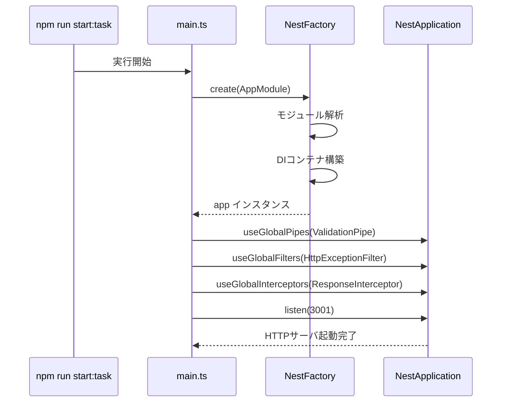
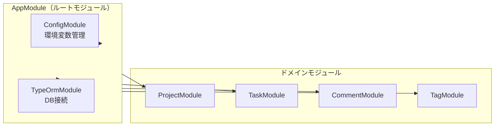
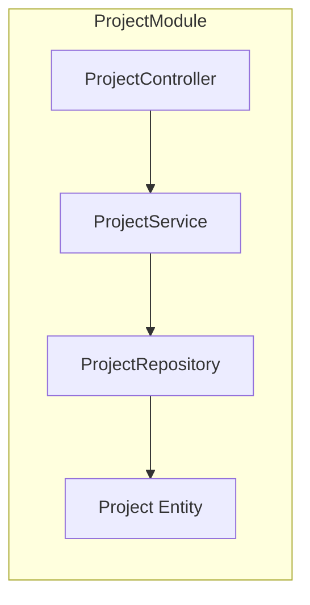
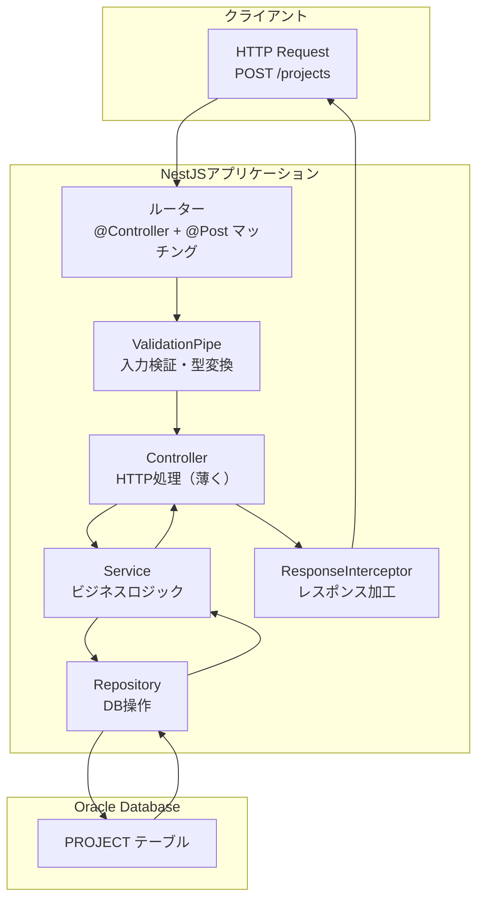
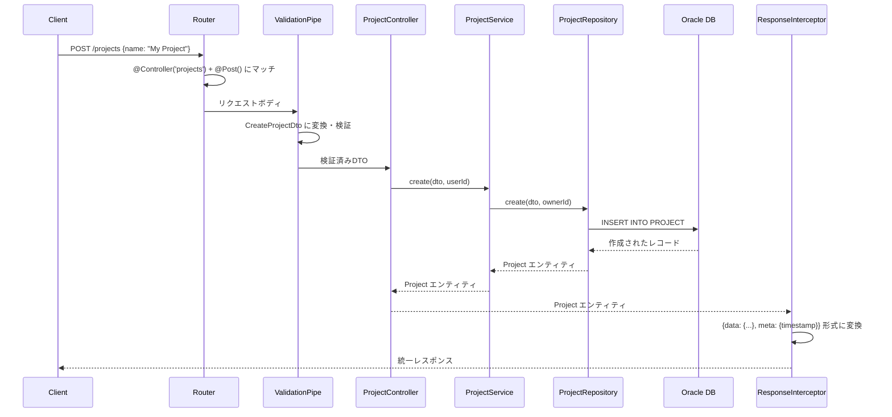
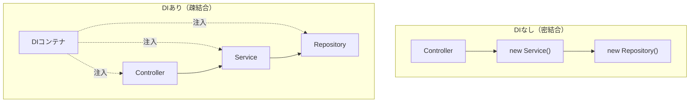
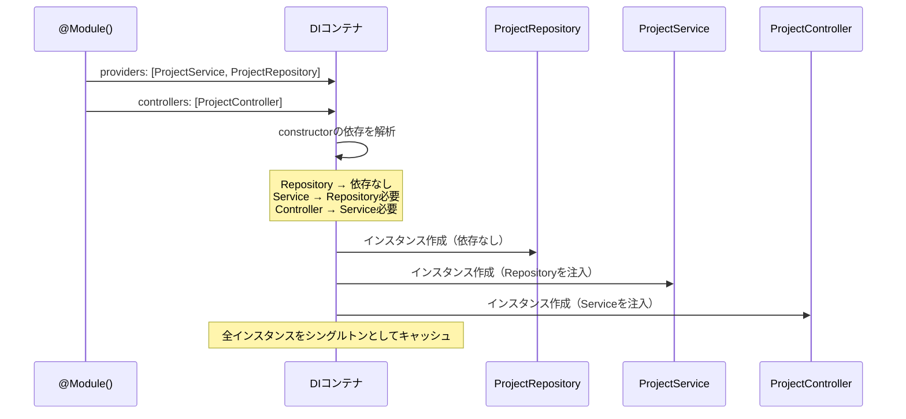
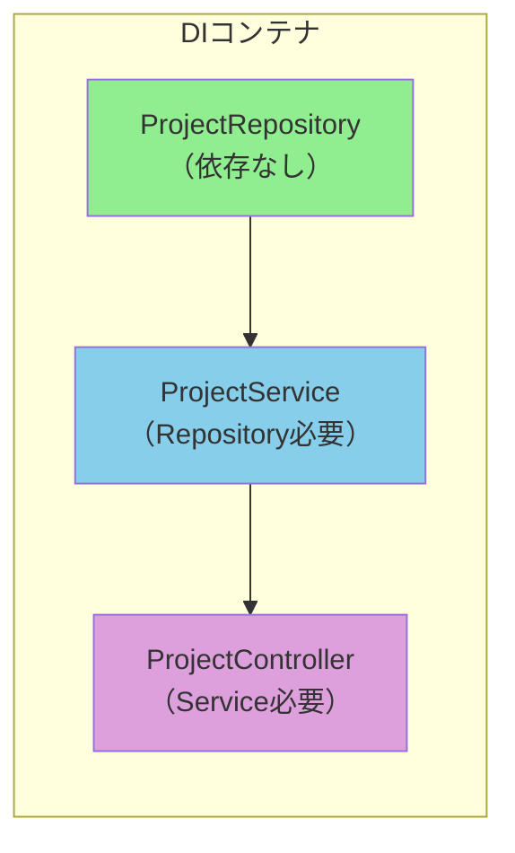
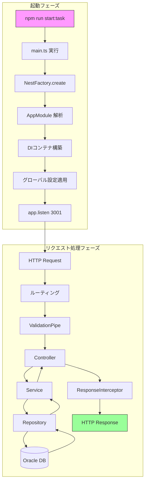

# NestJSコード構造と起動フロー解説

NestJSアプリケーションの構造を理解するための学習資料です。
本プロジェクトの`task-service`を例に解説します。

## 目次

1. [エントリポイント（main.ts）](#1-エントリポイントmaints)
2. [モジュールシステム](#2-モジュールシステム)
3. [リクエスト処理の流れ](#3-リクエスト処理の流れ)
4. [DIコンテナの仕組み](#4-diコンテナの仕組み)
5. [全体フロー](#5-全体フロー)

---

## 1. エントリポイント（main.ts）

### ファイル構成

```
services/task-service/src/
├── main.ts          ← エントリポイント（ここから起動）
├── app.module.ts    ← ルートモジュール
└── ...
```

### 起動フロー



### コード解説

```typescript
// services/task-service/src/main.ts
async function bootstrap() {
  // ステップ1: アプリケーションインスタンス作成
  const app = await NestFactory.create(AppModule);

  // ステップ2: グローバル設定
  app.useGlobalPipes(new ValidationPipe({...}));    // 入力検証
  app.useGlobalFilters(new HttpExceptionFilter());  // エラー処理
  app.useGlobalInterceptors(new ResponseInterceptor()); // レスポンス加工

  // ステップ3: HTTPサーバ起動
  await app.listen(3001);
}
bootstrap();
```

| ステップ | 処理 | 目的 |
|---------|------|------|
| 1 | `NestFactory.create()` | DIコンテナを構築し、アプリインスタンスを作成 |
| 2 | `useGlobal*()` | 全リクエストに適用するミドルウェアを設定 |
| 3 | `listen()` | 指定ポートでHTTPリクエスト待機を開始 |

---

## 2. モジュールシステム

### @Module デコレータの構造

```typescript
@Module({
  imports: [...],      // 他のモジュールをインポート
  controllers: [...],  // HTTPリクエストを処理するコントローラ
  providers: [...],    // サービス、リポジトリなどのDI対象
  exports: [...],      // 他のモジュールに公開するプロバイダ
})
export class SomeModule {}
```

### モジュール構成図



### ドメインモジュールの内部構造



### コード例（ProjectModule）

```typescript
// services/task-service/src/project/project.module.ts
@Module({
  imports: [TypeOrmModule.forFeature([Project])],  // エンティティ登録
  controllers: [ProjectController],                 // HTTPハンドラ
  providers: [ProjectService, ProjectRepository],   // ビジネスロジック・DB操作
  exports: [ProjectService, ProjectRepository],     // 他モジュールへ公開
})
export class ProjectModule {}
```

---

## 3. リクエスト処理の流れ

### 3層アーキテクチャ



### 処理フロー詳細



### 各層の責務

| 層 | クラス | 責務 |
|---|--------|------|
| Controller | `ProjectController` | HTTPリクエスト/レスポンス処理（薄く保つ） |
| Service | `ProjectService` | ビジネスロジック（存在確認、権限チェック等） |
| Repository | `ProjectRepository` | データアクセス（TypeORM操作） |

### コード例

```typescript
// Controller: HTTPリクエストの受付
@Controller('projects')
export class ProjectController {
  constructor(private readonly projectService: ProjectService) {}

  @Post()
  async create(@Body() dto: CreateProjectDto): Promise<Project> {
    return this.projectService.create(dto, userId);
  }
}

// Service: ビジネスロジック
@Injectable()
export class ProjectService {
  constructor(private readonly projectRepository: ProjectRepository) {}

  async update(id: number, dto: UpdateProjectDto, userId: number): Promise<Project> {
    // 存在確認
    const project = await this.projectRepository.findById(id);
    if (!project) throw new ProjectNotFoundException(id);

    // 権限チェック
    if (project.ownerId !== userId) {
      throw new ProjectForbiddenException('Only the owner can update');
    }

    return this.projectRepository.update(id, dto);
  }
}

// Repository: DB操作
@Injectable()
export class ProjectRepository {
  constructor(
    @InjectRepository(Project)
    private readonly repository: Repository<Project>,
  ) {}

  async findById(id: number): Promise<Project | null> {
    return this.repository.findOne({ where: { id } });
  }
}
```

---

## 4. DIコンテナの仕組み

### DI（Dependency Injection）とは

クラスが必要とする依存オブジェクトを、**外部から注入**する仕組みです。

### DIなし vs DIあり



### DIコンテナの動作原理



### 依存グラフ



### @Injectable() の意味

```typescript
@Injectable()  // このクラスはDIコンテナで管理される
export class ProjectService {
  // constructorの引数はDIコンテナが自動的に解決・注入
  constructor(private readonly projectRepository: ProjectRepository) {}
}
```

---

## 5. 全体フロー

### サーバ起動からリクエスト処理まで



### ファイル参照ガイド

| 概念 | ファイル | 行番号 |
|-----|---------|--------|
| エントリポイント | `services/task-service/src/main.ts` | 13-45 |
| ルートモジュール | `services/task-service/src/app.module.ts` | 18-57 |
| ドメインモジュール | `services/task-service/src/project/project.module.ts` | 14-20 |
| Controller | `services/task-service/src/project/project.controller.ts` | 33-127 |
| Service | `services/task-service/src/project/project.service.ts` | 22-129 |
| Repository | `services/task-service/src/project/project.repository.ts` | 36-127 |

---

## 学習のポイント

1. **main.ts から読み始める** - 全ての起点はここ
2. **@Module() の imports を追う** - モジュール間の依存関係がわかる
3. **Constructor を見る** - そのクラスが何に依存しているかがわかる
4. **F12（定義へ移動）を活用** - コードを追跡して理解を深める

## 関連ドキュメント

- [docs/design/task-service-api.md](../design/task-service-api.md) - task-service API設計
- [docs/design/task-service-entities.md](../design/task-service-entities.md) - エンティティ設計
