# Controllerクラスの実装方法

## 目次

1. [概要](#概要)
2. [Controllerの責務](#controllerの責務)
3. [依存性注入](#依存性注入)
4. [デコレータとは](#デコレータとは)
5. [デコレータの種類](#デコレータの種類)
   - [クラスデコレータ](#1-クラスデコレータ)
   - [メソッドデコレータ](#2-メソッドデコレータ)
   - [パラメータデコレータ](#3-パラメータデコレータ)
6. [パイプとの組み合わせ](#パイプとの組み合わせ)
7. [カスタムデコレータ](#カスタムデコレータ)
8. [エラーハンドリング](#エラーハンドリング)
9. [非同期処理](#非同期処理)
10. [デコレータの内部動作](#デコレータの内部動作)
11. [本プロジェクトでの使用例](#本プロジェクトでの使用例)
12. [まとめ](#まとめ)

---

## 概要

NestJSのControllerクラスの実装方法を解説する。
Controllerはルーティング、リクエストデータの取得、レスポンス制御を担当し、ビジネスロジックはServiceに委譲する。

本資料では以下を扱う：
- Controllerの責務と設計原則
- 依存性注入（DI）によるServiceの利用
- メソッドデコレータ（@Get, @Post, @HttpCode等）
- パラメータデコレータ（@Body, @Param, @Query, @Headers等）
- パイプによる変換・検証
- エラーハンドリング（HttpException）
- 非同期処理（async/await）
- カスタムパラメータデコレータ
- ファイルアップロード

> **DTOのバリデーション**（class-validatorデコレータ）については `dto-validation.md` を参照。

## Controllerの責務

Controllerを実装する前に、**何をControllerに書くべきか**を理解することが重要。
責務を明確にすることで、テストしやすく保守性の高いコードになる。

### なぜ責務を分離するのか

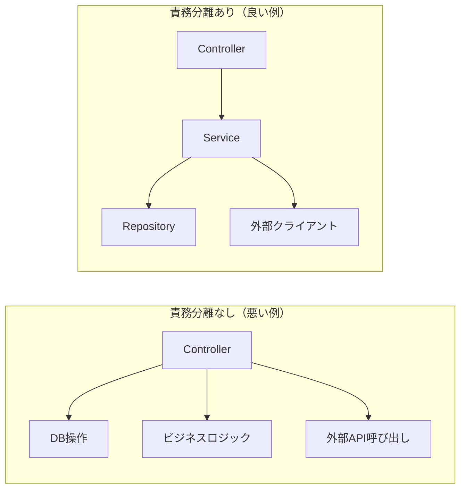

| 観点 | 責務分離なし | 責務分離あり |
|------|-------------|-------------|
| テスト | DB接続が必要、テスト困難 | Serviceをモックして単体テスト可能 |
| 再利用 | ロジックがController固有 | Serviceを別のControllerから呼び出し可能 |
| 変更影響 | 1箇所の変更が広範囲に影響 | 変更が局所化される |

### Controllerがやるべきこと

| 責務 | 目的 | 例 |
|------|------|-----|
| **ルーティング定義** | URLとメソッドの対応付け | `@Get(':id')` |
| **リクエストデータの取得** | HTTPリクエストから必要なデータを抽出 | `@Body()`, `@Param()`, `@Query()` |
| **入力の変換・検証** | 文字列→数値変換、形式チェック | `ParseIntPipe`, `ValidationPipe` |
| **Serviceへの処理委譲** | ビジネスロジックの実行を依頼 | `this.projectService.create(dto)` |
| **レスポンスの返却** | 処理結果をクライアントに返す | `return result;` |
| **HTTPステータスの制御** | 適切なステータスコードを設定 | `@HttpCode(201)` |

### Controllerがやるべきでないこと

| アンチパターン | 問題点 | 正しいアプローチ |
|--------------|--------|----------------|
| **ビジネスロジックの実装** | テスト困難、再利用不可 | → Serviceに実装 |
| **直接的なDB操作** | 責務過多、テスト困難 | → Repository経由 |
| **複雑なデータ変換** | Controllerが肥大化 | → Serviceまたは専用クラス |
| **外部APIの直接呼び出し** | 依存が増え、モック困難 | → 専用Clientクラス経由 |
| **トランザクション管理** | Controller層の責務ではない | → Service層で管理 |

### 本プロジェクトでの実践例

```typescript
// ✅ 良い例：Controllerは薄く、Serviceに委譲
@Controller('projects')
export class ProjectController {
  constructor(private readonly projectService: ProjectService) {}

  @Post()
  @HttpCode(HttpStatus.CREATED)
  async create(
    @Body() dto: CreateProjectDto,      // データ取得
    @CurrentUserId() userId: number,    // データ取得
  ) {
    return this.projectService.create(dto, userId);  // Serviceに委譲
  }
}

// ❌ 悪い例：Controllerにビジネスロジックを書く
@Controller('projects')
export class ProjectController {
  constructor(private readonly dataSource: DataSource) {}

  @Post()
  async create(@Body() dto: CreateProjectDto) {
    // Controllerで直接DB操作（アンチパターン）
    const project = new Project();
    project.name = dto.name;
    project.createdAt = new Date();
    await this.dataSource.getRepository(Project).save(project);
    return project;
  }
}
```

## 依存性注入

ControllerがServiceを利用するには、**依存性注入（DI）** を使用する。
DIを使う目的は、**クラス間の結合度を下げ、テストを容易にする**こと。

### なぜDIを使うのか

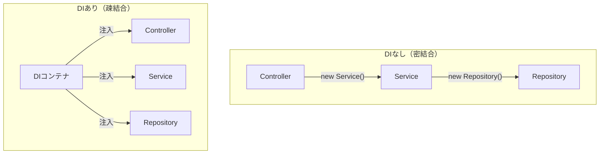

| 観点 | DIなし | DIあり |
|------|--------|--------|
| インスタンス管理 | 各クラスで`new`する | DIコンテナが一元管理 |
| テスト | 実際のServiceが必要 | モックServiceを注入可能 |
| 変更時の影響 | 依存クラスすべてを修正 | 注入箇所のみ修正 |

### コンストラクタインジェクション

NestJSでは**コンストラクタの引数**でServiceを受け取る。

```typescript
// project.controller.ts:33-40
@Controller('projects')
export class ProjectController {
  // コンストラクタでServiceを受け取る
  // private readonly により、自動的にthis.projectServiceに代入される
  constructor(private readonly projectService: ProjectService) {}

  @Get()
  async findAll() {
    // this.projectService を通じてServiceのメソッドを呼び出す
    return this.projectService.findAll();
  }
}
```

### 複数のServiceを注入する場合

```typescript
@Controller('dashboard')
export class DashboardController {
  constructor(
    private readonly projectService: ProjectService,
    private readonly taskService: TaskService,
    private readonly userService: UserService,
  ) {}

  @Get()
  async getSummary() {
    // 複数のServiceを組み合わせてデータを集約
    const projects = await this.projectService.count();
    const tasks = await this.taskService.count();
    const users = await this.userService.count();
    return { projects, tasks, users };
  }
}
```

### DIが機能する仕組み

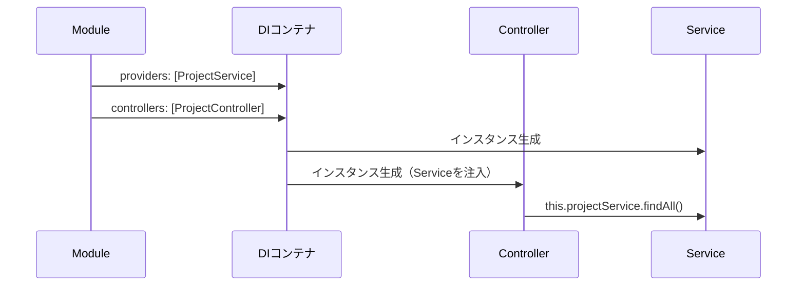

**Moduleでの登録**

```typescript
// project.module.ts
@Module({
  controllers: [ProjectController],  // Controllerを登録
  providers: [ProjectService],       // Serviceを登録（DIコンテナに追加）
})
export class ProjectModule {}
```

> **ポイント**: `providers`に登録されたクラスは、同じModule内の他クラスに注入可能になる。

## デコレータとは

```typescript
// デコレータの基本形
@デコレータ名(引数)
class/method/property/parameter
```

デコレータは**関数**であり、対象にメタデータを設定したり、振る舞いを変更したりする。

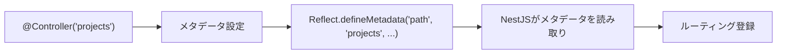

## デコレータの種類

### 1. クラスデコレータ

クラス全体に適用されるデコレータ。

```typescript
// project.controller.ts:33
@Controller('projects')  // ルートパス設定
export class ProjectController {
  // ...
}
```

| デコレータ | 用途 | 例 |
|-----------|------|-----|
| `@Controller(path)` | HTTPコントローラー定義 | `@Controller('projects')` |
| `@Module(options)` | モジュール定義 | `@Module({ imports: [...] })` |
| `@Injectable()` | DIコンテナへの登録 | Service, Repositoryに使用 |

### 2. メソッドデコレータ

メソッドに適用されるデコレータ。HTTPメソッドのルーティングや、レスポンスの制御を行う。

#### HTTPメソッドデコレータ

| デコレータ | ケース | 目的 |
|-----------|--------|------|
| `@Get()` | データの取得 | リソースを読み取る（副作用なし） |
| `@Post()` | データの新規作成 | 新しいリソースを作成する |
| `@Patch()` | データの部分更新 | 既存リソースの一部を変更する |
| `@Put()` | データの完全置換 | 既存リソースを完全に置き換える |
| `@Delete()` | データの削除 | リソースを削除する |

**具体例: CRUD操作**

```typescript
// 一覧取得: GET /projects
// ケース: ユーザーがプロジェクト一覧画面を開いた時
// 目的: 複数のプロジェクトを取得して表示する
@Get()
async findAll(@Query() query: ProjectQueryDto) {
  return this.projectService.findAll(query);
}

// 詳細取得: GET /projects/123
// ケース: ユーザーが特定のプロジェクトをクリックした時
// 目的: 1件のプロジェクトの詳細情報を取得する
@Get(':id')
async findOne(@Param('id', ParseIntPipe) id: number) {
  return this.projectService.findOne(id);
}

// 新規作成: POST /projects
// ケース: ユーザーが「新規プロジェクト作成」ボタンを押した時
// 目的: 新しいプロジェクトをDBに保存する
@Post()
async create(@Body() dto: CreateProjectDto) {
  return this.projectService.create(dto);
}

// 部分更新: PATCH /projects/123
// ケース: ユーザーがプロジェクト名だけを変更した時
// 目的: 変更されたフィールドのみを更新する（他は維持）
@Patch(':id')
async update(@Param('id', ParseIntPipe) id: number, @Body() dto: UpdateProjectDto) {
  return this.projectService.update(id, dto);
}

// 削除: DELETE /projects/123
// ケース: ユーザーがプロジェクトを削除した時
// 目的: 指定されたプロジェクトをDBから削除する
@Delete(':id')
async delete(@Param('id', ParseIntPipe) id: number) {
  return this.projectService.delete(id);
}
```

#### ルートパスのパターン

ルートパスには**パラメータ**や**ワイルドカード**を使用できる。
柔軟なURLマッチングが必要な場合に活用する。

**パスパラメータ**

```typescript
// ケース: 単一のリソースを識別する
// 目的: URLから動的な値を取得
@Get(':id')                      // /projects/123
@Get(':projectId/tasks/:taskId') // /projects/5/tasks/10
```

**ワイルドカード（`*`）**

```typescript
// ケース: 複数のパスパターンを1つのメソッドで処理したい時
// 目的: 類似したURLを一括でハンドリング
@Get('ab*cd')
async findWildcard() {
  // マッチするURL: /abcd, /ab123cd, /ab_cd など
  // マッチしない: /abcd/, /ab/cd
}

// ケース: プレフィックスで始まるすべてのパスをキャッチ
// 目的: フォールバックやプロキシ処理
@Get('docs/*')
async getDocs(@Param() params: any) {
  // /docs/guide, /docs/api/v1 などすべてマッチ
}
```

**@All() デコレータ**

```typescript
// ケース: すべてのHTTPメソッドを受け付けたい時
// 目的: メソッドに関係なく同じ処理を行う（プロキシ、ログ等）
@All('health')
async healthCheck() {
  // GET, POST, PUT, DELETE... すべてにマッチ
  return { status: 'ok' };
}
```

**ルートの優先順位**

具体的なパスが優先され、ワイルドカードは後にマッチする。

```typescript
@Controller('projects')
export class ProjectController {
  @Get('stats')          // 1. /projects/stats に優先的にマッチ
  async getStats() {}

  @Get(':id')            // 2. /projects/123 にマッチ（statsは上で処理済み）
  async findOne() {}

  @Get('*')              // 3. 上記以外のすべてにマッチ（フォールバック）
  async fallback() {}
}
```

> **ポイント**: 具体的なパスを先に定義し、パラメータやワイルドカードは後に定義する。

#### レスポンス制御デコレータ

| デコレータ | ケース | 目的 |
|-----------|--------|------|
| `@HttpCode(code)` | ステータスコードをカスタマイズしたい時 | デフォルトと異なるHTTPステータスを返す |
| `@Header(name, value)` | レスポンスヘッダーを追加したい時 | キャッシュ制御、カスタムヘッダー設定 |
| `@Redirect(url, code)` | 別URLにリダイレクトしたい時 | リダイレクト処理 |

**具体例: ステータスコードの制御 (@HttpCode)**

```typescript
// ケース: リソース作成成功時
// 目的: POSTのデフォルト(200)ではなく、201 Createdを返す
// Why: RESTful APIの慣習に従い、作成成功を明示する
@Post()
@HttpCode(HttpStatus.CREATED)  // 201
async create(@Body() dto: CreateProjectDto) {
  return this.projectService.create(dto);
}

// ケース: リソース削除成功時
// 目的: レスポンスボディなしで204 No Contentを返す
// Why: 削除成功時は返すデータがないため
@Delete(':id')
@HttpCode(HttpStatus.NO_CONTENT)  // 204
async delete(@Param('id', ParseIntPipe) id: number): Promise<void> {
  return this.projectService.delete(id);
}
```

**具体例: レスポンスヘッダーの追加 (@Header)**

```typescript
// ケース: APIレスポンスをキャッシュさせたくない時
// 目的: ブラウザやCDNにキャッシュを禁止するヘッダーを付与
// Why: 常に最新のデータを返す必要があるエンドポイント
@Get('dashboard')
@Header('Cache-Control', 'no-store, no-cache, must-revalidate')
async getDashboard() {
  return this.dashboardService.getSummary();
}

// ケース: レスポンスの文字コードを明示したい時
// 目的: Content-Typeヘッダーにcharsetを追加
@Get('report')
@Header('Content-Type', 'application/json; charset=utf-8')
async getReport() {
  return this.reportService.generate();
}

// ケース: CORSの追加ヘッダーを設定したい時
// 目的: 特定のカスタムヘッダーをクライアントに公開
// Why: クライアントがX-Total-Countヘッダーを読み取れるようにする
@Get('projects')
@Header('Access-Control-Expose-Headers', 'X-Total-Count')
@Header('X-Total-Count', '100')  // 実際は動的に設定する場合が多い
async findAll() {
  return this.projectService.findAll();
}

// ケース: ファイルダウンロード時のファイル名指定
// 目的: ブラウザにダウンロードファイル名を伝える
@Get('export')
@Header('Content-Disposition', 'attachment; filename="projects.csv"')
@Header('Content-Type', 'text/csv')
async exportCsv() {
  return this.exportService.toCsv();
}
```

**具体例: リダイレクト (@Redirect)**

```typescript
// ケース: 古いURLから新しいURLへの恒久的なリダイレクト
// 目的: URLの変更をクライアントに通知し、新しいURLへ誘導
// Why: SEO対策やAPI versioning時に使用
@Get('old-endpoint')
@Redirect('/api/v2/new-endpoint', HttpStatus.MOVED_PERMANENTLY)  // 301
async oldEndpoint() {
  // このメソッドの戻り値は無視される
}

// ケース: 一時的なリダイレクト
// 目的: メンテナンス中などに一時的に別ページへ誘導
@Get('maintenance')
@Redirect('/maintenance-page', HttpStatus.TEMPORARY_REDIRECT)  // 307
async maintenance() {}

// ケース: 条件によってリダイレクト先を変更したい時
// 目的: 動的にリダイレクト先URLを決定する
// Why: ユーザーの状態や条件によって遷移先を変える
@Get('login-redirect')
@Redirect()  // デフォルトURLなし
async loginRedirect(@Query('returnUrl') returnUrl?: string) {
  // 戻り値でリダイレクト先を上書きできる
  return {
    url: returnUrl || '/dashboard',
    statusCode: HttpStatus.FOUND,  // 302
  };
}

// ケース: OAuth認証後のコールバック処理
// 目的: 認証完了後にフロントエンドへリダイレクト
@Get('oauth/callback')
@Redirect()
async oauthCallback(@Query('code') code: string) {
  const token = await this.authService.exchangeCode(code);
  // トークンをクエリパラメータとしてフロントエンドに渡す
  return {
    url: `http://localhost:4200/auth/callback?token=${token}`,
    statusCode: HttpStatus.FOUND,
  };
}
```

**@Redirectの動的URL決定フロー**

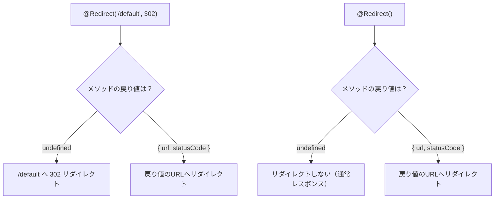

#### 認証・認可デコレータ

| デコレータ | ケース | 目的 |
|-----------|--------|------|
| `@UseGuards(guard)` | 認証/認可が必要なエンドポイント | リクエスト実行前にアクセス権をチェック |
| `@UseInterceptors(interceptor)` | リクエスト/レスポンスを加工したい時 | ログ記録、レスポンス変換等 |
| `@SetMetadata(key, value)` | Guardに追加情報を渡したい時 | 必要なロール情報などを設定 |

**具体例: 認証・認可**

```typescript
// ケース: ログインユーザーのみアクセス可能なエンドポイント
// 目的: JWTトークンを検証し、未認証ユーザーを拒否する
@UseGuards(JwtAuthGuard)
@Get('profile')
async getProfile(@CurrentUserId() userId: number) {
  return this.userService.findOne(userId);
}

// ケース: 管理者のみアクセス可能なエンドポイント
// 目的: 認証に加え、ADMINロールを持つユーザーのみ許可する
@UseGuards(JwtAuthGuard, RolesGuard)
@Roles('ADMIN')  // SetMetadataのラッパー
@Get('admin/users')
async getAllUsers() {
  return this.userService.findAll();
}
```

### 3. パラメータデコレータ

メソッドの引数に適用されるデコレータ。HTTPリクエストの様々な部分からデータを抽出する。

#### リクエストボディ関連

| デコレータ | ケース | 目的 |
|-----------|--------|------|
| `@Body()` | POSTやPATCHでJSONデータを受け取る時 | リクエストボディ全体をDTOとして取得 |
| `@Body(key)` | ボディの特定のプロパティだけ必要な時 | 特定のフィールドのみ抽出 |

**具体例: リクエストボディの取得**

```typescript
// ケース: プロジェクト作成時にname, descriptionを受け取る
// 目的: リクエストボディ全体をCreateProjectDtoとして受け取り、バリデーションを適用
// リクエスト: POST /projects { "name": "新規PJ", "description": "説明" }
@Post()
async create(@Body() dto: CreateProjectDto) {
  // dto.name → "新規PJ"
  // dto.description → "説明"
  return this.projectService.create(dto);
}

// ケース: 大きなリクエストから特定のフィールドだけ使う時
// 目的: ボディ全体をパースせず、必要なフィールドのみ取得
// リクエスト: POST /projects { "name": "新規PJ", "other": "不要なデータ" }
@Post()
async createSimple(@Body('name') name: string) {
  // name → "新規PJ"（descriptionやotherは無視）
}
```

#### URLパラメータ関連

| デコレータ | ケース | 目的 |
|-----------|--------|------|
| `@Param(key)` | URLパス内のIDや識別子を取得する時 | `/projects/:id` の `:id` 部分を取得 |
| `@Param()` | 複数のURLパラメータをまとめて取得する時 | 全パラメータをオブジェクトとして取得 |

**具体例: URLパラメータの取得**

```typescript
// ケース: プロジェクト詳細を取得（/projects/123）
// 目的: URLの:id部分を数値として取得
// ParseIntPipeで文字列→数値変換も同時に行う
@Get(':id')
async findOne(@Param('id', ParseIntPipe) id: number) {
  // /projects/123 → id = 123 (number型)
  return this.projectService.findOne(id);
}

// ケース: ネストしたリソースへのアクセス（/projects/5/tasks/10）
// 目的: 複数のURLパラメータを取得
@Get(':projectId/tasks/:taskId')
async findTask(
  @Param('projectId', ParseIntPipe) projectId: number,
  @Param('taskId', ParseIntPipe) taskId: number,
) {
  // /projects/5/tasks/10 → projectId = 5, taskId = 10
  return this.taskService.findOne(projectId, taskId);
}
```

#### クエリパラメータ関連

| デコレータ | ケース | 目的 |
|-----------|--------|------|
| `@Query()` | 検索条件やページネーションを受け取る時 | クエリ文字列全体をDTOとして取得 |
| `@Query(key)` | 特定のクエリパラメータだけ必要な時 | 特定のパラメータのみ抽出 |

**具体例: クエリパラメータの取得**

```typescript
// ケース: 一覧取得時にフィルタとページネーションを適用
// 目的: ?page=2&limit=10&status=TODO のようなクエリをDTOで受け取る
// リクエスト: GET /tasks?projectId=5&status=TODO&page=1&limit=10
@Get()
async findAll(@Query() query: TaskQueryDto) {
  // query.projectId → 5
  // query.status → "TODO"
  // query.page → 1
  // query.limit → 10
  return this.taskService.findAll(query);
}

// ケース: ページ番号だけ必要な時
// 目的: 単一のクエリパラメータを直接取得
// リクエスト: GET /projects?page=3
@Get()
async findAllSimple(@Query('page', ParseIntPipe) page: number) {
  // page → 3 (number型)
}

// ケース: オプショナルなクエリパラメータ
// 目的: パラメータが省略可能な場合のデフォルト値設定
// リクエスト: GET /projects または GET /projects?limit=5
@Get()
async findAllWithDefault(
  @Query('limit', new DefaultValuePipe(10), ParseIntPipe) limit: number,
) {
  // limit省略時 → 10、指定時 → 指定値
}
```

**具体例: パスパラメータとクエリパラメータの組み合わせ**

```typescript
// ケース: 特定のプロジェクト配下のタスク一覧をフィルタ付きで取得
// 目的: パスでリソースを特定し、クエリで絞り込み条件を指定
// リクエスト: GET /projects/5/tasks?status=TODO&priority=HIGH&page=1
@Get(':projectId/tasks')
async findTasksByProject(
  @Param('projectId', ParseIntPipe) projectId: number,  // パスパラメータ
  @Query() query: TaskQueryDto,                          // クエリパラメータ
) {
  // projectId → 5（どのプロジェクトか）
  // query.status → "TODO"（フィルタ条件）
  // query.priority → "HIGH"（フィルタ条件）
  // query.page → 1（ページネーション）
  return this.taskService.findByProject(projectId, query);
}

// ケース: ユーザーのタスク一覧を期間指定で取得
// 目的: 誰の・どの期間のタスクかを指定
// リクエスト: GET /users/10/tasks?startDate=2026-01-01&endDate=2026-01-31
@Get(':userId/tasks')
async findTasksByUser(
  @Param('userId', ParseIntPipe) userId: number,
  @Query('startDate') startDate?: string,
  @Query('endDate') endDate?: string,
) {
  // userId → 10（パスで特定）
  // startDate → "2026-01-01"（クエリで絞り込み）
  // endDate → "2026-01-31"（クエリで絞り込み）
  return this.taskService.findByUserAndPeriod(userId, startDate, endDate);
}

// ケース: 複数のパスパラメータとクエリパラメータを組み合わせ
// 目的: 階層構造のリソースに対してフィルタ・ページネーションを適用
// リクエスト: GET /projects/5/tasks/10/comments?page=1&limit=20
@Get(':projectId/tasks/:taskId/comments')
async findComments(
  @Param('projectId', ParseIntPipe) projectId: number,
  @Param('taskId', ParseIntPipe) taskId: number,
  @Query('page', new DefaultValuePipe(1), ParseIntPipe) page: number,
  @Query('limit', new DefaultValuePipe(20), ParseIntPipe) limit: number,
) {
  // projectId → 5, taskId → 10（リソースの特定）
  // page → 1, limit → 20（ページネーション）
  return this.commentService.findByTask(projectId, taskId, { page, limit });
}
```

**パスパラメータ vs クエリパラメータの使い分け**

| 用途 | 使用するもの | 例 |
|------|-------------|-----|
| リソースの特定・識別 | パスパラメータ `@Param` | `/projects/5`、`/users/10` |
| フィルタ・検索条件 | クエリパラメータ `@Query` | `?status=TODO`、`?search=keyword` |
| ページネーション | クエリパラメータ `@Query` | `?page=1&limit=10` |
| ソート順 | クエリパラメータ `@Query` | `?sort=createdAt&order=desc` |

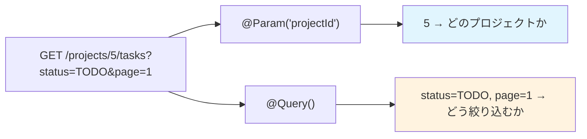

#### ヘッダー関連

| デコレータ | ケース | 目的 |
|-----------|--------|------|
| `@Headers()` | 全ヘッダーが必要な時 | ヘッダー全体をオブジェクトとして取得 |
| `@Headers(key)` | 特定のヘッダー値が必要な時 | Authorization, X-User-Id等を取得 |

**具体例: 特定のヘッダーを取得 (@Headers(key))**

```typescript
// ケース: BFFから伝播された認証情報を取得
// 目的: X-User-Idヘッダからユーザー識別子を取得
// リクエストヘッダー: X-User-Id: 123
@Post()
async create(
  @Body() dto: CreateProjectDto,
  @Headers('x-user-id') userIdHeader: string,
) {
  const userId = parseInt(userIdHeader, 10);
  return this.projectService.create(dto, userId);
}

// ケース: 認証トークンの取得
// 目的: Authorizationヘッダーからベアラートークンを抽出
// リクエストヘッダー: Authorization: Bearer eyJhbGc...
@Get('me')
async getMe(@Headers('authorization') auth: string) {
  const token = auth.replace('Bearer ', '');
  // トークンを検証...
}
```

**具体例: 全ヘッダーをオブジェクトとして取得 (@Headers())**

```typescript
import { IncomingHttpHeaders } from 'http';

// ケース: 複数のカスタムヘッダーを一括で処理したい時
// 目的: X-で始まるカスタムヘッダーをまとめて取得・処理
// リクエストヘッダー:
//   X-User-Id: 123
//   X-User-Roles: ADMIN,MEMBER
//   X-Request-Id: abc-123-def
@Post()
async create(
  @Body() dto: CreateProjectDto,
  @Headers() headers: IncomingHttpHeaders,
) {
  // オブジェクトから個別に取り出す
  const userId = headers['x-user-id'] as string;
  const roles = headers['x-user-roles'] as string;
  const requestId = headers['x-request-id'] as string;

  console.log(`[${requestId}] User ${userId} creating project`);
  return this.projectService.create(dto, parseInt(userId, 10));
}

// ケース: リクエストのメタ情報をログに記録したい時
// 目的: User-Agent、Accept-Language等の情報を収集
@Get('analytics')
async trackPageView(
  @Headers() headers: IncomingHttpHeaders,
  @Query('page') page: string,
) {
  const userAgent = headers['user-agent'];
  const acceptLanguage = headers['accept-language'];
  const referer = headers['referer'];

  await this.analyticsService.track({
    page,
    userAgent,
    language: acceptLanguage,
    referer,
  });

  return { tracked: true };
}

// ケース: 条件分岐で複数のヘッダーを参照する時
// 目的: ヘッダーの有無や値によって処理を分岐
@Get('content')
async getContent(@Headers() headers: IncomingHttpHeaders) {
  // Accept-Languageで言語を判定
  const lang = headers['accept-language']?.startsWith('ja') ? 'ja' : 'en';

  // カスタムヘッダーの有無でキャッシュ制御
  const noCache = headers['x-no-cache'] === 'true';

  // APIバージョンの判定
  const apiVersion = headers['x-api-version'] || 'v1';

  return this.contentService.get({ lang, noCache, apiVersion });
}

// ケース: ヘッダーをそのまま別サービスに転送したい時（BFFパターン）
// 目的: クライアントからのヘッダーを内部サービスに伝播
@Get('proxy/:path')
async proxyRequest(
  @Param('path') path: string,
  @Headers() headers: IncomingHttpHeaders,
) {
  // 必要なヘッダーだけを抽出して転送
  const forwardHeaders = {
    'x-user-id': headers['x-user-id'],
    'x-user-roles': headers['x-user-roles'],
    'x-request-id': headers['x-request-id'],
    'accept-language': headers['accept-language'],
  };

  return this.httpService.get(`http://internal-service/${path}`, {
    headers: forwardHeaders,
  });
}
```

**@Headers() vs @Headers(key) の使い分け**

| 方法 | ケース | メリット |
|------|--------|---------|
| `@Headers('key')` | 1〜2個の特定ヘッダーだけ必要 | シンプル、型が明確 |
| `@Headers()` | 複数ヘッダーを参照 / 動的にヘッダーを処理 | 柔軟、一括取得 |

```typescript
// @Headers(key) - 特定のヘッダーのみ（シンプルなケース）
async method(@Headers('x-user-id') userId: string) { }

// @Headers() - 全ヘッダー取得（複雑なケース）
async method(@Headers() headers: IncomingHttpHeaders) {
  const userId = headers['x-user-id'];
  const roles = headers['x-user-roles'];
  const requestId = headers['x-request-id'];
  // 複数のヘッダーを使用...
}
```

#### Expressオブジェクト直接アクセス

| デコレータ | ケース | 目的 |
|-----------|--------|------|
| `@Req()` | Expressのrequestオブジェクト全体が必要な時 | Cookie、IP、カスタム処理等 |
| `@Res()` | レスポンスを直接制御したい時 | ファイルダウンロード、ストリーミング |

**具体例: Expressオブジェクトの使用**

```typescript
// ケース: クライアントのIPアドレスを取得
// 目的: ログ記録やレート制限のためにIPを取得
@Post('login')
async login(@Body() dto: LoginDto, @Req() req: Request) {
  const clientIp = req.ip;
  return this.authService.login(dto, clientIp);
}

// ケース: ファイルダウンロード
// 目的: レスポンスストリームに直接書き込む
// 注意: @Res()使用時は戻り値が無視されるため、@Res({ passthrough: true })を使う場合あり
@Get('download/:id')
async download(@Param('id') id: string, @Res() res: Response) {
  const file = await this.fileService.getFile(id);
  res.download(file.path, file.name);
}
```

#### ファイルアップロード

ファイルをアップロードする場合、`@UseInterceptors`と専用デコレータを使用する。
本プロジェクトでは未使用だが、一般的なAPIでは頻出パターン。

**なぜ専用デコレータが必要か**

通常の`@Body()`はJSONデータを扱う。ファイルは`multipart/form-data`形式で送信されるため、
専用の処理（Multerミドルウェア）が必要になる。

| デコレータ | ケース | 目的 |
|-----------|--------|------|
| `@UploadedFile()` | 単一ファイルのアップロード | 1つのファイルを受け取る |
| `@UploadedFiles()` | 複数ファイルのアップロード | 複数ファイルを配列で受け取る |

**具体例: 単一ファイルのアップロード**

```typescript
import { FileInterceptor } from '@nestjs/platform-express';
import { UploadedFile, UseInterceptors } from '@nestjs/common';

// ケース: プロフィール画像のアップロード
// 目的: ユーザーが選択した画像ファイルを受け取り保存する
@Post('avatar')
@UseInterceptors(FileInterceptor('file'))  // 'file'はフォームのフィールド名
async uploadAvatar(
  @UploadedFile() file: Express.Multer.File,
  @CurrentUserId() userId: number,
) {
  // file.originalname → 元のファイル名
  // file.mimetype → ファイルタイプ（image/png等）
  // file.buffer → ファイルデータ（Buffer）
  // file.size → ファイルサイズ（bytes）
  return this.userService.updateAvatar(userId, file);
}
```

**具体例: 複数ファイルのアップロード**

```typescript
import { FilesInterceptor } from '@nestjs/platform-express';
import { UploadedFiles } from '@nestjs/common';

// ケース: プロジェクトに複数の添付ファイルを追加
// 目的: 一度のリクエストで複数ファイルを受け取る
@Post(':id/attachments')
@UseInterceptors(FilesInterceptor('files', 10))  // 最大10ファイル
async uploadAttachments(
  @Param('id', ParseIntPipe) projectId: number,
  @UploadedFiles() files: Express.Multer.File[],
) {
  // files は配列として受け取る
  return this.attachmentService.saveAll(projectId, files);
}
```

**ファイルバリデーション**

```typescript
import { ParseFilePipe, MaxFileSizeValidator, FileTypeValidator } from '@nestjs/common';

// ケース: ファイルサイズと形式を制限したい時
// 目的: 不正なファイルのアップロードを防ぐ
@Post('document')
@UseInterceptors(FileInterceptor('file'))
async uploadDocument(
  @UploadedFile(
    new ParseFilePipe({
      validators: [
        new MaxFileSizeValidator({ maxSize: 5 * 1024 * 1024 }),  // 5MB
        new FileTypeValidator({ fileType: 'application/pdf' }),   // PDFのみ
      ],
    }),
  )
  file: Express.Multer.File,
) {
  return this.documentService.save(file);
}
```

**ファイルアップロードの処理フロー**

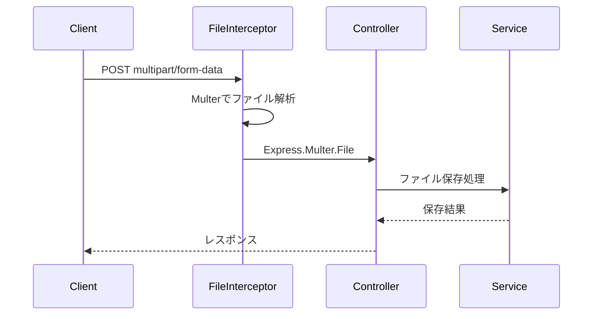

> **本プロジェクトでは未使用**: 現在のユースケースではファイルアップロードは不要。
> 将来的にプロジェクトにドキュメント添付機能を追加する場合に活用。

#### パラメータデコレータ使い分け早見表

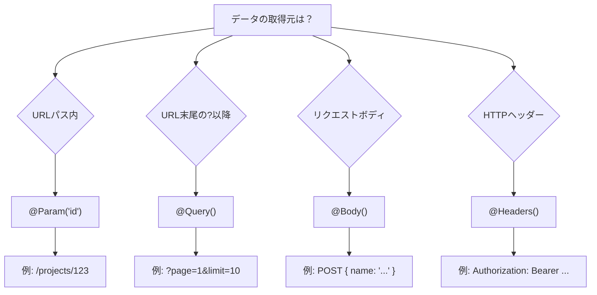

## パイプとの組み合わせ

パラメータデコレータはパイプと組み合わせて**変換・検証**を行う。

```typescript
// project.controller.ts:83
@Param('id', ParseIntPipe) id: number
//           ^^^^^^^^^^^^
//           パイプ: 文字列→数値変換
```

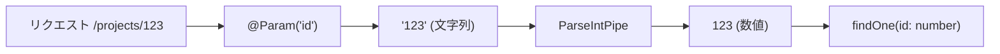

### よく使うパイプ

| パイプ | ケース | 目的 |
|--------|--------|------|
| `ParseIntPipe` | URLパラメータのIDを数値として扱いたい時 | 文字列→整数変換、数値以外はエラー |
| `ParseFloatPipe` | 小数点を含む数値を扱いたい時 | 文字列→浮動小数点数変換 |
| `ParseBoolPipe` | フラグ系のクエリパラメータを扱いたい時 | 文字列→真偽値変換 |
| `ParseUUIDPipe` | UUIDをパラメータとして受け取る時 | UUID形式の検証 |
| `ParseEnumPipe` | 列挙型の値を受け取りたい時 | 列挙型の値として検証・変換 |
| `ParseArrayPipe` | 配列形式のクエリパラメータを扱いたい時 | 文字列→配列変換 |
| `DefaultValuePipe` | 省略可能なパラメータにデフォルト値を設定したい時 | 未指定時のデフォルト値設定 |
| `ValidationPipe` | DTOのバリデーションを行いたい時 | class-validatorによる検証 |

**具体例: ParseIntPipe（文字列→整数変換）**

```typescript
// ケース: URLパラメータのIDを数値として受け取る
// 目的: '/projects/123' の '123' を number型に変換
// 失敗時: 400 Bad Request（"abc" など数値以外が来た場合）
@Get(':id')
async findOne(@Param('id', ParseIntPipe) id: number) {
  // '/projects/123' → id = 123 (number型)
  // '/projects/abc' → 400 Bad Request
  return this.projectService.findOne(id);
}

// ケース: クエリパラメータのページ番号を数値として受け取る
@Get()
async findAll(@Query('page', ParseIntPipe) page: number) {
  // '?page=2' → page = 2 (number型)
  return this.projectService.findAll({ page });
}
```

**具体例: ParseBoolPipe（文字列→真偽値変換）**

```typescript
// ケース: フラグ系のクエリパラメータを扱う
// 目的: '?active=true' を boolean型に変換
// 受け付ける値: 'true', 'false', '1', '0'
@Get()
async findAll(@Query('active', ParseBoolPipe) active: boolean) {
  // '?active=true' → active = true (boolean型)
  // '?active=1' → active = true
  // '?active=false' → active = false
  return this.userService.findAll({ active });
}

// ケース: 削除済みを含めるかどうかのフラグ
@Get()
async findAll(@Query('includeDeleted', ParseBoolPipe) includeDeleted: boolean) {
  // '?includeDeleted=true' → 削除済みも含めて取得
  return this.projectService.findAll({ includeDeleted });
}
```

**具体例: ParseUUIDPipe（UUID形式検証）**

```typescript
// ケース: UUIDをリソース識別子として使用している場合
// 目的: パラメータがUUID形式であることを検証
// 失敗時: 400 Bad Request（UUID形式でない場合）
@Get(':id')
async findOne(@Param('id', ParseUUIDPipe) id: string) {
  // '/users/550e8400-e29b-41d4-a716-446655440000' → OK
  // '/users/invalid-id' → 400 Bad Request
  return this.userService.findOne(id);
}

// UUIDバージョンを指定する場合
@Get(':id')
async findOne(@Param('id', new ParseUUIDPipe({ version: '4' })) id: string) {
  // UUID v4形式のみ受け付ける
  return this.userService.findOne(id);
}
```

**具体例: ParseEnumPipe（列挙型変換）**

```typescript
// 列挙型の定義
enum TaskStatus {
  TODO = 'TODO',
  IN_PROGRESS = 'IN_PROGRESS',
  DONE = 'DONE',
}

// ケース: ステータスでフィルタリングする場合
// 目的: クエリパラメータが列挙型の値であることを検証
// 失敗時: 400 Bad Request（列挙型にない値の場合）
@Get()
async findAll(
  @Query('status', new ParseEnumPipe(TaskStatus)) status: TaskStatus,
) {
  // '?status=TODO' → status = TaskStatus.TODO
  // '?status=INVALID' → 400 Bad Request
  return this.taskService.findByStatus(status);
}
```

**具体例: ParseArrayPipe（配列変換）**

```typescript
// ケース: 複数のIDを一度に指定したい場合
// 目的: カンマ区切りの文字列を配列に変換
// リクエスト: ?ids=1,2,3 または ?ids=1&ids=2&ids=3
@Get()
async findByIds(
  @Query('ids', new ParseArrayPipe({ items: Number, separator: ',' }))
  ids: number[],
) {
  // '?ids=1,2,3' → ids = [1, 2, 3]
  return this.projectService.findByIds(ids);
}

// ケース: 複数のタグでフィルタリング
@Get()
async findByTags(
  @Query('tags', new ParseArrayPipe({ items: String, separator: ',' }))
  tags: string[],
) {
  // '?tags=frontend,backend,api' → tags = ['frontend', 'backend', 'api']
  return this.taskService.findByTags(tags);
}
```

**具体例: DefaultValuePipe（デフォルト値設定）**

```typescript
// ケース: ページネーションのデフォルト値を設定
// 目的: パラメータが省略された場合のデフォルト値を指定
// 注意: 他のパイプと組み合わせて使用することが多い
@Get()
async findAll(
  @Query('page', new DefaultValuePipe(1), ParseIntPipe) page: number,
  @Query('limit', new DefaultValuePipe(10), ParseIntPipe) limit: number,
) {
  // '?page=2&limit=20' → page = 2, limit = 20
  // '?' → page = 1, limit = 10（デフォルト値）
  // '?page=3' → page = 3, limit = 10
  return this.projectService.findAll({ page, limit });
}

// ケース: ソート順のデフォルト値
@Get()
async findAll(
  @Query('sort', new DefaultValuePipe('createdAt')) sort: string,
  @Query('order', new DefaultValuePipe('desc')) order: 'asc' | 'desc',
) {
  // '?' → sort = 'createdAt', order = 'desc'
  return this.projectService.findAll({ sort, order });
}
```

**具体例: ValidationPipe（DTOバリデーション）**

```typescript
// 通常はmain.tsでグローバル設定（本プロジェクトの方式）
// main.ts
app.useGlobalPipes(new ValidationPipe({
  whitelist: true,        // DTOに定義されていないプロパティを除去
  forbidNonWhitelisted: true,  // 未定義プロパティがあればエラー
  transform: true,        // 型変換を有効化
}));

// 個別のエンドポイントで使用する場合
@Post()
async create(
  @Body(new ValidationPipe({ whitelist: true })) dto: CreateProjectDto,
) {
  return this.projectService.create(dto);
}

// 特定のパラメータだけに適用する場合
@Get()
async findAll(
  @Query(new ValidationPipe({ transform: true })) query: ProjectQueryDto,
) {
  // QueryのDTOも型変換・バリデーションされる
  return this.projectService.findAll(query);
}
```

**パイプの組み合わせ**

複数のパイプは左から右へ順番に実行されます。

```typescript
// DefaultValuePipe → ParseIntPipe の順で実行
@Query('page', new DefaultValuePipe(1), ParseIntPipe) page: number

// 実行フロー:
// 1. 値が未指定 → DefaultValuePipe が '1' を設定
// 2. ParseIntPipe が '1' → 1 (number) に変換
```

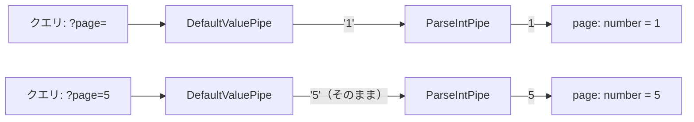

## カスタムデコレータ

標準のパラメータデコレータでは取得できない値を抽出したい場合、**カスタムデコレータ**を作成する。
本プロジェクトでは`@CurrentUserId()`でX-User-Idヘッダから認証情報を取得している。

### 作成方法

`createParamDecorator`を使用してカスタムパラメータデコレータを作成できる。

```typescript
// current-user.decorator.ts:23-42
export const CurrentUserId = createParamDecorator(
  (data: unknown, ctx: ExecutionContext): number | undefined => {
    // ExecutionContextからリクエストを取得
    const request = ctx.switchToHttp().getRequest<Request>();

    // X-User-Idヘッダを取得
    const userIdHeader = request.headers['x-user-id'];

    if (!userIdHeader) {
      return undefined;
    }

    // 文字列→数値変換
    const userId = parseInt(userIdString, 10);
    return isNaN(userId) ? undefined : userId;
  },
);
```

### 使用例

```typescript
// project.controller.ts:47-49
@Post()
async create(
  @Body() dto: CreateProjectDto,
  @CurrentUserId() userId: number | undefined,  // カスタムデコレータ
) {
  // userId は X-User-Id ヘッダから取得した値
}
```

### 仕組み

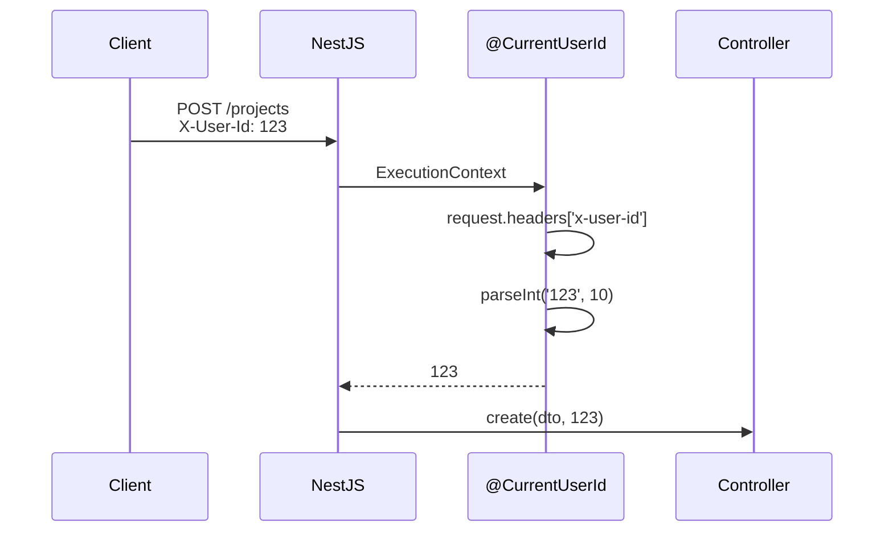

## エラーハンドリング

Controllerでエラーが発生した場合、適切なHTTPステータスコードとエラーメッセージを返す必要がある。
NestJSでは**例外をスロー**することで、自動的にエラーレスポンスが生成される。

### なぜ例外をスローするのか

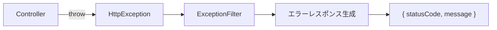

| アプローチ | 問題点 |
|-----------|--------|
| `return { error: '...' }` | ステータスコードが200になる、形式がバラバラ |
| `res.status(404).json(...)` | NestJSの機能（Interceptor等）をバイパス |
| `throw new NotFoundException()` | ✅ 統一的なエラーハンドリング、ステータスコード自動設定 |

### よく使う組み込み例外

| 例外クラス | ステータス | ケース | 目的 |
|-----------|----------|--------|------|
| `BadRequestException` | 400 | リクエストが不正な時 | クライアントの入力エラーを通知 |
| `UnauthorizedException` | 401 | 認証されていない時 | ログインが必要であることを通知 |
| `ForbiddenException` | 403 | 権限がない時 | アクセス権限がないことを通知 |
| `NotFoundException` | 404 | リソースが見つからない時 | 指定されたデータが存在しないことを通知 |
| `ConflictException` | 409 | データ競合時 | 重複登録などの競合を通知 |
| `InternalServerErrorException` | 500 | サーバーエラー時 | 予期せぬエラーを通知 |

### 具体例: リソースが見つからない場合

```typescript
// ケース: 指定されたIDのプロジェクトが存在しない
// 目的: 404 Not Foundを返し、クライアントにリソースが存在しないことを伝える
@Get(':id')
async findOne(@Param('id', ParseIntPipe) id: number) {
  const project = await this.projectService.findOne(id);

  if (!project) {
    // NotFoundException をスローすると 404 が返る
    throw new NotFoundException(`Project with id ${id} not found`);
  }

  return project;
}
```

### 具体例: 様々なエラーケース

```typescript
@Controller('projects')
export class ProjectController {
  constructor(private readonly projectService: ProjectService) {}

  @Post()
  async create(@Body() dto: CreateProjectDto, @CurrentUserId() userId: number) {
    // ケース: 認証されていない（userIdがない）
    // 目的: 401を返し、ログインが必要であることを伝える
    if (!userId) {
      throw new UnauthorizedException('Authentication required');
    }

    // ケース: 同名のプロジェクトが既に存在する
    // 目的: 409を返し、重複を通知する
    const existing = await this.projectService.findByName(dto.name);
    if (existing) {
      throw new ConflictException(`Project "${dto.name}" already exists`);
    }

    return this.projectService.create(dto, userId);
  }

  @Delete(':id')
  async delete(
    @Param('id', ParseIntPipe) id: number,
    @CurrentUserId() userId: number,
    @CurrentUserRoles() roles: string[],
  ) {
    const project = await this.projectService.findOne(id);

    // ケース: プロジェクトが存在しない
    if (!project) {
      throw new NotFoundException(`Project with id ${id} not found`);
    }

    // ケース: 削除権限がない（所有者でもADMINでもない）
    // 目的: 403を返し、権限不足を通知する
    if (project.ownerId !== userId && !roles.includes('ADMIN')) {
      throw new ForbiddenException('You do not have permission to delete this project');
    }

    return this.projectService.delete(id);
  }
}
```

### エラーレスポンスの形式

例外をスローすると、NestJSがJSON形式のエラーレスポンスを生成する。

```typescript
throw new NotFoundException('Project not found');
```

```json
// デフォルトのレスポンス形式
{
  "statusCode": 404,
  "message": "Project not found",
  "error": "Not Found"
}
```

### カスタムエラーレスポンス

本プロジェクトでは`HttpExceptionFilter`で統一フォーマットに変換している。

```json
// 本プロジェクトのレスポンス形式
{
  "error": {
    "code": "TASK_PROJECT_NOT_FOUND",
    "message": "Project not found"
  },
  "meta": {
    "timestamp": "2026-01-18T10:00:00.000Z"
  }
}
```

### エラー処理の流れ

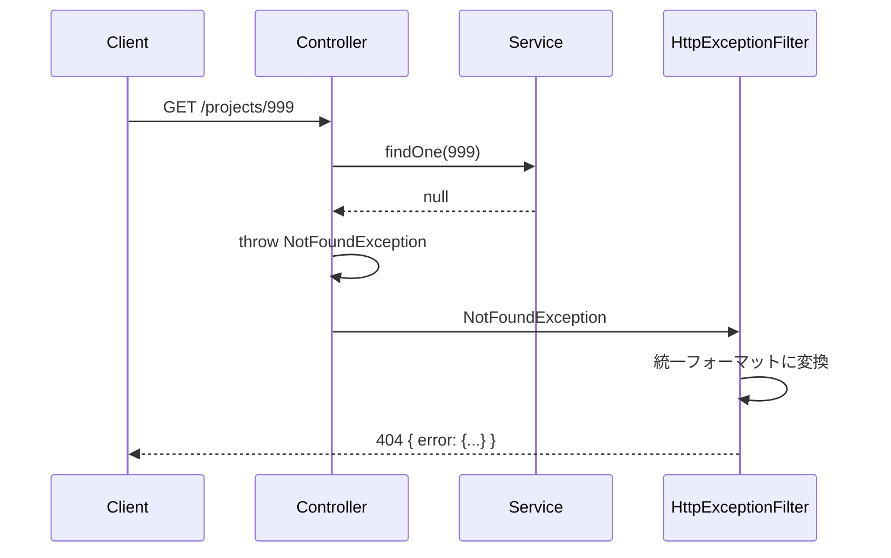

### Controller vs Service でのエラースロー

| 場所 | ケース | 理由 |
|------|--------|------|
| **Controller** | 認証・認可エラー | HTTPレイヤーの責務 |
| **Controller** | 存在チェック後の404 | HTTPステータスの決定はControllerの責務 |
| **Service** | ビジネスルール違反 | ビジネスロジックの責務 |
| **Service** | データ整合性エラー | ドメインロジックの責務 |

```typescript
// Controller: HTTPレイヤーのエラー
@Get(':id')
async findOne(@Param('id', ParseIntPipe) id: number) {
  const project = await this.projectService.findOne(id);
  if (!project) {
    throw new NotFoundException();  // Controllerで404を決定
  }
  return project;
}

// Service: ビジネスルールのエラー
async updateStatus(id: number, newStatus: TaskStatus) {
  const task = await this.taskRepository.findOne(id);
  if (task.status === 'DONE' && newStatus === 'TODO') {
    // 完了タスクをTODOに戻すことは許可しない（ビジネスルール）
    throw new BadRequestException('Cannot revert completed task to TODO');
  }
  // ...
}
```

## 非同期処理

NestJSのControllerメソッドは、**Promise**または**Observable**を返すことができる。
本プロジェクトでは`async/await`（Promise）を使用している。

### なぜ非同期処理が必要か

Controllerメソッドは、DB操作や外部API呼び出しなど**I/O待ち**が発生する処理を呼び出すことが多い。
非同期処理を使うことで、**待ち時間中に他のリクエストを処理**できる。

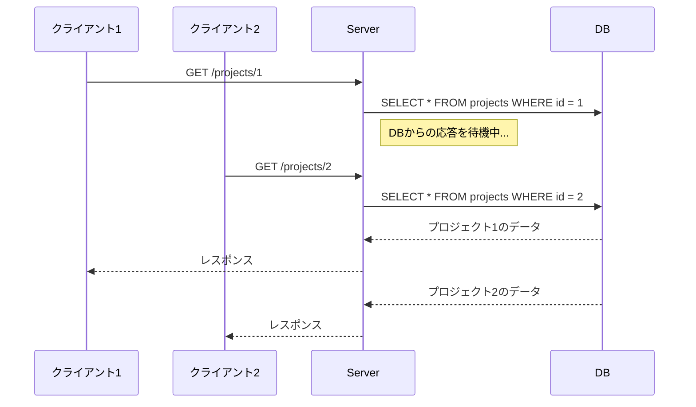

### async/await パターン（推奨）

```typescript
// ケース: DBからデータを取得する一般的なパターン
// 目的: DB操作の完了を待ってからレスポンスを返す
@Get(':id')
async findOne(@Param('id', ParseIntPipe) id: number) {
  // awaitでServiceの処理完了を待つ
  const project = await this.projectService.findOne(id);

  if (!project) {
    throw new NotFoundException();
  }

  return project;  // NestJSがJSON化してレスポンス
}
```

### 複数の非同期処理を並列実行

```typescript
// ケース: 複数のServiceを呼び出してデータを集約
// 目的: 並列実行で処理時間を短縮
@Get()
async getDashboard() {
  // Promise.all で並列実行（順番に待つより高速）
  const [projectCount, taskCount, userCount] = await Promise.all([
    this.projectService.count(),
    this.taskService.count(),
    this.userService.count(),
  ]);

  return { projectCount, taskCount, userCount };
}
```

### Observableパターン（参考）

RxJSのObservableも使用可能。リアルタイム処理やストリーミングで有用。

```typescript
import { Observable } from 'rxjs';

// ケース: HttpModuleを使った外部API呼び出し
// 目的: RxJSのパイプ演算子で柔軟なデータ加工
@Get('external')
getExternalData(): Observable<any> {
  return this.httpService.get('https://api.example.com/data').pipe(
    map(response => response.data),
    catchError(err => {
      throw new BadGatewayException('External API error');
    }),
  );
}
```

### async/await vs Observable

| 観点 | async/await | Observable |
|------|-------------|------------|
| 学習コスト | 低い（JavaScript標準） | 高い（RxJS知識が必要） |
| 単発リクエスト | ✅ シンプルで読みやすい | 冗長になりがち |
| ストリーミング | 対応不可 | ✅ 得意 |
| キャンセル | 対応不可 | ✅ 対応 |
| 本プロジェクト | ✅ 採用 | 未使用 |

> **本プロジェクトの方針**: 単発のリクエスト/レスポンスが主なため、`async/await`を採用。

## デコレータの内部動作

デコレータがどのように動作するかを理解しておくと、トラブルシューティングに役立つ。

### 実行順序

複数のデコレータは**下から上**に実行される。

```typescript
@UseGuards(AuthGuard)      // 3. 最後に実行
@UseInterceptors(LoggingInterceptor)  // 2. 次に実行
@Get(':id')                // 1. 最初に実行
async findOne() { }
```

### メタデータの仕組み

デコレータは内部で`Reflect Metadata API`を使用してメタデータを保存する。
NestJSは起動時にこのメタデータを読み取り、ルーティングやDIを構築する。

```typescript
// NestJSの@Controller内部動作（簡略化）
function Controller(path: string) {
  return (target: Function) => {
    Reflect.defineMetadata('path', path, target);
  };
}

// NestJSがメタデータを読み取る
const path = Reflect.getMetadata('path', ProjectController);
// → 'projects'
```

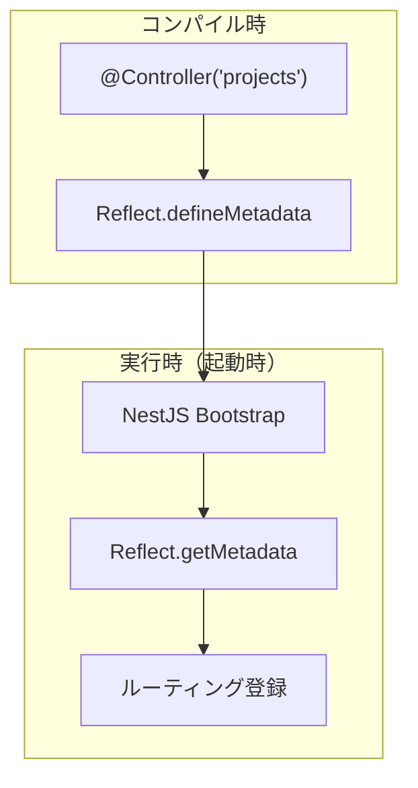

## 本プロジェクトでの使用例

### ProjectController

```typescript
@Controller('projects')  // クラスデコレータ
export class ProjectController {

  @Post()                              // メソッドデコレータ
  @HttpCode(HttpStatus.CREATED)        // メソッドデコレータ
  async create(
    @Body() dto: CreateProjectDto,     // パラメータデコレータ
    @CurrentUserId() userId: number,   // カスタムデコレータ
  ) { }

  @Get(':id')                                    // メソッドデコレータ（パス付き）
  async findOne(
    @Param('id', ParseIntPipe) id: number,       // パラメータ + パイプ
  ) { }
}
```

## まとめ

### Controller実装の要点

| トピック | 目的 | キーワード |
|---------|------|-----------|
| **責務の分離** | テスト容易性・保守性の確保 | Controllerは薄く、Serviceに委譲 |
| **依存性注入** | クラス間の疎結合化 | `constructor(private readonly service: Service)` |
| **デコレータ** | HTTPリクエストの処理定義 | `@Get`, `@Post`, `@Body`, `@Param` |
| **パイプ** | 入力の変換・検証 | `ParseIntPipe`, `ValidationPipe` |
| **エラーハンドリング** | 適切なHTTPエラーレスポンス | `throw new NotFoundException()` |
| **非同期処理** | I/O待ちの効率的な処理 | `async/await`, `Promise.all` |

### デコレータ種類一覧

| デコレータ種類 | 適用対象 | 用途 |
|--------------|---------|------|
| クラスデコレータ | class | コントローラー/モジュール定義 |
| メソッドデコレータ | method | ルーティング、ステータスコード |
| パラメータデコレータ | parameter | リクエストデータ取得 |

> **DTOのバリデーション**（プロパティデコレータ）については `dto-validation.md` を参照。

### 設計の原則

1. **Controllerは薄く保つ** - ビジネスロジックはServiceへ
2. **DIを活用する** - テスト時にモックを注入可能に
3. **例外をスローする** - 統一的なエラーハンドリング
4. **async/awaitを使う** - 可読性の高い非同期処理
5. **パイプで変換・検証** - Controller内のボイラープレート削減
