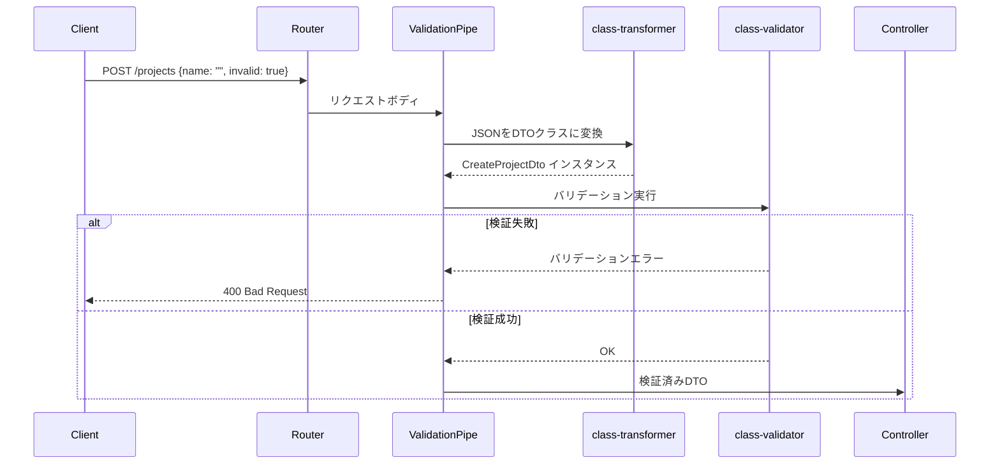
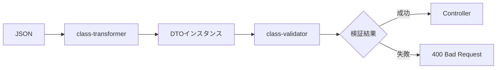
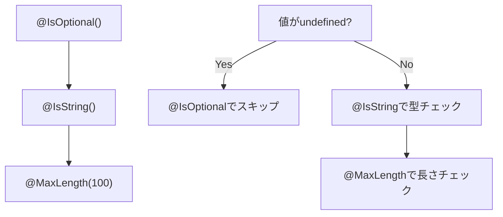
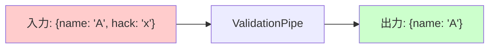
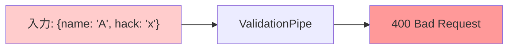
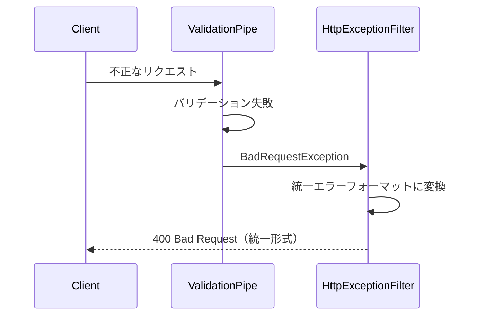

# NestJS ValidationPipe 解説

NestJSの入力検証の仕組みを解説します。

## 目次

1. [ValidationPipeとは](#1-validationpipeとは)
2. [動作の流れ](#2-動作の流れ)
3. [DTOとバリデーションデコレータ](#3-dtoとバリデーションデコレータ)
4. [ValidationPipeの設定オプション](#4-validationpipeの設定オプション)
5. [エラーレスポンス](#5-エラーレスポンス)

---

## 1. ValidationPipeとは

ValidationPipeは、NestJSが提供する**入力検証パイプ**です。
HTTPリクエストのボディやクエリパラメータを**自動的に検証**し、不正なデータを弾きます。

### 使用ライブラリ

| パッケージ | 役割 |
|-----------|------|
| `class-validator` | バリデーションデコレータ（@IsNotEmpty, @IsString等） |
| `class-transformer` | JSONからクラスインスタンスへの変換 |

これらは`@nestjs/common`の`ValidationPipe`が内部で使用しています。

---

## 2. 動作の流れ

### シーケンス図



### 処理ステップ



---

## 3. DTOとバリデーションデコレータ

### DTOの役割

DTO（Data Transfer Object）は**入力データの型とバリデーションルール**を定義するクラスです。

### コード例

```typescript
// services/task-service/src/project/dto/create-project.dto.ts
import { IsNotEmpty, IsString, MaxLength, IsOptional } from 'class-validator';

export class CreateProjectDto {
  @IsNotEmpty({ message: 'name is required' })    // 必須チェック
  @IsString({ message: 'name must be a string' }) // 文字列型チェック
  @MaxLength(100, { message: '...' })             // 最大長チェック
  name: string;

  @IsOptional()                                   // 任意フィールド
  @IsString({ message: '...' })
  @MaxLength(1000, { message: '...' })
  description?: string;
}
```

### よく使うバリデーションデコレータ

| デコレータ | 用途 | 例 |
|-----------|------|-----|
| `@IsNotEmpty()` | 空文字・null・undefinedを拒否 | 必須フィールド |
| `@IsString()` | 文字列型チェック | 名前、説明 |
| `@IsNumber()` | 数値型チェック | ID、数量 |
| `@IsInt()` | 整数チェック | ページ番号 |
| `@IsEmail()` | メールアドレス形式 | email |
| `@IsOptional()` | undefinedを許可 | 任意フィールド |
| `@MaxLength(n)` | 最大文字数 | 入力制限 |
| `@MinLength(n)` | 最小文字数 | パスワード |
| `@Min(n)` | 最小値 | ページ番号 >= 1 |
| `@Max(n)` | 最大値 | 取得件数 <= 100 |
| `@IsEnum(E)` | Enum値チェック | ステータス |
| `@IsArray()` | 配列チェック | タグリスト |
| `@ValidateNested()` | ネストオブジェクト | 複合DTO |

### バリデーションデコレータの適用順序



---

## 4. ValidationPipeの設定オプション

### main.ts での設定

```typescript
// services/task-service/src/main.ts:17-30
app.useGlobalPipes(
  new ValidationPipe({
    whitelist: true,              // DTOに定義されていないプロパティを除去
    forbidNonWhitelisted: true,   // 未定義プロパティがあればエラー
    transform: true,              // 型変換を有効化
    transformOptions: {
      enableImplicitConversion: true,  // 暗黙的型変換
    },
  }),
);
```

### 各オプションの効果

#### whitelist: true

DTOに定義されていないプロパティを**自動削除**します。



#### forbidNonWhitelisted: true

未定義プロパティがある場合、**エラー**を返します。



#### transform: true

JSONオブジェクトを**DTOクラスのインスタンス**に変換します。

```typescript
// transformなし
typeof dto === 'object'  // プレーンオブジェクト

// transformあり
dto instanceof CreateProjectDto  // クラスインスタンス
```

#### enableImplicitConversion: true

クエリパラメータの**暗黙的型変換**を有効化します。

```typescript
// GET /projects?page=1&limit=20

// enableImplicitConversion: false
query.page === '1'  // string

// enableImplicitConversion: true
query.page === 1    // number（DTOの型定義に基づいて変換）
```

### オプション比較表

| オプション | 効果 | セキュリティ |
|-----------|------|-------------|
| `whitelist: true` | 未定義プロパティを削除 | 中 |
| `forbidNonWhitelisted: true` | 未定義プロパティでエラー | 高 |
| `transform: true` | クラスインスタンス化 | - |
| `enableImplicitConversion` | 型変換 | - |

---

## 5. エラーレスポンス

### バリデーションエラー時のレスポンス

ValidationPipeのエラーは`HttpExceptionFilter`で加工され、統一フォーマットで返されます。

```
POST /projects
Content-Type: application/json

{
  "name": "",
  "description": "test"
}
```

```
HTTP/1.1 400 Bad Request

{
  "error": {
    "code": "TASK_VALIDATION_ERROR",
    "message": "name is required"
  },
  "meta": {
    "timestamp": "2026-01-15T10:00:00.000Z"
  }
}
```

### エラー処理フロー



---

## ファイル参照ガイド

| 概念 | ファイル | 行番号 |
|-----|---------|--------|
| ValidationPipe設定 | `services/task-service/src/main.ts` | 17-30 |
| CreateProjectDto | `services/task-service/src/project/dto/create-project.dto.ts` | 全体 |
| ProjectQueryDto | `services/task-service/src/project/dto/project-query.dto.ts` | 全体 |
| HttpExceptionFilter | `services/task-service/src/common/filters/http-exception.filter.ts` | 全体 |

---

## 関連ドキュメント

- [nestjs-code-structure.md](./nestjs-code-structure.md) - NestJSコード構造と起動フロー
- [docs/design/task-service-api.md](../design/task-service-api.md) - API設計（リクエスト/レスポンス仕様）
