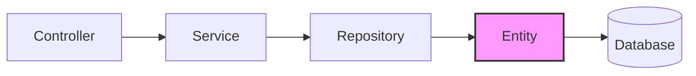
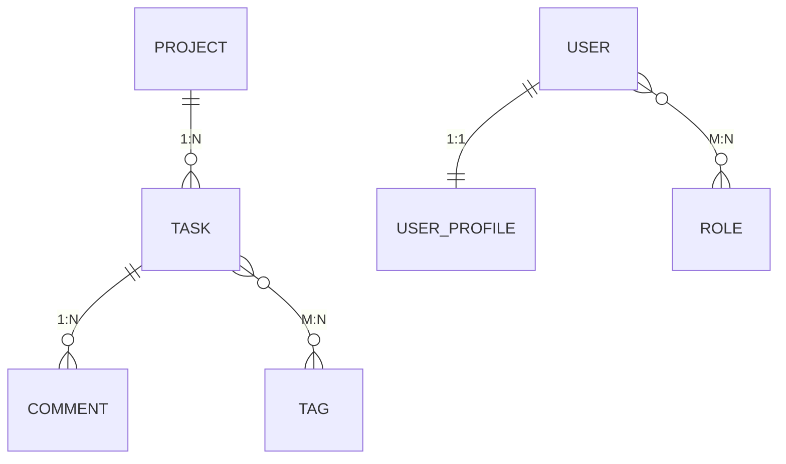
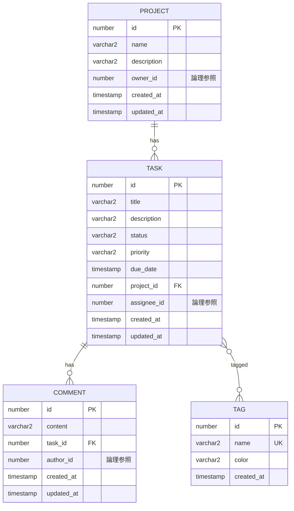
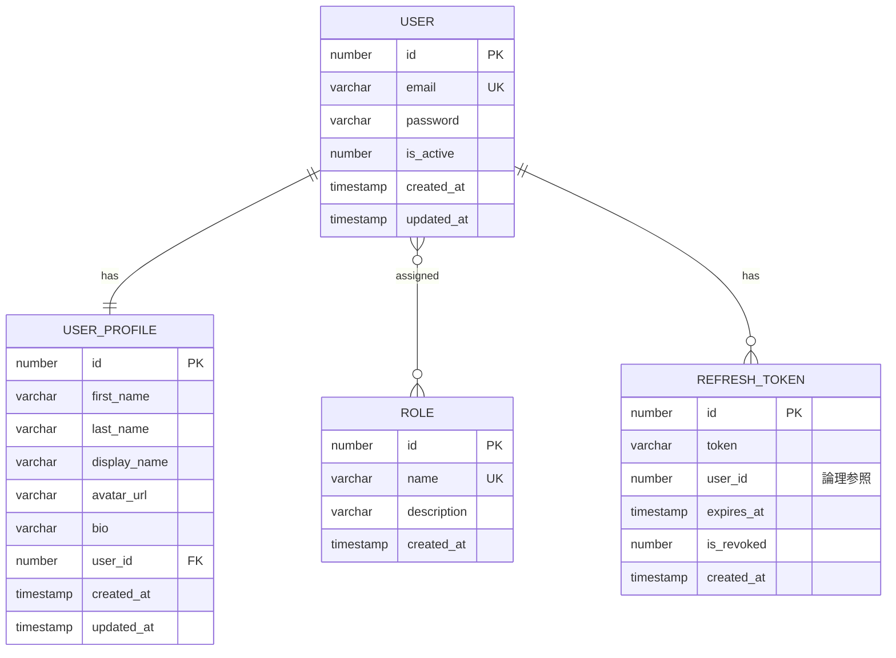

# TypeORMエンティティ詳解

TypeORMを使ったエンティティ定義の詳細を解説します。

> **対象者**: NestJSでデータベース連携を実装する開発者

## 目次

1. [概要](#1-概要)
2. [エンティティ定義の基本](#2-エンティティ定義の基本)
3. [データ型とOracle固有対応](#3-データ型とoracle固有対応)
4. [Enumの扱い](#4-enumの扱い)
5. [リレーション詳解](#5-リレーション詳解)
6. [インデックス定義](#6-インデックス定義)
7. [Value Transformer](#7-value-transformer)
8. [Cascade設定の詳細](#8-cascade設定の詳細)
9. [外部キーと論理参照](#9-外部キーと論理参照)
10. [エンティティ設計のベストプラクティス](#10-エンティティ設計のベストプラクティス)
11. [本プロジェクトのエンティティ一覧](#11-本プロジェクトのエンティティ一覧)
12. [まとめ](#12-まとめ)

---

## 1. 概要

### TypeORMとは

TypeORMは、TypeScript/JavaScript向けのORM（Object-Relational Mapping）ライブラリです。
エンティティ（クラス）とデータベースのテーブルをマッピングし、SQL文を直接書かずにDB操作を行えます。

```
TypeScript クラス  ⟷  TypeORM  ⟷  データベース テーブル
   (Entity)                          (Table)
```

### NestJSとの統合

NestJSでは `@nestjs/typeorm` パッケージを使用してTypeORMを統合します。

```typescript
// app.module.ts での設定例
@Module({
  imports: [
    TypeOrmModule.forRoot({
      type: 'oracle',
      host: 'localhost',
      port: 1521,
      username: 'task_user',
      password: 'password',
      sid: 'XE',
      entities: [Task, Project, Comment, Tag],
      synchronize: true,  // 開発用: スキーマ自動同期
    }),
    TypeOrmModule.forFeature([Task, Project, Comment, Tag]),
  ],
})
export class AppModule {}
```

### エンティティの役割



- **Entity**: テーブル構造とカラムの定義
- **Repository**: エンティティに対するCRUD操作
- **Service**: ビジネスロジック
- **Controller**: HTTPリクエスト/レスポンス

---

## 2. エンティティ定義の基本

### 2.1 最小構成

```typescript
import { Entity, PrimaryGeneratedColumn, Column } from 'typeorm';

@Entity('tasks')  // テーブル名を指定
export class Task {
  @PrimaryGeneratedColumn()  // 自動生成される主キー
  id: number;

  @Column()  // カラム
  title: string;
}
```

### 2.2 @Entity デコレータ

| オプション | 説明 | 例 |
|-----------|------|-----|
| `name` | テーブル名 | `@Entity('tasks')` または `@Entity({ name: 'tasks' })` |
| `schema` | スキーマ名 | `@Entity({ schema: 'public' })` |
| `database` | データベース名 | マルチDB環境で使用 |

**命名規則**:

```typescript
// スネークケースのテーブル名を明示的に指定（推奨）
@Entity('user_profiles')
export class UserProfile { ... }

// 指定しない場合、クラス名がそのままテーブル名に
@Entity()
export class User { ... }  // → "user" テーブル
```

### 2.3 @Column デコレータ

基本的なオプション:

| オプション | 説明 | 例 |
|-----------|------|-----|
| `name` | カラム名 | `@Column({ name: 'first_name' })` |
| `type` | データ型 | `@Column({ type: 'varchar' })` |
| `length` | 長さ | `@Column({ length: 255 })` |
| `nullable` | NULL許可 | `@Column({ nullable: true })` |
| `unique` | ユニーク制約 | `@Column({ unique: true })` |
| `default` | デフォルト値 | `@Column({ default: 'TODO' })` |

```typescript
// 本プロジェクトでの実例（Task エンティティ）
@Column({ name: 'title', type: 'varchar2', length: 200 })
title: string;

@Column({
  name: 'description',
  type: 'varchar2',
  length: 2000,
  nullable: true,
})
description: string | null;
```

### 2.4 主キーの定義

```typescript
// 自動インクリメント（推奨）
@PrimaryGeneratedColumn()
id: number;

// UUID自動生成
@PrimaryGeneratedColumn('uuid')
id: string;

// 手動設定（既存DBとの連携時など）
@PrimaryColumn()
id: number;
```

### 2.5 日時カラム

```typescript
// 作成日時（自動設定）
@CreateDateColumn({ name: 'created_at' })
createdAt: Date;

// 更新日時（自動更新）
@UpdateDateColumn({ name: 'updated_at' })
updatedAt: Date;

// 論理削除用（ソフトデリート）
@DeleteDateColumn({ name: 'deleted_at' })
deletedAt: Date;
```

**動作の違い**:

| デコレータ | 挿入時 | 更新時 | 削除時 |
|-----------|--------|--------|--------|
| `@CreateDateColumn` | 現在日時を自動設定 | 変更なし | - |
| `@UpdateDateColumn` | 現在日時を自動設定 | 現在日時を自動更新 | - |
| `@DeleteDateColumn` | NULL | NULL | 現在日時を設定 |

---

## 3. データ型とOracle固有対応

### 3.1 主要なデータ型マッピング

| TypeScript型 | Oracle型 | TypeORM設定 |
|-------------|----------|-------------|
| `string` | VARCHAR2 | `type: 'varchar2', length: n` |
| `number` (整数) | NUMBER | `type: 'number'` |
| `number` (小数) | NUMBER(p,s) | `type: 'decimal', precision: p, scale: s` |
| `boolean` | NUMBER(1) | `type: 'number', width: 1` + transformer |
| `Date` | TIMESTAMP | `type: 'timestamp'` |
| `Date` (日付のみ) | DATE | `type: 'date'` |

### 3.2 Oracle固有の注意点

#### VARCHAR2の使用

```typescript
// PostgreSQL/MySQL
@Column({ type: 'varchar', length: 255 })

// Oracle
@Column({ type: 'varchar2', length: 255 })
```

#### Boolean型の扱い

Oracleはboolean型をサポートしないため、NUMBER(1)で代用します。

```typescript
// OracleでのBoolean実装
@Column({
  name: 'is_active',
  type: 'number',
  width: 1,
  default: 1,
  transformer: {
    to: (value: boolean): number => (value ? 1 : 0),
    from: (value: number): boolean => value === 1,
  },
})
isActive: boolean;
```

**動作**:
- JavaScript: `true` / `false`
- データベース: `1` / `0`

#### 数値型の精度

```typescript
// 整数（デフォルト）
@Column({ type: 'number' })
count: number;

// 小数（価格など）
@Column({ type: 'decimal', precision: 10, scale: 2 })
price: number;  // 例: 12345678.90
```

### 3.3 本プロジェクトでのデータ型使用例

```typescript
// Project エンティティ
@Column({ name: 'name', type: 'varchar2', length: 100 })
name: string;

@Column({ name: 'owner_id', type: 'number' })
ownerId: number;

// Task エンティティ
@Column({ name: 'due_date', type: 'timestamp', nullable: true })
dueDate: Date | null;
```

---

## 4. Enumの扱い

### 4.1 OracleでのEnum実装

OracleはENUM型をネイティブサポートしていないため、**VARCHAR + TypeScript enum**で実装します。

```typescript
// Enum定義
export enum TaskStatus {
  TODO = 'TODO',
  IN_PROGRESS = 'IN_PROGRESS',
  DONE = 'DONE',
}

// エンティティでの使用
@Column({
  name: 'status',
  type: 'varchar2',
  length: 20,
  default: TaskStatus.TODO,
})
status: TaskStatus;
```

### 4.2 Enumファイルの構成

```
services/task-service/src/task/entities/
├── task.entity.ts
├── task-status.enum.ts    ← Enum定義
└── task-priority.enum.ts  ← Enum定義
```

**task-status.enum.ts**:

```typescript
/**
 * タスクステータス Enum
 *
 * Why: OracleはENUM型をサポートしないため、
 * VARCHAR + TypeScript enumで実装する。
 * DBにはTODO, IN_PROGRESS, DONEの文字列が保存される。
 */
export enum TaskStatus {
  /** 未着手 */
  TODO = 'TODO',
  /** 進行中 */
  IN_PROGRESS = 'IN_PROGRESS',
  /** 完了 */
  DONE = 'DONE',
}
```

### 4.3 Enumのバリデーション

DTOでは `@IsEnum()` でバリデーションを行います。

```typescript
// create-task.dto.ts
import { IsEnum } from 'class-validator';
import { TaskStatus } from '../entities/task-status.enum';

export class CreateTaskDto {
  @IsOptional()
  @IsEnum(TaskStatus, {
    message: 'status must be one of: TODO, IN_PROGRESS, DONE',
  })
  status?: TaskStatus;
}
```

### 4.4 数値Enumの選択肢

文字列Enumの代わりに数値Enumも使用可能ですが、本プロジェクトでは**可読性重視で文字列Enumを採用**しています。

```typescript
// 数値Enum（非採用）
export enum TaskStatus {
  TODO = 0,
  IN_PROGRESS = 1,
  DONE = 2,
}
// DB: 0, 1, 2 が保存される
// デメリット: SQLで確認時に意味がわかりにくい

// 文字列Enum（採用）
export enum TaskStatus {
  TODO = 'TODO',
  IN_PROGRESS = 'IN_PROGRESS',
  DONE = 'DONE',
}
// DB: 'TODO', 'IN_PROGRESS', 'DONE' が保存される
// メリット: SQLで確認時に意味が明確
```

---

## 5. リレーション詳解

### 5.1 リレーションの種類



| 種類 | デコレータ | 例 |
|------|-----------|-----|
| 1対多 | `@OneToMany` / `@ManyToOne` | Project - Task |
| 1対1 | `@OneToOne` | User - UserProfile |
| 多対多 | `@ManyToMany` | Task - Tag, User - Role |

### 5.2 OneToMany / ManyToOne

**最も一般的なリレーション**。外部キーは「多」側に配置されます。

```typescript
// Project（1側）
@Entity('projects')
export class Project {
  @PrimaryGeneratedColumn()
  id: number;

  @Column({ type: 'varchar2', length: 100 })
  name: string;

  // 1対多: 1つのプロジェクトに複数のタスク
  @OneToMany(() => Task, (task) => task.project, { cascade: true })
  tasks: Task[];
}

// Task（多側）
@Entity('tasks')
export class Task {
  @PrimaryGeneratedColumn()
  id: number;

  // 外部キーカラム（明示的に定義）
  @Column({ name: 'project_id', type: 'number' })
  projectId: number;

  // 多対1: 複数のタスクが1つのプロジェクトに属する
  @ManyToOne(() => Project, { nullable: false, onDelete: 'CASCADE' })
  @JoinColumn({ name: 'project_id' })
  project: Project;
}
```

**ポイント**:
- `@JoinColumn`は外部キーを持つ側（「多」側）に配置
- `projectId`カラムを別途定義すると、リレーションをロードせずIDだけ取得可能
- `onDelete: 'CASCADE'`で親削除時に子も削除

### 5.3 OneToOne

**1対1のリレーション**。どちらにJoinColumnを置くかで「オーナー側」が決まります。

```typescript
// User（非オーナー側）
@Entity('users')
export class User {
  @PrimaryGeneratedColumn()
  id: number;

  @Column({ type: 'varchar', length: 255, unique: true })
  email: string;

  // cascade: true でUser作成時にProfileも同時作成可能
  @OneToOne(() => UserProfile, (profile) => profile.user, { cascade: true })
  profile: UserProfile;
}

// UserProfile（オーナー側 - JoinColumnを持つ）
@Entity('user_profiles')
export class UserProfile {
  @PrimaryGeneratedColumn()
  id: number;

  @Column({ name: 'display_name', type: 'varchar', length: 100 })
  displayName: string;

  // JoinColumnを持つ側がオーナー
  @OneToOne(() => User, (user) => user.profile, {
    nullable: false,
    onDelete: 'CASCADE',
  })
  @JoinColumn({ name: 'user_id' })
  user: User;

  // 外部キーカラムを明示的に公開
  @Column({ name: 'user_id' })
  userId: number;
}
```

**なぜUserとUserProfileを分離するのか**:

1. **パフォーマンス**: 認証処理時に不要なプロフィール情報をロードしない
2. **更新頻度の違い**: プロフィール更新と認証情報更新は頻度が異なる
3. **学習目的**: 1対1リレーションのパターンを学ぶ

### 5.4 ManyToMany

**多対多のリレーション**。中間テーブルが必要です。

```typescript
// Task（オーナー側 - JoinTableを持つ）
@Entity('tasks')
export class Task {
  @PrimaryGeneratedColumn()
  id: number;

  @ManyToMany(() => Tag, (tag) => tag.tasks)
  @JoinTable({
    name: 'task_tags',  // 中間テーブル名
    joinColumn: { name: 'task_id', referencedColumnName: 'id' },
    inverseJoinColumn: { name: 'tag_id', referencedColumnName: 'id' },
  })
  tags: Tag[];
}

// Tag（非オーナー側）
@Entity('tags')
export class Tag {
  @PrimaryGeneratedColumn()
  id: number;

  @Column({ type: 'varchar2', length: 50, unique: true })
  name: string;

  // 逆方向のリレーション（JoinTableなし）
  @ManyToMany(() => Task, (task) => task.tags)
  tasks: Task[];
}
```

**生成される中間テーブル**:

```sql
CREATE TABLE task_tags (
  task_id NUMBER NOT NULL,
  tag_id NUMBER NOT NULL,
  PRIMARY KEY (task_id, tag_id),
  FOREIGN KEY (task_id) REFERENCES tasks(id) ON DELETE CASCADE,
  FOREIGN KEY (tag_id) REFERENCES tags(id) ON DELETE CASCADE
);
```

### 5.5 リレーションオプション

| オプション | 説明 | 例 |
|-----------|------|-----|
| `eager` | 常に一緒にロード | `{ eager: true }` |
| `lazy` | 遅延ロード（Promise） | `{ lazy: true }` |
| `cascade` | 操作の連鎖 | `{ cascade: true }` |
| `onDelete` | 削除時の動作 | `'CASCADE'`, `'SET NULL'`, `'NO ACTION'` |
| `nullable` | NULL許可 | `{ nullable: true }` |

**eagerとlazyの違い**:

```typescript
// eager: true - 常にロード
@OneToMany(() => Task, (task) => task.project, { eager: true })
tasks: Task[];
// project = await projectRepo.findOne(1);
// project.tasks は既にロード済み

// lazy: true - アクセス時にロード（Promise）
@OneToMany(() => Task, (task) => task.project, { lazy: true })
tasks: Promise<Task[]>;
// project = await projectRepo.findOne(1);
// tasks = await project.tasks;  // ここでロード

// デフォルト - 明示的にロードが必要
@OneToMany(() => Task, (task) => task.project)
tasks: Task[];
// project = await projectRepo.findOne({
//   where: { id: 1 },
//   relations: ['tasks'],  // 明示的に指定
// });
```

### 5.6 循環参照の回避

リレーション定義で循環参照を避けるため、**アロー関数**で型を指定します。

```typescript
// NG: 直接参照（循環参照エラーの可能性）
@OneToMany(Task, task => task.project)

// OK: アロー関数で遅延評価
@OneToMany(() => Task, (task) => task.project)
```

---

## 6. インデックス定義

### 6.1 単一カラムインデックス

クラスレベルで `@Index` デコレータを使用します。

```typescript
@Entity('tasks')
@Index('idx_tasks_project_id', ['projectId'])
@Index('idx_tasks_status', ['status'])
@Index('idx_tasks_assignee_id', ['assigneeId'])
export class Task {
  // ...
}
```

### 6.2 複合インデックス

複数カラムを組み合わせたインデックス。

```typescript
// プロジェクトとステータスで頻繁に検索する場合
@Index('idx_tasks_project_status', ['projectId', 'status'])
```

### 6.3 ユニークインデックス

ユニーク制約とインデックスを同時に設定。

```typescript
// @Column の unique オプション
@Column({ type: 'varchar', length: 255, unique: true })
email: string;

// または @Index の unique オプション
@Index('idx_users_email', ['email'], { unique: true })
```

### 6.4 インデックス設計の指針

| 検索パターン | インデックス設計 |
|-------------|-----------------|
| 外部キーでの検索 | 外部キーカラムに単一インデックス |
| ステータスでのフィルタ | ステータスカラムに単一インデックス |
| 複合条件での検索 | 頻度の高い組み合わせに複合インデックス |

**本プロジェクトでの実例**:

```typescript
// Task エンティティ
@Index('idx_tasks_project_id', ['projectId'])    // プロジェクト内タスク取得
@Index('idx_tasks_status', ['status'])            // ステータスでフィルタ
@Index('idx_tasks_assignee_id', ['assigneeId'])   // 担当者でフィルタ

// Comment エンティティ
@Index('idx_comments_task_id', ['taskId'])        // タスクのコメント取得
```

---

## 7. Value Transformer

### 7.1 Transformerとは

データベースとアプリケーション間で値を変換する仕組みです。

```
アプリケーション ←→ Transformer ←→ データベース
   (boolean)          to/from        (number)
```

### 7.2 Boolean Transformer

Oracleでboolean型を扱う場合の必須パターン。

```typescript
@Column({
  name: 'is_active',
  type: 'number',
  width: 1,
  default: 1,
  transformer: {
    // アプリ → DB: boolean → number
    to: (value: boolean): number => (value ? 1 : 0),
    // DB → アプリ: number → boolean
    from: (value: number): boolean => value === 1,
  },
})
isActive: boolean;
```

**使用箇所**:
- `services/user-service/src/user/entities/user.entity.ts` - `isActive`
- `services/user-service/src/auth/entities/refresh-token.entity.ts` - `isRevoked`

### 7.3 再利用可能なTransformer

共通のTransformerをクラスとして定義することも可能。

```typescript
// common/transformers/boolean.transformer.ts
export class BooleanTransformer implements ValueTransformer {
  to(value: boolean): number {
    return value ? 1 : 0;
  }

  from(value: number): boolean {
    return value === 1;
  }
}

// 使用例
@Column({
  name: 'is_active',
  type: 'number',
  width: 1,
  default: 1,
  transformer: new BooleanTransformer(),
})
isActive: boolean;
```

### 7.4 その他のTransformer例

```typescript
// JSON変換
const JsonTransformer: ValueTransformer = {
  to: (value: object): string => JSON.stringify(value),
  from: (value: string): object => JSON.parse(value),
};

// 暗号化（例: パスワード以外の機密情報）
const EncryptTransformer: ValueTransformer = {
  to: (value: string): string => encrypt(value),
  from: (value: string): string => decrypt(value),
};
```

---

## 8. Cascade設定の詳細

### 8.1 Cascadeオプション

親エンティティの操作を子エンティティに連鎖させます。

```typescript
@OneToMany(() => Task, (task) => task.project, { cascade: true })
tasks: Task[];
```

| オプション | 動作 |
|-----------|------|
| `cascade: true` | insert, update, remove 全て連鎖 |
| `cascade: ['insert']` | insert のみ連鎖 |
| `cascade: ['update']` | update のみ連鎖 |
| `cascade: ['remove']` | remove のみ連鎖 |

### 8.2 使用例

```typescript
// Project削除時にTaskも削除される
@OneToMany(() => Task, (task) => task.project, { cascade: true })
tasks: Task[];

// User作成時にProfileも同時作成される
@OneToOne(() => UserProfile, (profile) => profile.user, { cascade: true })
profile: UserProfile;
```

### 8.3 onDeleteとの違い

| 設定 | 制御レベル | 動作 |
|------|-----------|------|
| `cascade` | TypeORM（アプリ層） | TypeORMのRepository経由の操作に適用 |
| `onDelete` | データベース（DB層） | 直接SQLでの削除にも適用 |

```typescript
// 両方設定するのが安全
@ManyToOne(() => Project, { nullable: false, onDelete: 'CASCADE' })
@JoinColumn({ name: 'project_id' })
project: Project;
```

### 8.4 Cascade使用時の注意点

- **パフォーマンス**: 大量の子エンティティがある場合、削除に時間がかかる
- **意図しない削除**: cascade設定を誤ると、意図しないデータが削除される
- **推奨**: 明示的に`cascade: ['insert']`のように必要な操作のみ指定

---

## 9. 外部キーと論理参照

### 9.1 物理外部キーと論理参照

| 種類 | 特徴 | 使用場面 |
|------|------|---------|
| 物理外部キー | DB制約で整合性を保証 | 同一DB内のリレーション |
| 論理参照 | アプリ層で整合性を管理 | マイクロサービス間 |

### 9.2 本プロジェクトでの使い分け

**物理外部キー（同一サービス内）**:

```typescript
// Task → Project（同一サービス内）
@ManyToOne(() => Project, { nullable: false, onDelete: 'CASCADE' })
@JoinColumn({ name: 'project_id' })
project: Project;
```

**論理参照（サービス間）**:

```typescript
// Project.ownerId → user-service の User
// 外部キー制約なし
@Column({ name: 'owner_id', type: 'number' })
ownerId: number;

// Task.assigneeId → user-service の User
// 外部キー制約なし
@Column({ name: 'assignee_id', type: 'number', nullable: true })
assigneeId: number | null;
```

### 9.3 論理参照のメリット

1. **サービスの独立性**: DB間の依存がない
2. **デプロイの柔軟性**: サービスを個別にデプロイ可能
3. **データベースの分離**: サービスごとに異なるDBを使用可能

### 9.4 論理参照時の整合性担保

整合性はBFF層（api-gateway）で担保します。

```typescript
// api-gateway での例
async createProject(dto: CreateProjectDto, userId: number) {
  // 1. user-serviceでユーザーの存在確認
  const user = await this.userService.findById(userId);
  if (!user) {
    throw new BadRequestException('User not found');
  }

  // 2. task-serviceでプロジェクト作成
  return this.taskService.createProject({
    ...dto,
    ownerId: userId,
  });
}
```

---

## 10. エンティティ設計のベストプラクティス

### 10.1 命名規則

| 対象 | 規則 | 例 |
|------|------|-----|
| エンティティクラス | PascalCase | `UserProfile` |
| テーブル名 | snake_case（複数形） | `user_profiles` |
| カラム名 | snake_case | `first_name` |
| プロパティ名 | camelCase | `firstName` |

```typescript
@Entity('user_profiles')
export class UserProfile {
  @Column({ name: 'first_name', type: 'varchar', length: 100 })
  firstName: string;
}
```

### 10.2 外部キーカラムの明示的定義

リレーションとは別に外部キーカラムを定義すると便利です。

```typescript
// 外部キーカラムを明示的に定義
@Column({ name: 'project_id', type: 'number' })
projectId: number;

// リレーション
@ManyToOne(() => Project)
@JoinColumn({ name: 'project_id' })
project: Project;
```

**メリット**:
- リレーションをロードせずにIDだけ取得可能
- クエリビルダーでの条件指定が簡単

### 10.3 nullable設計

```typescript
// 必須フィールド
@Column({ type: 'varchar2', length: 200 })  // nullable: false がデフォルト
title: string;

// 任意フィールド
@Column({ type: 'varchar2', length: 2000, nullable: true })
description: string | null;  // TypeScript型も null を許可
```

### 10.4 コメントの付け方

本プロジェクトでは学習目的のため、以下の情報をコメントに記載します。

```typescript
/**
 * オーナーユーザーID
 * - 必須、user-serviceへの論理参照（外部キー制約なし）
 *
 * Why: BFFから伝播されるX-User-Idを使用して設定
 */
@Column({ name: 'owner_id', type: 'number' })
ownerId: number;
```

---

## 11. 本プロジェクトのエンティティ一覧

### task-service

| エンティティ | テーブル | 説明 |
|-------------|---------|------|
| Project | projects | プロジェクト |
| Task | tasks | タスク |
| Comment | comments | コメント |
| Tag | tags | タグ |

**ER図**:



### user-service

| エンティティ | テーブル | 説明 |
|-------------|---------|------|
| User | users | ユーザー（認証情報） |
| UserProfile | user_profiles | ユーザープロフィール |
| Role | roles | ロール |
| RefreshToken | refresh_tokens | リフレッシュトークン |

**ER図**:



---

## 12. まとめ

### 主要なデコレータ

| デコレータ | 用途 |
|-----------|------|
| `@Entity` | テーブル定義 |
| `@Column` | カラム定義 |
| `@PrimaryGeneratedColumn` | 自動生成主キー |
| `@CreateDateColumn` / `@UpdateDateColumn` | 日時自動設定 |
| `@OneToMany` / `@ManyToOne` | 1対多リレーション |
| `@OneToOne` | 1対1リレーション |
| `@ManyToMany` | 多対多リレーション |
| `@JoinColumn` / `@JoinTable` | 結合カラム/テーブル定義 |
| `@Index` | インデックス定義 |

### 本プロジェクトの設計判断

| 項目 | 判断 | 理由 |
|------|------|------|
| Enum | 文字列Enum | SQLでの可読性 |
| Boolean | NUMBER(1) + Transformer | Oracle互換性 |
| サービス間参照 | 論理参照（外部キーなし） | マイクロサービスの独立性 |
| 命名 | テーブル=snake_case、プロパティ=camelCase | 業界標準 |

### 関連ドキュメント

- [dto-validation.md](./dto-validation.md) - DTOバリデーション詳解
- [nestjs-controller.md](./nestjs-controller.md) - Controller実装
- [docs/project-plan.md](../project-plan.md) - プロジェクト設計・ADR

---

## ファイル参照ガイド

| 概念 | ファイル |
|-----|---------|
| Projectエンティティ | `services/task-service/src/project/entities/project.entity.ts` |
| Taskエンティティ | `services/task-service/src/task/entities/task.entity.ts` |
| Commentエンティティ | `services/task-service/src/comment/entities/comment.entity.ts` |
| Tagエンティティ | `services/task-service/src/tag/entities/tag.entity.ts` |
| Userエンティティ | `services/user-service/src/user/entities/user.entity.ts` |
| UserProfileエンティティ | `services/user-service/src/user/entities/user-profile.entity.ts` |
| Roleエンティティ | `services/user-service/src/role/entities/role.entity.ts` |
| RefreshTokenエンティティ | `services/user-service/src/auth/entities/refresh-token.entity.ts` |
| TaskStatus Enum | `services/task-service/src/task/entities/task-status.enum.ts` |
| TaskPriority Enum | `services/task-service/src/task/entities/task-priority.enum.ts` |
