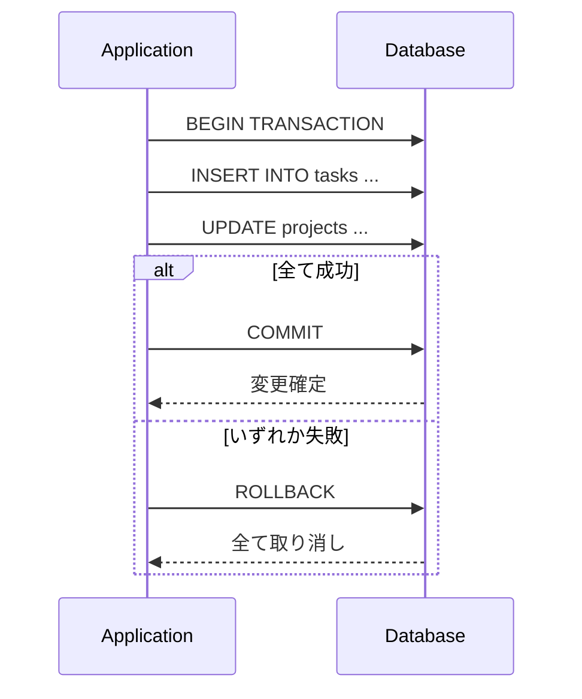
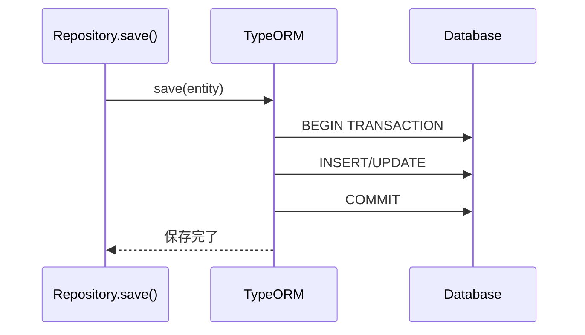
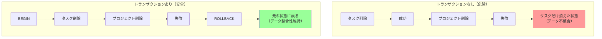
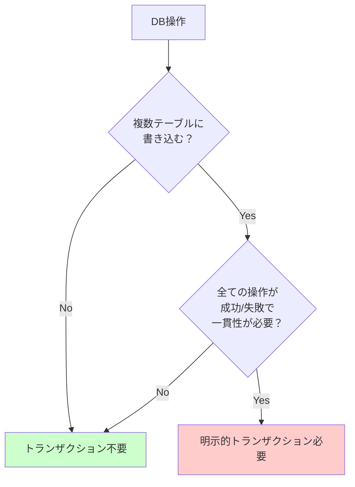
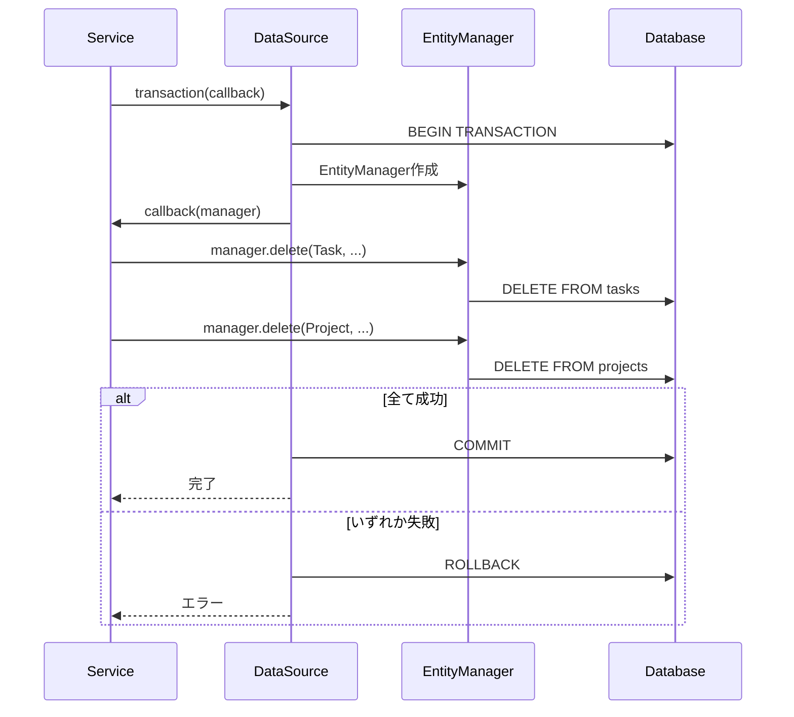
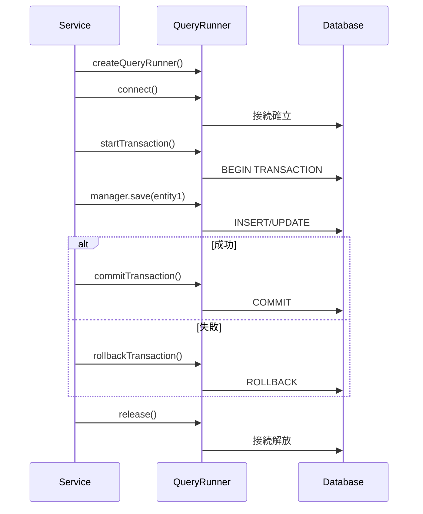
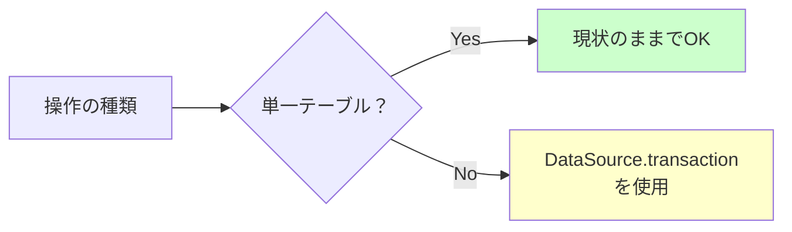

# TypeORM トランザクション管理

NestJS + TypeORMでのトランザクション管理について解説します。

## 目次

1. [トランザクションとは](#1-トランザクションとは)
2. [TypeORMの自動トランザクション](#2-typeormの自動トランザクション)
3. [明示的トランザクションが必要なケース](#3-明示的トランザクションが必要なケース)
4. [NestJSでのトランザクション実装方法](#4-nestjsでのトランザクション実装方法)
5. [本プロジェクトの実装状況](#5-本プロジェクトの実装状況)

---

## 1. トランザクションとは

トランザクションは、複数のDB操作を**一つの論理的な単位**として扱う仕組みです。

### ACID特性

| 特性 | 説明 |
|-----|------|
| **A**tomicity（原子性） | 全て成功するか、全て失敗するか |
| **C**onsistency（一貫性） | データの整合性を保証 |
| **I**solation（分離性） | 他のトランザクションから独立 |
| **D**urability（永続性） | コミット後のデータは永続化 |

### トランザクションの流れ



---

## 2. TypeORMの自動トランザクション

### 単一操作は自動管理

TypeORMの`save()`や`delete()`は、**内部で自動的にトランザクション**を使用しています。

```typescript
// 単一操作 → 自動トランザクション
await repository.save(entity);   // 内部でBEGIN...COMMIT
await repository.delete(id);     // 内部でBEGIN...COMMIT
```

### 自動トランザクションの流れ



### 単一操作でトランザクションが不要な理由

| 操作 | 説明 |
|-----|------|
| `save()` | 1回のINSERT/UPDATEは原子的 |
| `delete()` | 1回のDELETEは原子的 |
| `findOne()` | 読み取り専用、変更なし |

---

## 3. 明示的トランザクションが必要なケース

### ケース1: 複数テーブルの一括更新



### ケース2: ビジネスロジックで複数操作

```typescript
// 注文処理の例（トランザクション必要）
async createOrder(dto: CreateOrderDto): Promise<Order> {
  // 1. 在庫を減らす
  await this.inventoryRepository.decrease(dto.productId, dto.quantity);
  // 2. 注文を作成
  const order = await this.orderRepository.create(dto);
  // 3. 支払い処理
  await this.paymentRepository.process(order.id);
  // ↑ 3で失敗したら1,2も取り消したい
}
```

### トランザクションが必要な判断基準



---

## 4. NestJSでのトランザクション実装方法

### 方法1: DataSource.transaction()（推奨）

最もシンプルで推奨される方法です。

```typescript
import { Injectable } from '@nestjs/common';
import { DataSource } from 'typeorm';
import { Project } from './entities/project.entity';
import { Task } from '../task/entities/task.entity';

@Injectable()
export class ProjectService {
  constructor(private readonly dataSource: DataSource) {}

  /**
   * プロジェクトと関連タスクを一括削除
   */
  async deleteWithTasks(id: number): Promise<void> {
    await this.dataSource.transaction(async (manager) => {
      // トランザクション内のEntityManagerを使用
      await manager.delete(Task, { projectId: id });
      await manager.delete(Project, { id });
      // どちらかが失敗したら全体がロールバック
    });
  }
}
```

### transaction() の流れ



### 方法2: QueryRunner（細かい制御が必要な場合）

トランザクションの開始・コミット・ロールバックを手動で制御できます。

```typescript
import { Injectable } from '@nestjs/common';
import { DataSource } from 'typeorm';

@Injectable()
export class ProjectService {
  constructor(private readonly dataSource: DataSource) {}

  async complexOperation(): Promise<void> {
    const queryRunner = this.dataSource.createQueryRunner();

    // 接続確立
    await queryRunner.connect();
    // トランザクション開始
    await queryRunner.startTransaction();

    try {
      // トランザクション内の操作
      await queryRunner.manager.save(entity1);
      await queryRunner.manager.save(entity2);

      // 全て成功したらコミット
      await queryRunner.commitTransaction();
    } catch (err) {
      // エラー時はロールバック
      await queryRunner.rollbackTransaction();
      throw err;
    } finally {
      // 接続解放（必須）
      await queryRunner.release();
    }
  }
}
```

### QueryRunner の流れ



### 方法3: @Transactional デコレータ（typeorm-transactional）

デコレータベースで簡潔に記述できます（追加パッケージが必要）。

```bash
npm install typeorm-transactional
```

```typescript
import { Transactional } from 'typeorm-transactional';

@Injectable()
export class ProjectService {
  @Transactional()
  async createWithTasks(dto: CreateProjectDto): Promise<Project> {
    // このメソッド全体が1つのトランザクション
    const project = await this.projectRepository.create(dto);
    await this.taskRepository.createMany(dto.tasks);
    return project;
  }
}
```

### 方法比較

| 方法 | 簡潔さ | 制御の細かさ | 追加依存 |
|-----|--------|-------------|---------|
| DataSource.transaction() | ○ | △ | なし |
| QueryRunner | △ | ○ | なし |
| @Transactional | ○ | △ | あり |

---

## 5. 本プロジェクトの実装状況

### 現状

本プロジェクトでは、**明示的なトランザクションは使用していません**。

```typescript
// services/task-service/src/project/project.repository.ts
async delete(id: number): Promise<boolean> {
  const result = await this.repository.delete(id);
  return (result.affected ?? 0) > 0;
}
```

### 理由

| 理由 | 説明 |
|-----|------|
| 学習目的 | 複雑な操作を避けてシンプルに |
| 単一テーブル操作 | TypeORMの自動トランザクションで十分 |
| カスケード削除 | `cascade: true`でDB側で処理 |

### カスケード削除の設定

```typescript
// services/task-service/src/project/entities/project.entity.ts
@OneToMany(() => Task, task => task.project, { cascade: true })
tasks: Task[];
```

### 本番環境での推奨事項



---

## 参考: エラーハンドリングとの組み合わせ

```typescript
@Injectable()
export class ProjectService {
  constructor(
    private readonly dataSource: DataSource,
    private readonly projectRepository: ProjectRepository,
  ) {}

  async deleteWithTasks(id: number, userId: number): Promise<void> {
    // 事前チェック（トランザクション外）
    const project = await this.projectRepository.findById(id);
    if (!project) {
      throw new ProjectNotFoundException(id);
    }
    if (project.ownerId !== userId) {
      throw new ProjectForbiddenException('Only the owner can delete');
    }

    // トランザクション内でDB操作
    await this.dataSource.transaction(async (manager) => {
      await manager.delete(Task, { projectId: id });
      await manager.delete(Project, { id });
    });
  }
}
```

---

## 関連ドキュメント

- [nestjs-code-structure.md](./nestjs-code-structure.md) - NestJSコード構造
- [nestjs-validation-pipe.md](./nestjs-validation-pipe.md) - 入力検証
- [TypeORM公式ドキュメント - Transactions](https://typeorm.io/transactions)
